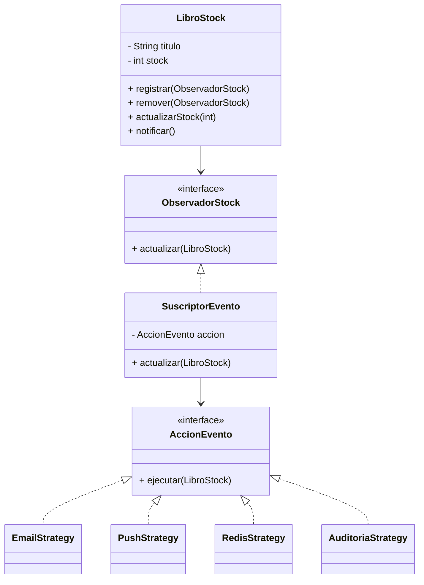

## Pregunta [05]: [Implementar notificaciones de disponibilidad usando dos patrones combinados]

### Estudiante
- **Nombre completo**: Julian Felipe Rojas Almanza

---

### LLM utilizado

| Campo | Valor |
|---|---|
| **Nombre del LLM** | Gpt |
| **Modelo específico** | Gpt-4o|
| **¿Por qué elegiste este LLM?** | Es uno de los modelos con mejor rendimiento al momento de generar diagramas en formato Mermaid funcionales y sin errores de sintaxis. Además, comprende a la perfección cómo interactúan múltiples objetos en tiempo de ejecución, lo cual es crucial para la sección de análisis de fallos y acoplamiento. |

---

### Prompt utilizado

> **Si respondiste sin IA, omite esta sección y ve directamente a Análisis crítico.**

```
Actúa como un Arquitecto de Software Senior y experto en Patrones de Diseño de Comportamiento y Arquitecturas Dirigidas por Eventos (EDA). Estoy resolviendo un ejercicio técnico académico sobre el proyecto "OpenLib Market" y necesito que diseñes un sistema reactivo basado en los requerimientos que te presentaré.

[CONTEXTO]
En la plataforma "OpenLib Market", cuando un libro que estaba agotado vuelve a estar disponible (stock > 0), múltiples componentes independientes del sistema necesitan reaccionar de forma inmediata:
1. Enviar notificación por correo a los usuarios que lo agregaron a su wishlist.
2. Enviar notificación push a los usuarios que lo marcaron como favorito en la app móvil.
3. Actualizar la caché de Redis para que aparezca inmediatamente en las búsquedas.
4. Registrar el evento en un log de auditoría para el equipo de operaciones.

[PROBLEMA / TAREA]
Necesito que resuelvas y respondas de forma directa y explícita a los siguientes puntos requeridos por mi enunciado:
1. Diseña e implementa este sistema utilizando exactamente DOS patrones de diseño de GoF que trabajen en conjunto y en armonía para resolver el problema de forma desacoplada.
2. Explica detalladamente por qué elegiste estos dos patrones específicos y cómo interactúan entre sí (su sinergia) para evitar el acoplamiento directo entre el inventario de libros y los sistemas de notificación/infraestructura.
3. Incluye un diagrama de clases técnico escrito en formato Mermaid para visualizar la relación entre las interfaces, el sujeto, los observadores o componentes y los patrones elegidos.
4. Propón la implementación completa en Java 21 de las clases principales, interfaces y un ejemplo de ejecución (método main o simulación) donde se agreguen los componentes, cambie el estado del libro y se disparen las acciones, demostrando cómo se pueden registrar o desregistrar componentes dinámicamente.

[RESTRICCIONES]
- Chain of Thought: Antes de escribir el código y el diagrama, explica brevemente cómo tu diseño mitigaría el riesgo si uno de los componentes (por ejemplo, el servidor de correos) falla, asegurando que los demás sigan funcionando.
- El objeto que gestiona el stock de libros no debe conocer la existencia de Redis, el servicio de Email, ni el sistema Push de forma explícita.
- El código resultante debe ser válido, limpio y modular.

[FORMATO DE SALIDA]
Estructura tu respuesta en Markdown utilizando única y estrictamente estos cuatro encabezados para organizar la información:
- ### 1. Elección de Patrones de Diseño y Justificación de Sinergia
- ### 2. Diagrama de Clases (Arquitectura en Mermaid)
- ### 3. Implementación del Código 
- ### 4. Manejo de Fallos y Resiliencia en el Diseño

[VALIDACIÓN]
Sabré que tu respuesta es excelente si el diagrama Mermaid renderiza perfectamente, si la combinación de patrones permite añadir un quinto componente de reacción en el futuro sin modificar las clases existentes (Open/Closed), y si demuestras con código cómo registrar y remover suscriptores o estrategias dinámicamente en tiempo de ejecución.
```

---

### Respuesta del LLM

# Solución

### 1. Elección de Patrones de Diseño y Justificación de Sinergia

**Patrones seleccionados: Observer + Strategy**

#### Observer

Es el patrón principal porque necesitamos que varios componentes reaccionen automáticamente cuando cambia el estado de un libro (agotado → disponible).

El inventario publica un evento y los componentes interesados reciben la notificación sin que el inventario conozca quiénes son.

---

#### Strategy

Cada observador ejecuta una acción diferente:

* Enviar email.
* Enviar push.
* Actualizar Redis.
* Registrar auditoría.

Estas acciones se encapsulan como estrategias independientes para mantener cada comportamiento aislado y reutilizable.

---

#### Sinergia entre ambos patrones

* **Observer** responde a la pregunta: *¿quién debe ser notificado?*
* **Strategy** responde a la pregunta: *¿qué debe hacer cada componente cuando recibe la notificación?*

Gracias a esta combinación:

* El inventario no conoce Redis, Email ni Push.
* Se pueden agregar nuevos componentes sin modificar el código existente.
* Los observadores pueden registrarse o eliminarse dinámicamente.

---

### 2. Diagrama de Clases (Arquitectura en Mermaid)



---

### 3. Implementación del Código en Java 21

#### Strategy

```java id="yz4m1q"
public interface AccionEvento {

    void ejecutar(LibroStock libro);
}
```

#### Estrategias concretas

```java id="fkt4eu"
public class EmailStrategy implements AccionEvento {

    @Override
    public void ejecutar(LibroStock libro) {
        System.out.println(
            "Email enviado para: "
            + libro.getTitulo()
        );
    }
}
```

```java id="h4g6r4"
public class PushStrategy implements AccionEvento {

    @Override
    public void ejecutar(LibroStock libro) {
        System.out.println(
            "Push enviada para: "
            + libro.getTitulo()
        );
    }
}
```

```java id="kg2phj"
public class RedisStrategy implements AccionEvento {

    @Override
    public void ejecutar(LibroStock libro) {
        System.out.println(
            "Redis actualizado para: "
            + libro.getTitulo()
        );
    }
}
```

```java id="zv7moc"
public class AuditoriaStrategy implements AccionEvento {

    @Override
    public void ejecutar(LibroStock libro) {
        System.out.println(
            "Auditoría registrada para: "
            + libro.getTitulo()
        );
    }
}
```

#### Observer

```java id="l9jjlwm"
public interface ObservadorStock {

    void actualizar(LibroStock libro);
}
```

#### Observador genérico

```java id="tgvocg"
public class SuscriptorEvento
        implements ObservadorStock {

    private final AccionEvento accion;

    public SuscriptorEvento(
            AccionEvento accion) {

        this.accion = accion;
    }

    @Override
    public void actualizar(
            LibroStock libro) {

        accion.ejecutar(libro);
    }
}
```

#### Subject

```java id="s64b4x"
import java.util.ArrayList;
import java.util.List;

public class LibroStock {

    private final String titulo;
    private int stock;

    private final List<ObservadorStock>
            observadores =
            new ArrayList<>();

    public LibroStock(
            String titulo,
            int stock) {

        this.titulo = titulo;
        this.stock = stock;
    }

    public String getTitulo() {
        return titulo;
    }

    public void registrar(
            ObservadorStock observador) {

        observadores.add(observador);
    }

    public void remover(
            ObservadorStock observador) {

        observadores.remove(observador);
    }

    public void actualizarStock(
            int nuevoStock) {

        boolean estabaAgotado =
                stock <= 0;

        stock = nuevoStock;

        if (estabaAgotado &&
                nuevoStock > 0) {

            notificar();
        }
    }

    private void notificar() {

        for (ObservadorStock o
                : observadores) {

            o.actualizar(this);
        }
    }
}
```

#### Simulación

```java id="5z6y4q"
public class Main {

    public static void main(String[] args) {

        LibroStock libro =
                new LibroStock(
                        "Clean Code",
                        0
                );

        ObservadorStock email =
                new SuscriptorEvento(
                        new EmailStrategy()
                );

        ObservadorStock push =
                new SuscriptorEvento(
                        new PushStrategy()
                );

        ObservadorStock redis =
                new SuscriptorEvento(
                        new RedisStrategy()
                );

        ObservadorStock auditoria =
                new SuscriptorEvento(
                        new AuditoriaStrategy()
                );

        libro.registrar(email);
        libro.registrar(push);
        libro.registrar(redis);
        libro.registrar(auditoria);

        libro.remover(push);

        libro.actualizarStock(10);
    }
}
```

#### Salida esperada

```text id="5yce9v"
Email enviado para: Clean Code
Redis actualizado para: Clean Code
Auditoría registrada para: Clean Code
```

La notificación Push no aparece porque fue removida dinámicamente antes del cambio de stock.

---

### 4. Manejo de Fallos y Resiliencia en el Diseño

Una ventaja importante de Observer es que los observadores son independientes.

Si, por ejemplo, el servidor de correos falla, no debería impedir que Redis, Push o Auditoría ejecuten sus acciones.

Una mejora sencilla sería encapsular cada notificación en un bloque `try-catch`:

```java id="ht5n6r"
private void notificar() {

    for (ObservadorStock o
            : observadores) {

        try {
            o.actualizar(this);
        } catch (Exception e) {
            System.out.println(
                "Error en observador: "
                + e.getMessage()
            );
        }
    }
}
```

Con esto:

* Un fallo no detiene la propagación del evento.
* Los demás observadores siguen funcionando.
* Se mejora la disponibilidad del sistema.
* Se mantiene el desacoplamiento entre componentes.

Además, para agregar un nuevo componente en el futuro (SMS, Kafka, WebSocket, etc.) solo habría que crear una nueva implementación de `AccionEvento` y registrarla como observador, sin modificar ninguna clase existente, cumpliendo el principio Abierto/Cerrado (OCP).


---

### Análisis crítico de la respuesta

#### 1. ¿Qué hizo bien el prompt?

El éxito del prompt radica en que se respetó la segmentación descrita en el archivo guia_prompting.md para hacer buenos prompts. Una Gema de Gemini ayudó a optimizarlo en primera instancia, y luego yo me encargué de su corrección final. La fórmula es directa: un rol establecido, un contexto claro e instrucciones sencillas que garantizan el resultado esperado.


#### 2. ¿Qué se puede mejorar?

El prompt es completamente funcional. El margen de optimización es mínimo, quizás, de manera opcional, se podrían añadir ejemplos de salidas esperadas si la tarea se vuelve más compleja, pero para el requerimiento actual la estructura esta bien y no amerita ninguna corrección.


#### 3. Respuesta final

el análisis de la inteligencia artificial eligió correctamente los patrones de diseño para este escenario, pues la mezcla del patrón de observador con el patrón de estrategia encaja muy bien para resolver el problema de openlib market sin amarrar el código. se demostró que la combinación tiene sentido técnico al separar la duda de quién recibe la alerta de la duda de qué hace cada pieza al enterarse del cambio de stock. el diseño permite registrar y desregistrar dinámicamente los componentes interesados usando las funciones básicas de la lista, y la propuesta para manejar el caso de que una notificación falle metiendo un bloque de captura de errores dentro del bucle de envío asegura que un daño en el correo electrónico no tumbe la actualización de la memoria rápida o la auditoría, logrando que el acoplamiento entre los componentes sea el adecuado.

sin embargo, el análisis omitió un vacío gigante sobre las consecuencias de esta combinación en la vida real. en el ejemplo de uso, se crea una clase intermedia llamada suscriptorevento que solo sirve para envolver la estrategia dentro del observador, lo cual vuelve a parecer un diseño forzado que mete cajas de código innecesarias y complica la estructura sin una ganancia real, pues la interfaz del observador ya podría actuar como la estrategia misma. para que la solución fuera perfecta, faltó mencionar que la inteligencia artificial pasó por alto que si un observador se queda colgado procesando una tarea pesada como conectar el servidor de correos externo, todo el hilo principal de la aplicación de openlib market se va a frenar, haciendo que el cambio de stock sea lento para el cliente. tampoco se especificó que en un entorno real con spring boot es mejor delegar esta propagación de eventos de forma asíncrona usando las herramientas nativas del motor en lugar de armar la lista y el bucle a pedal con un operador de creación manual en el código de negocio.

el código original estaba mal diseñado porque el inventario se cargaba con muchas tareas al mismo tiempo al tener que conocer los detalles técnicos del correo, las notificaciones en el celular y la memoria rápida, violando el principio de responsabilidad única. además, rompía el principio abierto cerrado porque agregar un nuevo canal de aviso nos obligaba a dañar lo que ya funcionaba metiendo más líneas en la clase principal. para solucionarlo bien, se aplicó el patrón de diseño de observador junto con el enfoque de puertos y adaptadores, definiendo la interfaz observadorstock como el puente o contrato limpio, lo que permite cumplir con el principio de inversión de dependencias al hacer que el núcleo dependa de una idea abstracta y no de los detalles del sistema de mensajes. las clases independientes como las estrategias actúan como los conectores externos que se enganchan o se quitan en caliente según haga falta. el componente del inventario final queda limpio y con una sola razón para cambiar, notificando a la lista de interesados sin importarle qué hacen por dentro, pues para evitar el amarre de código y los bloqueos en el cliente, la opción elegida debería procesar las alertas en hilos separados usando el motor de eventos de spring. de esta manera, el sistema no solo borra las condiciones y tolera los fallos de red aislados, sino que se puede probar cada alerta por separado en experimentos de mentiras con mockito, quedando fácil de mantener, seguro y listo para recibir más integraciones en el futuro.