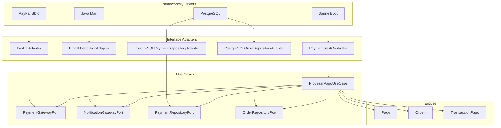

## Pregunta [07]: [Diseñar un módulo aplicando Clean Architecture a OpenLib Market]

### Estudiante
- **Nombre completo**: Julian Felipe Rojas Almanza

---

### LLM utilizado

| Campo | Valor |
|---|---|
| **Nombre del LLM** | Gpt |
| **Modelo específico** | Gpt-4o |
| **¿Por qué elegiste este LLM?** | Es parte de los modelos más eficientes para modelar diagramas estructurales en formato Mermaid y aplicar de forma pragmática la separación de conceptos. Evitan mezclar anotaciones de frameworks dentro de las capas internas de entidades y casos de uso, un error conceptual crítico y muy común en otros LLMs. |

---

### Prompt utilizado

> **Si respondiste sin IA, omite esta sección y ve directamente a Análisis crítico.**

```
Actúa como un Arquitecto de Software Principal con experiencia en Clean Architecture y Diseño Guiado por el Dominio (DDD). Estoy resolviendo un ejercicio técnico académico para el sistema "OpenLib Market" y necesito que rediseñes un módulo crítico siguiendo estrictamente las reglas de Robert C. Martin.

[CONTEXTO]
El equipo de desarrollo ha acoplado todo el módulo de **gestión de pagos** en una sola clase monolítica llamada `PaymentService` dentro de un único método `realizarPago`. Este método hace todo: llama a las pasarelas de pago externas, gestiona transacciones directas a PostgreSQL, envía correos de notificación, cambia estados de órdenes y maneja la lógica de entrega. El sistema debe exponer una API REST para ser consumida por un frontend en JavaFX.

[PROBLEMA / TAREA]
Necesito que rediseñes por completo este módulo aplicando los principios de Clean Architecture para resolver el acoplamiento severo. Tu respuesta debe incluir de forma explícita:
1. La definición exacta de qué componentes, interfaces, puertos y clases van en cada una de las cuatro capas funcionales:
   - Entidades (Entities)
   - Casos de Uso (Use Cases)
   - Adaptadores de Interfaz (Interface Adapters)
   - Frameworks y Drivers
2. Un diagrama de estructura arquitectónica detallado en formato Mermaid que ilustre la organización de estas capas y demuestre visualmente cómo todas las dependencias del código fuente apuntan exclusivamente hacia adentro.
3. Una explicación clara y concisa de cómo se aplica la Inversión de Dependencias (DIP) mediante la definición de Puertos (Interfaces) y Adaptadores para inyectar las dependencias externas (Base de datos PostgreSQL, pasarelas de pago como PayPal/Tarjeta y envío de correos) sin violar los límites de la arquitectura.

[RESTRICCIONES]
- Chain of Thought: Antes de presentar el diseño, explica por qué colocar anotaciones de frameworks de persistencia (como Hibernate/JPA) o de frameworks web (como Spring Web) directamente en las clases de la capa de Entidades o Casos de Uso es una violación de Clean Architecture.
- El Caso de Uso de pagos debe ser agnóstico a si la petición viene de una API REST de JavaFX, una interfaz de consola o un test unitario.
- Los adaptadores externos (como pasarelas de pago y repositorios de persistencia) deben ser implementados hacia el exterior, consumiendo los puertos definidos por la capa de Casos de Uso.
- Todo el diseño conceptual y nombres de componentes deben estar estrictamente orientados al negocio de pagos de OpenLib Market (ej: `ProcesarPagoUseCase`, `NotificationGatewayPort`, `PaymentRestController`, etc.).

[FORMATO DE SALIDA]
Estructura tu respuesta en Markdown utilizando única y estrictamente estos cuatro encabezados para organizar la información:
- ### 1. Distribución de Componentes por Capas (Clean Architecture)
- ### 2. Diagrama Estructural de Dependencias (Mermaid)
- ### 3. Mecanismo de Inversión de Dependencias y Puertos
- ### 4. Evaluación de Testabilidad del Nuevo Diseño

[VALIDACIÓN]
Sabré que tu respuesta es excelente si el controlador REST y la base de datos PostgreSQL quedan completamente relegados a la capa más externa, si el diagrama Mermaid renderiza sin errores de sintaxis mostrando un flujo de dependencias estrictamente centrípeto (hacia adentro), y si demuestras que la lógica central de pagos puede ser testeada de forma aislada mediante dobles de prueba (mocks) sin levantar bases de datos ni servicios de red.
```

---

### Respuesta del LLM

> **Si respondiste sin IA, omite esta sección y ve directamente a Análisis crítico.**

# Solución

### 1. Distribución de Componentes por Capas (Clean Architecture)

Antes del rediseño, es importante entender que colocar anotaciones como `@Entity`, `@Table`, `@RestController`, `@Autowired` o cualquier dependencia de Spring/JPA dentro de Entidades o Casos de Uso viola Clean Architecture.

¿Por qué?

Porque esas capas internas comenzarían a depender de frameworks externos. Si mañana PostgreSQL se reemplaza por MongoDB o Spring Boot por otro framework, el núcleo del negocio tendría que modificarse.

Las capas internas deben contener únicamente reglas de negocio.

---

#### Capa 1: Entidades (Entities)

Representan las reglas más estables del dominio de pagos.

```text
Pago
Orden
Cliente
MetodoPago
TransaccionPago
EstadoPago
```

Ejemplos:

```text
Pago
Orden
TransaccionPago
```

Responsabilidades:

* Validar reglas del negocio.
* Gestionar estados de pago.
* Calcular montos finales.

No conocen:

* PostgreSQL
* Spring Boot
* REST
* PayPal
* SMTP

---

#### Capa 2: Casos de Uso (Use Cases)

Contienen la lógica de aplicación.

Caso principal:

```text
ProcesarPagoUseCase
```

Puertos de salida:

```text
PaymentGatewayPort
PaymentRepositoryPort
OrderRepositoryPort
NotificationGatewayPort
DeliveryGatewayPort
```

DTOs internos:

```text
ProcesarPagoCommand
ProcesarPagoResponse
```

Responsabilidades:

* Validar la orden.
* Solicitar el cobro.
* Actualizar estado del pago.
* Actualizar estado de la orden.
* Solicitar notificación.
* Solicitar entrega.

Todo esto mediante interfaces.

---

#### Capa 3: Adaptadores de Interfaz (Interface Adapters)

Adaptan información entre el exterior y los casos de uso.

Controladores:

```text
PaymentRestController
```

Mappers:

```text
PaymentRequestMapper
PaymentResponseMapper
```

DTOs REST:

```text
PaymentRequest
PaymentResponse
```

Implementaciones de puertos:

```text
PostgreSQLPaymentRepositoryAdapter
PostgreSQLOrderRepositoryAdapter
PayPalAdapter
CreditCardAdapter
EmailNotificationAdapter
DeliveryServiceAdapter
```

---

#### Capa 4: Frameworks y Drivers

Tecnologías concretas.

```text
Spring Boot
Spring MVC
Spring Data JPA
PostgreSQL
Hibernate
JavaMail
PayPal SDK
Stripe SDK
Docker
```

Ejemplos:

```text
JpaPaymentRepository
JpaOrderRepository
SpringSecurityConfig
PostgreSQLDatasourceConfig
```

Esta capa puede reemplazarse sin modificar el negocio.

---

### 2. Diagrama Estructural de Dependencias (Mermaid)



---

### 3. Mecanismo de Inversión de Dependencias y Puertos

La clave de Clean Architecture es que los Casos de Uso no conocen implementaciones concretas.

Por ejemplo, el caso de uso define el puerto:

```java id="3ibd4k"
public interface PaymentGatewayPort {

    PaymentResult cobrar(Pago pago);
}
```

El caso de uso depende únicamente de esta interfaz:

```java id="5mqk3s"
public class ProcesarPagoUseCase {

    private final PaymentGatewayPort gateway;

    public ProcesarPagoUseCase(
            PaymentGatewayPort gateway) {

        this.gateway = gateway;
    }
}
```

La implementación concreta vive fuera:

```java id="iynm96"
public class PayPalAdapter
        implements PaymentGatewayPort {

    @Override
    public PaymentResult cobrar(
            Pago pago) {

        // SDK de PayPal
    }
}
```

Lo mismo ocurre para:

```text
NotificationGatewayPort
    ↓
EmailNotificationAdapter

PaymentRepositoryPort
    ↓
PostgreSQLPaymentRepositoryAdapter

OrderRepositoryPort
    ↓
PostgreSQLOrderRepositoryAdapter
```

De esta manera:

* El caso de uso no sabe si usa PayPal o Stripe.
* No sabe si la base de datos es PostgreSQL o MongoDB.
* No sabe si la notificación es Email o SMS.

Solo conoce contratos.

---

### 4. Evaluación de Testabilidad del Nuevo Diseño

La principal ventaja del rediseño es que el núcleo del negocio puede probarse completamente aislado.

Ejemplo:

```java id="s4f73v"
PaymentGatewayPort fakeGateway =
        new FakePaymentGateway();

PaymentRepositoryPort fakeRepo =
        new InMemoryPaymentRepository();

NotificationGatewayPort fakeNotification =
        new FakeNotificationGateway();

ProcesarPagoUseCase useCase =
        new ProcesarPagoUseCase(
                fakeGateway,
                fakeRepo,
                fakeNotification
        );
```

Durante la prueba:

```text
No se levanta Spring Boot.
No se conecta PostgreSQL.
No se llama PayPal.
No se envían correos.
```

Se valida únicamente la lógica de negocio:

```text
✓ Pago aprobado
✓ Orden actualizada
✓ Transacción registrada
✓ Notificación solicitada
```

Beneficios obtenidos:

* Pruebas unitarias rápidas.
* Bajo acoplamiento.
* Infraestructura reemplazable.
* Cumplimiento de DIP.
* Cumplimiento de la Regla de Dependencia.
* Casos de uso reutilizables desde REST, JavaFX, consola o pruebas automatizadas.

En consecuencia, `ProcesarPagoUseCase` permanece completamente independiente de PostgreSQL, Spring Boot, PayPal y cualquier tecnología externa, que es precisamente el objetivo principal de Clean Architecture.


---

### Análisis crítico de la respuesta

#### 1. ¿Qué hizo bien el prompt?

[Evalúa tu propio prompt, no la respuesta del LLM. ¿El contexto fue suficiente? ¿Las restricciones fueron claras? ¿El formato de salida que pediste ayudó a obtener una buena respuesta? ¿Qué parte de tu prompt fue más efectiva? Sé específico: menciona fragmentos concretos de tu prompt que funcionaron bien.]


#### 2. ¿Qué se puede mejorar?

[¿Qué le faltó a tu prompt? ¿Qué harías diferente si pudieras reformularlo? ¿El LLM entendió mal algo por falta de claridad en tu prompt? ¿La respuesta tiene errores u omisiones? ¿Qué no cubrió el LLM que tú sí sabes por lo visto en clase?]


#### 3. Respuesta final

[Escribe tu respuesta definitiva a la pregunta del parcial, integrando lo que aprendiste del LLM pero yendo más allá. Corrige errores, llena omisiones, conecta con conceptos vistos en clase. Esta es tu respuesta: demuestra que tú dominas el tema.]
