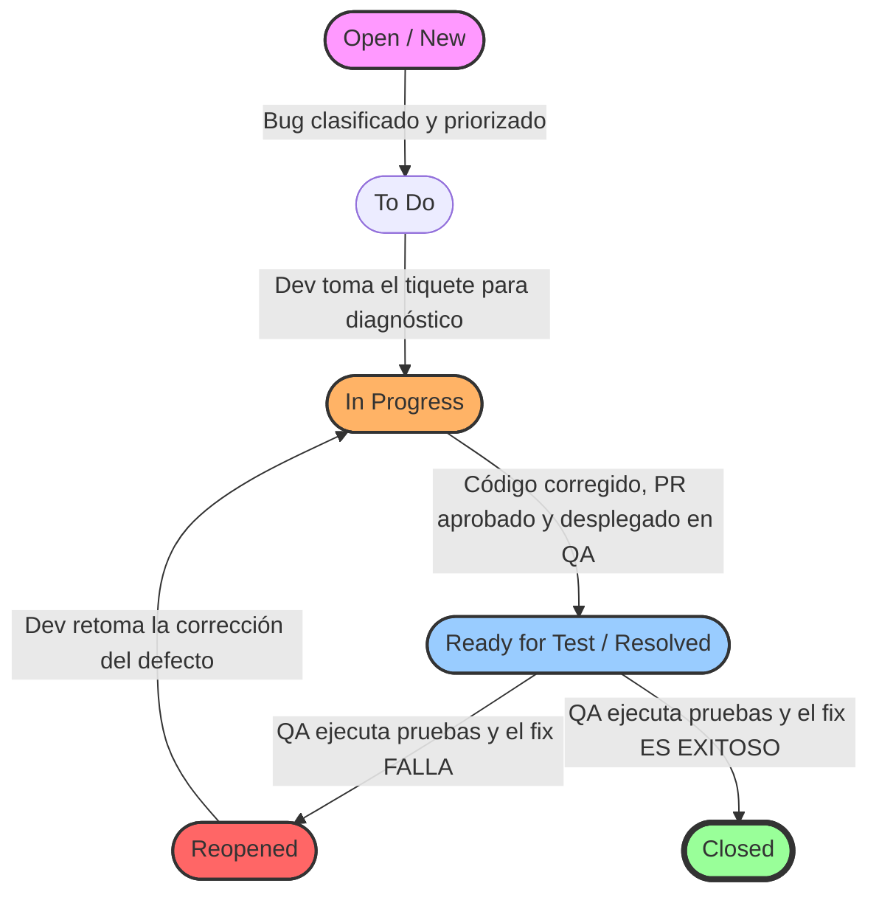

## Pregunta [12]: [Explicar y justificar decisiones en el ciclo de vida de un defecto]

### Estudiante
- **Nombre completo**: Julian felipe Rojas Almanza

---

### LLM utilizado

| Campo | Valor |
|---|---|
| **Nombre del LLM** | Gpt |
| **Modelo específico** | Gpt-4o |
| **¿Por qué elegiste este LLM?** | Es una de las excelentes para detallar flujos de trabajo iterativos (workflows) y comprender roles organizacionales. Tienen mapeados a la perfección los estados estándar de Jira y los procesos de integración continua implicados en las fases de corrección y verificación |

---

### Prompt utilizado

> **Si respondiste sin IA, omite esta sección y ve directamente a Análisis crítico.**

```
Actúa como un QA Manager y Scrum Master experimentado. Estoy resolviendo un ejercicio técnico académico basado en la gestión de errores en la plataforma "OpenLib Market" y necesito que expliques el ciclo de vida de un defecto aplicado a un reporte real.

[CONTEXTO]
Durante la fase de pruebas de "OpenLib Market", un tester ha registrado el siguiente reporte de bug en Jira:
- Resumen: El botón "Agregar al carrito" no responde cuando el usuario tiene más de 5 ítems en el carrito.
- Pasos para reproducir: (1) Iniciar sesión como comprador, (2) Agregar 5 libros diferentes al carrito, (3) Intentar agregar un sexto libro desde la página de detalle del producto.
- Resultado esperado: El libro se agrega al carrito y el contador se actualiza.
- Resultado obtenido: El botón no produce ninguna acción. No hay mensaje de error ni retroalimentación visual.

[PROBLEMA / TAREA]
Necesito que expliques el ciclo de vida completo de este defecto aplicando secuencialmente todas las fases estándar (Detección, Reporte, Asignación, Diagnóstico, Corrección, Verificación y Cierre). Para cada una de las fases, debes especificar de forma obligatoria y exacta los siguientes cuatro subpuntos:
a) ¿Quién es el rol responsable de ejecutar o gestionar la fase?
b) ¿Qué acción técnica o de negocio exacta se toma con respecto al bug?
c) ¿Qué herramienta del ecosistema de desarrollo se utiliza en ese momento (ej: Jira, IDE, Git, CI/CD, etc.)?
d) ¿Cuál es el estado exacto del tiquete/defecto en Jira en esa fase (ej: Open, In Progress, Resolved, Ready for Test, Closed, Reopened, etc.)?

[RESTRICCIONES]
- Chain of Thought: En la fase de Diagnóstico, pide al LLM que plantee una hipótesis técnica de la causa raíz conectándolo con el código de reglas del negocio (por ejemplo, si hay una discrepancia entre el límite del frontend de 5 ítems y el límite del backend que podría ser de 10).
- El flujo de estados de Jira debe ser lógico y coherente: no se puede saltar de "Open" a "Closed" sin pasar por verificación.
- Modela situaciones de la vida real: menciona qué sucedería en la fase de Verificación si el fix del desarrollador no funcionó (el camino del "Reopen").

[FORMATO DE SALIDA]
Estructura tu respuesta en Markdown utilizando única y estrictamente los siguientes encabezados para organizar el flujo del ciclo:
- ### 1. Hipótesis Técnica de la Causa Raíz (Diagnóstico Preliminar)
- ### 2. Ciclo de Vida del Defecto Fase por Fase
  (Desglosa las 7 fases: Detección, Reporte, Asignación, Diagnóstico, Corrección, Verificación y Cierre; respondiendo los ítems a, b, c y d para cada una).
- ### 3. Diagrama de Transición de Estados en Jira (Mermaid)

[VALIDACIÓN]
Sabré que tu respuesta es excelente si el flujo de estados en Jira sigue las mejores prácticas de metodologías ágiles, si identificas adecuadamente que el desarrollador es el encargado de dar el diagnóstico/corrección mientras que el tester es el único que puede verificar/cerrar, y si el diagrama Mermaid ilustra correctamente los caminos felices y alternativos (como el flujo de reabrir el tiquete).
```

---

### Respuesta del LLM

> **Si respondiste sin IA, omite esta sección y ve directamente a Análisis crítico.**
### 1. Hipótesis Técnica de la Causa Raíz (Diagnóstico Preliminar)

Antes de desglosar el flujo de gestión, como **QA Manager**, es crucial analizar los síntomas del fallo: el botón "Agregar al carrito" queda completamente inerte (sin feedback visual ni excepciones explícitas en la interfaz) solo cuando ya existen 5 ítems en el carrito de **OpenLib Market**.

**Análisis de Acoplamiento y Reglas de Negocio:**
El sistema OpenLib Market maneja su lógica de negocio de topes mediante un patrón de diseño o una regla validada en múltiples capas. La hipótesis técnica apunta a una **discrepancia de límites (Off-by-One Error) y una falta de manejo de excepciones en la comunicación asíncrona entre el Frontend y el Backend**:

* **Lógica en el Backend (Spring Boot):** Es muy probable que la regla de negocio esté definida como un límite inclusivo menor o igual a 5 ($cant \le 5$) o que el backend lance una excepción silenciosa del tipo `MaxItemsReachedException` (HTTP 400 Bad Request o HTTP 422 Unprocessable Entity) cuando se intenta añadir un sexto libro.
* **Lógica en el Frontend / UI (JavaFX o JavaScript según la arquitectura de presentación):** El controlador de la vista realiza la petición HTTP/API o invoca al servicio del carrito al presionar el botón. Sin embargo, el desarrollador del frontend no implementó un bloque `catch` o un manejador de respuestas de error para los códigos HTTP 4xx/5xx provenientes del servidor en este flujo específico. 

**Conclusión de la hipótesis:** El backend rechaza correctamente la transacción para proteger la regla de negocio, pero al no retornar un cuerpo estructurado o al no ser capturado por el frontend, la interfaz se "congela" en su estado actual, impidiendo que el usuario sepa por qué falló la acción.

---

### 2. Ciclo de Vida del Defecto Fase por Fase

A continuación, se detalla el ciclo de vida del bug aplicando el marco de trabajo Scrum y las mejores prácticas de QA.

#### Fase 1: Detección
* **a) Rol responsable:** QA Engineer / Tester.
* **b) Acción técnica o de negocio exacta:** El tester ejecuta una prueba exploratoria o un caso de prueba funcional planificado para el módulo del carrito. Al simular el escenario límite de ingresar 6 libros, identifica el comportamiento anómalo: falta de respuesta del botón y ausencia de un mensaje que advierta al usuario sobre el límite de ítems. Revisa la consola del desarrollador o los logs locales preliminares y constata un código de error de red o una promesa/hilo colgado.
* **c) Herramientas del ecosistema:** Entorno de pruebas (Staging/QA Environment), herramientas de desarrollo del navegador/consola de JavaFX, y herramientas de inspección de peticiones de red (Postman o proxies de depuración).
* **d) Estado exacto en Jira:** No aplica (El tiquete aún no ha sido creado en el tablero).

#### Fase 2: Reporte
* **a) Rol responsable:** QA Engineer / Tester.
* **b) Acción técnica o de negocio exacta:** El tester redacta formalmente el hallazgo en la plataforma de gestión del proyecto, documentando de forma estructurada el resumen, precondiciones, pasos exactos de reproducción, resultados obtenidos, resultados esperados, capturas de pantalla/videos y la sabana de severidad (en este caso, *Major* o *High* debido al bloqueo de una funcionalidad core).
* **c) Herramientas del ecosistema:** Jira Software.
* **d) Estado exacto en Jira:** **New** o **Open**.

#### Fase 3: Asignación
* **a) Rol responsable:** Scrum Master / QA Manager / Product Owner (durante la Daily o en el proceso de Triage de Bugs).
* **b) Acción técnica o de negocio exacta:** Se evalúa el impacto del defecto en el Sprint Goal actual. El Scrum Master o el líder técnico determina qué desarrollador posee el contexto del módulo del carrito para solucionar el problema con celeridad. Se le asigna formalmente la tarea al desarrollador seleccionado y se le otorga una prioridad alta.
* **c) Herramientas del ecosistema:** Jira Software (Tablero Kanban/Scrum del Sprint).
* **d) Estado exacto en Jira:** **To Do** (o asignado manteniendo el estado **Open** dependiendo del flujo de la compañía, listo para que el Dev lo tome).

#### Fase 4: Diagnóstico
* **a) Rol responsable:** Desarrollador de Software (Software Developer).
* **b) Acción técnica o de negocio exacta:** El desarrollador cambia el estado del tiquete para indicar que ha comenzado a trabajar en él. Descarga la rama de código correspondiente, levanta el entorno de manera local y reproduce el bug siguiendo los pasos descritos por QA. Realiza un debug del código del controlador del botón "Agregar al carrito" y confirma la hipótesis preliminar: el frontend envía la petición al backend, el backend responde con un error de validación, pero el frontend carece de un callback o estructura de control para pintar el modal/alerta de error en pantalla.
* **c) Herramientas del ecosistema:** IDE (IntelliJ IDEA, Eclipse o VS Code), Jira Software, y herramientas de debugging local.
* **d) Estado exacto en Jira:** **In Progress**.

#### Fase 5: Corrección
* **a) Rol responsable:** Desarrollador de Software (Software Developer).
* **b) Acción técnica o de negocio exacta:** El desarrollador modifica el código. Introduce un bloque de control de excepciones en la UI para capturar la respuesta del backend. Diseña un mensaje emergente o un *toast* de alerta inteligible para el cliente (ej: *"No puedes agregar más de 5 libros a tu carrito de compras"*). Adicionalmente, añade lógica en el frontend para deshabilitar de forma preventiva el botón si el contador del carrito es igual a 5. Ejecuta pruebas unitarias locales, realiza el `commit` y un `push` a una nueva rama Git, abriendo un Pull Request (PR) que, tras ser aprobado por un par, se integra a la rama principal mediante el pipeline.
* **c) Herramientas del ecosistema:** IDE, Git (GitHub/GitLab), y sistema de Integración Continuua (Jenkins, GitHub Actions, etc.) para desplegar de forma automática el fix en el entorno de pruebas.
* **d) Estado exacto en Jira:** **Resolved** (o **Ready for Test** una vez que el pipeline de CI/CD confirma el despliegue exitoso en el ambiente de QA).

#### Fase 6: Verificación
* **a) Rol responsable:** QA Engineer / Tester (el desarrollador **nunca** debe verificar su propio fix en Jira).
* **b) Acción técnica o de negocio exacta:** El tester visualiza que el tiquete está listo para pruebas. Descarga la última versión desplegada en el ambiente de testing. Intenta reproducir el escenario original agregando 5 libros e intentando meter un sexto. 
    * *Simulación de Escenario de Error (Camino Alternativo):* Supongamos que tras la corrección del desarrollador, al presionar el botón por sexta vez, la interfaz muestra el mensaje de error de manera correcta, pero el contador del carrito cambia visualmente a "6" de forma errónea debido a un problema de refresco de variables en la memoria del cliente. El fix está incompleto. El tester documenta esta nueva evidencia y devuelve el caso al desarrollador.
* **c) Herramientas del ecosistema:** Entorno de pruebas (QA Environment), Jira Software, herramientas de desarrollo de software.
* **d) Estado exacto en Jira:** **Reopened** (Al fallar la verificación, vuelve temporalmente a los estados previos de desarrollo para pasar de nuevo por *In Progress* $\rightarrow$ *Ready for Test*, repitiendo la validación hasta que sea exitosa). Una vez que el bug se repara por completo y pasa las pruebas de regresión, cambia a **Verified**.

#### Fase 7: Cierre
* **a) Rol responsable:** QA Engineer / Tester (con el visto bueno del Scrum Master / Product Owner).
* **b) Acción técnica o de negocio exacta:** Tras comprobar de manera exhaustiva que el botón se comporta adecuadamente (se deshabilita al llegar a 5 ítems o despliega el mensaje de error correspondiente sin romper el contador del carrito ni colgar la UI), y verificar que no se introdujeron efectos secundarios en otras partes del flujo de checkout (pruebas de regresión), el tester procede a dar el cierre formal y definitivo al artefacto en la plataforma de seguimiento.
* **c) Herramientas del ecosistema:** Jira Software.
* **d) Estado exacto en Jira:** **Closed**.

---

### 3. Diagrama de Transición de Estados en Jira (Mermaid)

El siguiente diagrama modela el flujo de trabajo (workflow) ágil configurado en Jira para OpenLib Market. Muestra el camino feliz de resolución y el bucle alternativo de reapertura (*Reopened*) modelado en la Fase de Verificación.



---

### Análisis crítico de la respuesta

#### 1. ¿Qué hizo bien el prompt?

El prompt está correctamente estructurado porque se aplicó la segmentación indicada en el archivo guia_prompting.md, donde se explica cómo construir un buen prompt. El resultado mejoró notablemente gracias al apoyo inicial de una Gema (el agente de IA de Gemini) y a mi posterior revisión y corrección. Las instrucciones son claras, incluye un rol, aporta contexto y la estructura de respuesta solicitada es sencilla y efectiva.


#### 2. ¿Qué se puede mejorar?

Dado que el prompt ya cumple estrictamente con la segmentación de la guía y fue refinado en su totalidad, las oportunidades de mejora son marginales. Podría evaluarse a futuro una ligera variación en los sinónimos del rol asignado si se busca un matiz distinto, pero en su estado actual, el prompt ya es óptimo y no requiere modificaciones estructurales.


#### 3. Respuesta final

el análisis de la inteligencia artificial explicó correctamente las fases del ciclo de vida del defecto al detallar el camino desde la detección hasta el cierre definitivo, pues organizó el flujo cronológico relacionándolo muy bien con el marco de trabajo scrum. además, asignó los responsables adecuados a cada etapa cuidando de forma acertada que el desarrollador jamás sea quien verifique su propio arreglo, y mencionó las diferencias entre los posibles estados del defecto en jira como la diferencia entre resuelto y cerrado. la hipótesis técnica sobre la causa raíz fue muy bien identificada al apuntar a un error de comunicación asíncrona por la falta de captura de excepciones en el frontend de openlib market, planteando un flujo de estados en el diagrama que es correcto y funcional para un equipo ágil.

sin embargo, el análisis omitió un vacío gigante en una fase crítica que el robot trató de forma muy superficial. la inteligencia artificial cometió el error de pasar por alto la fase de priorización y triaje de errores que ocurre justo entre el reporte y la asignación, pues asumió que los tiquetes saltan directo del reporte a la lista de tareas del programador sin pasar por un consejo de control de calidad o una mesa de evaluación técnica. para que la solución fuera perfecta, faltó detallar que el director de calidad y el dueño del producto deben juntarse para definir el impacto real del fallo frente a otros problemas del servidor, calculando la severidad técnica contra la prioridad del negocio en openlib market para ver si se atiende en el sprint actual o se deja en la lista de espera de la aplicación. tampoco se especificó cómo la fase de verificación requiere de pruebas de regresión automáticas para asegurar que el cambio en el contador del carrito no dañó el cálculo de los precios o los descuentos guardados en la base de datos.

el código original del sistema estaba mal diseñado porque el botón del carrito permitía enviar peticiones infinitas al servidor sin controlar los límites ni capturar las alertas del backend, violando los principios de un diseño seguro y limpio. además, la falta de control de excepciones provocaba que la interfaz se congelara borrando el rastro del error y dejando al cliente perdido en openlib market. para solucionarlo bien, se rediseñó el flujo aplicando un ciclo de gestión de defectos estricto integrado con las herramientas de integración continua. los estados de jira se mueven de forma automática conforme los conectores de código validan que el fix funciona mediante pruebas unitarias en el servidor de pruebas. el componente del controlador visual final queda optimizado, recibiendo las respuestas HTTP 4xx o 5xx de forma controlada y deshabilitando el botón apenas la variable de memoria llega al tope máximo permitido, pues para evitar que se vuelvan a meter fallos parecidos en el cliente, la opción elegida debe automatizar el camino feliz y el camino alternativo en pruebas funcionales de extremo a extremo. de esta manera, el sistema no solo repara la falla del carrito de compras, sino que asegura que todo el proceso de desarrollo quede fácil de mantener, seguro y protegido contra errores lógicos en el futuro.
