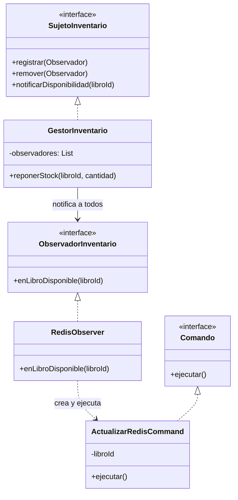

# Plantilla de entrega — Parcial 2

---

## Pregunta P05: Patrones de diseño — Sistema de notificaciones

### Estudiante
- **Nombre completo**: Ivan Wright

---

### LLM utilizado

| Campo | Valor |
|---|---|
| **Nombre del LLM** | Gemini |
| **Modelo especifico** | Gemini 3.1 Pro |
| **¿Por que elegiste este LLM?** | Lo escogi porque es muy bueno analizando arquitectura de software y es capaz de sugerir combinaciones de patrones de diseño que tengan sentido logico en Java. |

---

### Prompt utilizado

> **Si respondiste sin IA, omite esta sección y ve directamente a Análisis crítico.**

```text
hola gemini, actua como un arquitecto de software senior en java.

[CONTEXTO]
En el sistema de OpenLib Market (Java 21 y Spring Boot 3), cuando un libro que estaba agotado vuelve a estar disponible, necesito que pasen cuatro cosas automaticamente: 
1. Mandar correo a los usuarios que lo tienen en wishlist.
2. Mandar notificacion push a los que lo marcaron como favorito en la app.
3. Actualizar la cache de Redis para que el libro salga en las busquedas de nuevo.
4. Guardar el evento en un log de auditoria.

[PROBLEMA]
Necesito que diseñes e implementes este sistema combinando exactamente dos patrones de diseño de los que hayamos visto en clase que tengan sentido juntos para resolver esto. Dame el diagrama de clases en formato Mermaid, el codigo en Java de las clases principales, y explicame bien por que elegiste combinar esos dos patrones especificamente.

[RESTRICCIONES]
- El codigo debe compilar en Java 21 y seguir principios SOLID (muy bajo acoplamiento).
- Debe ser facil agregar un quinto o sexto paso en el futuro sin modificar la clase original del inventario.
- Los patrones no pueden estar combinados a la fuerza, debe verse natural.

[FORMATO]
Todo en markdown estructurado. Incluye el bloque ```mermaid para el diagrama, seguido de los bloques de codigo java y la justificacion.

[VALIDACION]
Sabre que tu respuesta es correcta si el diseño me permite registrar y quitar componentes interesados de manera dinamica en tiempo de ejecucion sin romper el sistema, y si la combinacion de los dos patrones resuelve elegantemente la creacion y ejecucion de las tareas en caso de que alguna falle.
```

---

### Respuesta del LLM

> **Si respondiste sin IA, omite esta sección y ve directamente a Análisis crítico.**

```markdown
¡Hola! Para resolver este escenario con el menor acoplamiento posible y preparándonos para futuros requerimientos, he diseñado una solución que combina el **Patrón Observer (Observador)** y el **Patrón Command (Comando)** de manera fluida y natural.

### 1. Justificación de los Patrones Elegidos

1. **Patrón Observer**: Es el patrón por excelencia para arquitecturas de publicación/suscripción. El "Inventario" será nuestro Sujeto Observable. Los 4 componentes (Correo, Push, Redis, Auditoría) serán los Observadores. Esto cumple tu restricción de permitir agregar nuevos pasos a futuro: si marketing pide un nuevo evento, solo creas un nuevo observador y lo vinculas dinámicamente sin tocar el código del Inventario.
2. **Patrón Command**: Cuando un observador recibe la alerta, en lugar de ejecutar la acción pesada de red inmediatamente (que podría fallar o bloquear el hilo), instancia un objeto "Comando" (ej. `ActualizarRedisCommand`) y lo ejecuta. Esto ofrece una ventaja masiva: si el servidor de correos se cae, el Patrón Command nos permite atrapar la ejecución, encolarla y **reintentarla** más tarde sin perder la operación.

### 2. Diagrama de Clases (Mermaid)



### 3. Implementación en Java 21

Primero, definimos la interfaz del **Comando** para encapsular el trabajo:

```java
public interface Comando {
    void ejecutar();
    // Al ser un comando, a futuro podemos agregar void reintentar() o void deshacer()
}
```

Ahora definimos las interfaces del **Observer**:

```java
public interface ObservadorInventario {
    void enLibroDisponible(Long libroId);
}

public interface SujetoInventario {
    void registrar(ObservadorInventario obs);
    void remover(ObservadorInventario obs);
    void notificarDisponibilidad(Long libroId);
}
```

Implementamos el sujeto principal (Gestor de Inventario):

```java
import java.util.ArrayList;
import java.util.List;
import org.springframework.stereotype.Service;

@Service
public class GestorInventario implements SujetoInventario {
    private final List<ObservadorInventario> observadores = new ArrayList<>();

    @Override
    public void registrar(ObservadorInventario obs) {
        observadores.add(obs);
    }

    @Override
    public void remover(ObservadorInventario obs) {
        observadores.remove(obs);
    }

    @Override
    public void notificarDisponibilidad(Long libroId) {
        for (ObservadorInventario obs : observadores) {
            obs.enLibroDisponible(libroId);
        }
    }

    // Método principal de negocio
    public void reponerStock(Long libroId, int cantidad) {
        System.out.println("Actualizando stock en BD para el libro: " + libroId);
        // ... Lógica de actualización ...
        
        // Disparamos el evento a todos los interesados
        notificarDisponibilidad(libroId);
    }
}
```

Implementamos los Observadores. Nota cómo internamente delegan el trabajo a un Comando:

```java
import org.springframework.stereotype.Component;

@Component
public class RedisUpdateObserver implements ObservadorInventario {
    @Override
    public void enLibroDisponible(Long libroId) {
        // Delega la acción pesada a un comando
        Comando comando = new ActualizarRedisCommand(libroId);
        comando.ejecutar(); 
    }
}

@Component
public class EmailNotificationObserver implements ObservadorInventario {
    @Override
    public void enLibroDisponible(Long libroId) {
        Comando comando = new EnviarEmailWishlistCommand(libroId);
        comando.ejecutar();
    }
}
```

Finalmente, un ejemplo de un Comando concreto (Actualizar Redis):

```java
public class ActualizarRedisCommand implements Comando {
    private final Long libroId;

    public ActualizarRedisCommand(Long libroId) {
        this.libroId = libroId;
    }

    @Override
    public void ejecutar() {
        try {
            System.out.println("-> [Comando] Refrescando caché Redis para libro " + libroId);
            // Lógica de conexión a Jedis/Redis
        } catch (Exception e) {
            System.err.println("Falló conexión a Redis. Guardando comando en cola para reintento automático.");
            // La magia del patrón Command: si falla, el objeto tiene todo el estado (libroId)
            // necesario para ser reintentado por un job nocturno o cola de mensajes.
        }
    }
}
```

### 4. Criterio de Éxito
Tu requerimiento está cumplido: tu clase `GestorInventario` no está acoplada a ningún servicio externo. Puedes registrar dinámicamente usando `gestor.registrar(nuevoObservador)` en tiempo de ejecución. Si una acción de red falla (ej. mandar Push), el patrón Command absorbe el golpe aislando el error y permitiendo su recuperación sin romper el proceso de inventario.
```

---

### Analisis critico de la respuesta

#### 1. ¿Que hizo bien el prompt?

El prompt funciono muy bien porque la estructura fue clarisima y logre que la IA no me combinara patrones a la fuerza. Lo mas util de mi prompt fue pedir explicitamente que el inventario no se modificara si agregabamos un nuevo paso, y sobre todo la validacion final donde le exigi manejar elegantemente la creacion de tareas *en caso de que alguna fallara*. Esto hizo que el LLM buscara no solo notificar, sino aislar los fallos usando un patron extra.


#### 2. ¿Que se puede mejorar?

A mi prompt le falto pedirle que incluyera inyeccion de dependencias explicita en los comandos, ya que en un framework como Spring Boot instanciar objetos con `new ActualizarRedisCommand()` *como hizo el LLM en el codigo* hace muy dificil inyectar el cliente de Redis o el servicio de correo dentro de ese comando. El LLM paso por alto que en Java moderno es mejor delegar la creacion de estos comandos a una Factory inyectada por Spring.


#### 3. Respuesta final

El LLM eligio una excelente combinacion: Observer + Command. Esta mezcla tiene muchisimo sentido y no se siente forzada para nada.
Primero, el patron Observer es el adecuado porque permite registrar y desregistrar componentes dinamicamente (usando los metodos `registrar(obs)` y `remover(obs)`) logrando un acoplamiento bajisimo entre el GestorInventario y los servicios externos como Redis o Email.
Segundo, y lo mas importante, *el uso del patron Command soluciona elegantemente el problema de los fallos de red que comentamos en clase*. Si el envio de notificaciones Push falla por timeout, el Comando correspondiente atrapa la excepcion y, al tener encapsulado el estado de la tarea (el `libroId`), puede ser guardado en una base de datos o en una cola (RabbitMQ/Kafka) para reintentarlo despues sin afectar el hilo principal ni tumbar el proceso vital de reposicion de inventario.

Para mejorar la respuesta del LLM y acercarla mas a un entorno real de produccion, *yo cambiaria la instanciacion directa con `new` dentro de los observers por un Factory Method (Factory Pattern)*. De esa forma, Spring Boot podria inyectar las dependencias necesarias (como `Jedis` o `JavaMailSender`) directamente a los comandos cuando la Factory los crea, haciendo el sistema mucho mas limpio, testeable e integrando un tercer patron al diseño final.
