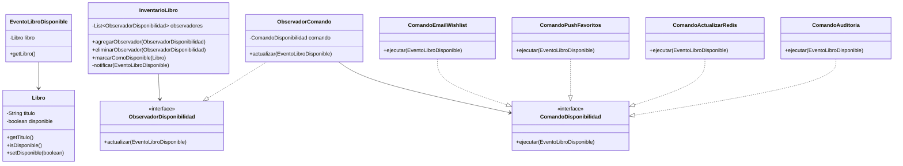

# Plantilla de entrega — Parcial 2

## Pregunta [05]: [patrones notificaciones]

### Estudiante

* **Nombre completo**: [Marlon Garcia]

---

### LLM utilizado

| Campo                           | Valor                                                                                                                                                                                                                                            |
| ------------------------------- | ------------------------------------------------------------------------------------------------------------------------------------------------------------------------------------------------------------------------------------------------ |
| **Nombre del LLM**              | ChatGPT                                                                                                                                                                                                                                          |
| **Modelo específico**           | GPT-5.5 Thinking                                                                                                                                                                                                                                 |
| **¿Por qué elegiste este LLM?** | Elegí este LLM porque permite organizar la solución de forma clara, se me hace perfecto para diseñar sistemas y arquitecturas, además para un código que no sea de producción se me hace adecuado y más que suficiente |

---

### Prompt utilizado

```
Contexto: En OpenLib Market un e-commerce de libros, con roles de comprador, vendedor y administrador, cuando un libro agotado vuelve a estar disponible, varios componentes del sistema necesitan reaccionar:

- Enviar notificación por correo a los usuarios que lo agregaron a su wishlist.
- Enviar notificación push a los usuarios que lo marcaron como favorito en la app móvil.
- Actualizar la caché de Redis para que aparezca en búsquedas.
- Registrar el evento en un log de auditoría.

Tarea: Diseña e implementa este sistema usando dos patrones de diseño GoF incluye observer ya que este funciona especificamente para notificar y hacer funciones de auditorias por eventos.

Diseñe e implemente este sistema de notificaciones usando dos patrones de diseño combinados de los vistos en clase. Debe incluir: diagrama de clases en Mermaid o texto, código Java de las clases principales, y explicación de por qué eligió esos dos patrones.
```

---

### Respuesta del LLM

Para este caso se pueden usar dos patrones de diseño trabajando juntos: **Observer** y **Command**.

El patrón **Observer** sirve porque cuando un libro vuelve a estar disponible, varios componentes del sistema necesitan enterarse automáticamente del evento. Es decir, el inventario cambia el estado del libro y notifica a todos los elementos interesados.

El patrón **Command** sirve porque cada reacción del sistema se puede representar como una acción independiente. Por ejemplo, enviar correo, enviar notificación push, actualizar Redis o registrar auditoría. Así, cada acción queda encapsulada en una clase distinta y el sistema es más fácil de extender.

---

## Diagrama de clases en Mermaid



---

## Código Java

```java
import java.util.ArrayList;
import java.util.List;

// ==========================
// MODELO
// ==========================

class Libro {
    private String titulo;
    private boolean disponible;

    public Libro(String titulo, boolean disponible) {
        this.titulo = titulo;
        this.disponible = disponible;
    }

    public String getTitulo() {
        return titulo;
    }

    public boolean isDisponible() {
        return disponible;
    }

    public void setDisponible(boolean disponible) {
        this.disponible = disponible;
    }
}

// ==========================
// EVENTO
// ==========================

class EventoLibroDisponible {
    private Libro libro;

    public EventoLibroDisponible(Libro libro) {
        this.libro = libro;
    }

    public Libro getLibro() {
        return libro;
    }
}

// ==========================
// OBSERVER
// ==========================

interface ObservadorDisponibilidad {
    void actualizar(EventoLibroDisponible evento);
}

// Este observador recibe el evento y ejecuta un comando.
class ObservadorComando implements ObservadorDisponibilidad {
    private ComandoDisponibilidad comando;

    public ObservadorComando(ComandoDisponibilidad comando) {
        this.comando = comando;
    }

    @Override
    public void actualizar(EventoLibroDisponible evento) {
        comando.ejecutar(evento);
    }
}

// Esta clase representa el sujeto observado.
class InventarioLibro {
    private List<ObservadorDisponibilidad> observadores = new ArrayList<>();

    public void agregarObservador(ObservadorDisponibilidad observador) {
        observadores.add(observador);
    }

    public void eliminarObservador(ObservadorDisponibilidad observador) {
        observadores.remove(observador);
    }

    public void marcarComoDisponible(Libro libro) {
        libro.setDisponible(true);

        EventoLibroDisponible evento = new EventoLibroDisponible(libro);
        notificar(evento);
    }

    private void notificar(EventoLibroDisponible evento) {
        for (ObservadorDisponibilidad observador : observadores) {
            observador.actualizar(evento);
        }
    }
}

// ==========================
// COMMAND
// ==========================

interface ComandoDisponibilidad {
    void ejecutar(EventoLibroDisponible evento);
}

class ComandoEmailWishlist implements ComandoDisponibilidad {
    @Override
    public void ejecutar(EventoLibroDisponible evento) {
        System.out.println(
            "Enviando correo a los usuarios que tenían en wishlist el libro: "
            + evento.getLibro().getTitulo()
        );
    }
}

class ComandoPushFavoritos implements ComandoDisponibilidad {
    @Override
    public void ejecutar(EventoLibroDisponible evento) {
        System.out.println(
            "Enviando notificación push a los usuarios que marcaron como favorito el libro: "
            + evento.getLibro().getTitulo()
        );
    }
}

class ComandoActualizarRedis implements ComandoDisponibilidad {
    @Override
    public void ejecutar(EventoLibroDisponible evento) {
        System.out.println(
            "Actualizando la caché de Redis para que el libro aparezca en búsquedas: "
            + evento.getLibro().getTitulo()
        );
    }
}

class ComandoAuditoria implements ComandoDisponibilidad {
    @Override
    public void ejecutar(EventoLibroDisponible evento) {
        System.out.println(
            "Registrando en auditoría que el libro volvió a estar disponible: "
            + evento.getLibro().getTitulo()
        );
    }
}

// ==========================
// EJEMPLO DE USO
// ==========================

public class Main {
    public static void main(String[] args) {
        Libro libro = new Libro("Design Patterns", false);

        InventarioLibro inventario = new InventarioLibro();

        inventario.agregarObservador(
            new ObservadorComando(new ComandoEmailWishlist())
        );

        inventario.agregarObservador(
            new ObservadorComando(new ComandoPushFavoritos())
        );

        inventario.agregarObservador(
            new ObservadorComando(new ComandoActualizarRedis())
        );

        inventario.agregarObservador(
            new ObservadorComando(new ComandoAuditoria())
        );

        inventario.marcarComoDisponible(libro);
    }
}
```

---

## Explicación de la solución

En este diseño, `InventarioLibro` es la clase encargada de manejar el estado de disponibilidad de un libro. Cuando un libro vuelve a estar disponible, se crea un evento llamado `EventoLibroDisponible`.

Después, el inventario notifica a todos los observadores registrados. Cada observador tiene asociado un comando específico, que representa una acción concreta del sistema.

Por ejemplo:

* un comando envía correos a usuarios de wishlist;
* otro comando envía notificaciones push;
* otro actualiza Redis;
* otro registra el evento en auditoría.

La ventaja de este diseño es que el inventario no necesita saber cómo funcionan internamente esos procesos. Solo notifica que ocurrió el evento. Luego, cada comando se encarga de ejecutar su propia lógica.

---

## Por qué se eligieron estos patrones

Se eligió **Observer** porque el problema parte de un evento que debe ser escuchado por varios componentes. Cuando cambia la disponibilidad del libro, varios servicios deben reaccionar.

Se eligió **Command** porque cada reacción puede encapsularse como una acción independiente. Esto evita meter toda la lógica en una sola clase y facilita agregar nuevas acciones en el futuro.

Por ejemplo, si después se necesita enviar una notificación por WhatsApp, no sería necesario modificar `InventarioLibro`. Solo se crearía una nueva clase, como `ComandoWhatsApp`, y se registraría como nuevo observador.

---

### Análisis crítico de la respuesta

#### 1. ¿Qué hizo bien el prompt?

El prompt fue claro porque presentó el contexto completo del problema de OpenLib Market. Específicamente, explicó qué evento debía manejar el sistema: que un libro agotado vuelve a estar disponible.

También fue útil incluir la lista de acciones que debían ocurrir:

* enviar correo;
* enviar push;
* actualizar Redis;
* registrar auditoría.

Eso ayudó a que la respuesta identificara correctamente que había varias reacciones ante un mismo evento. Además, el prompt pidió explícitamente usar “dos patrones de diseño combinados”, por lo que el LLM no se quedó solo con un patrón, sino que propuso una combinación.

Otra parte efectiva fue pedir el formato concreto de salida: diagrama de clases, código Java y explicación. Eso permitió que la respuesta quedara organizada y fácil de convertir en entrega.

#### 2. ¿Qué se puede mejorar?

El prompt se puede mejorar especificando el lenguaje y el nivel de detalle esperado. Aunque se pidió código Java, se podría haber aclarado si se quería Java 17, Java 21 el cual es el que estamos usando en clase o una implementación más simple sin frameworks.

Además, se podría pedir que el código fuera ejecutable en un solo archivo para facilitar la prueba. La respuesta generada tiene las clases principales, pero en un proyecto real sería mejor separar cada clase en su propio archivo.

Otra mejora posible sería pedir explícitamente que la solución no usara frameworks externos, ya que Redis, correo y push normalmente dependen de servicios reales. En este caso se usaron `System.out.println()` para simular esas acciones, lo cual está bien para este fin de resolver un punto, pero no representa una integración real.

#### 3. Respuesta final

Para resolver este problema usaría los patrones **Observer** y **Command** trabajando juntos.

El problema consiste en que, cuando un libro agotado vuelve a estar disponible, varios componentes deben reaccionar. No sería buena idea que una sola clase se encargue de enviar correos, enviar push, actualizar Redis y registrar auditoría, porque eso mezclaría demasiadas responsabilidades.

Por eso, con **Observer**, el inventario puede notificar automáticamente que ocurrió el evento de disponibilidad. Los observadores interesados reciben esa notificación.

Luego, con **Command**, cada acción se encapsula en una clase independiente. Así, enviar correo, enviar push, actualizar Redis y registrar auditoría no quedan pegados directamente a la lógica del inventario.

El diseño final funciona así:

1. `InventarioLibro` marca el libro como disponible.
2. Se crea un `EventoLibroDisponible`.
3. El inventario notifica a sus observadores.
4. Cada observador ejecuta un comando específico.
5. Cada comando realiza una acción concreta del sistema.

Este diseño es mejor porque separa responsabilidades y permite extender el sistema fácilmente. Si en el futuro se quiere agregar otra acción, como enviar SMS o WhatsApp, solo se crea un nuevo comando y se registra como observador, sin modificar la clase principal del inventario.

Además, esta solución se relaciona con principios SOLID:

* Cumple **SRP**, porque cada clase tiene una responsabilidad clara.
* Cumple **OCP**, porque se pueden agregar nuevas acciones sin modificar el inventario.
* Cumple **DIP**, porque se depende de interfaces como `ObservadorDisponibilidad` y `ComandoDisponibilidad`, no de clases concretas.

En conclusión, **Observer + Command** es una buena combinación porque Observer se encarga de comunicar que ocurrió el evento, mientras Command se encarga de encapsular cada reacción del sistema.
