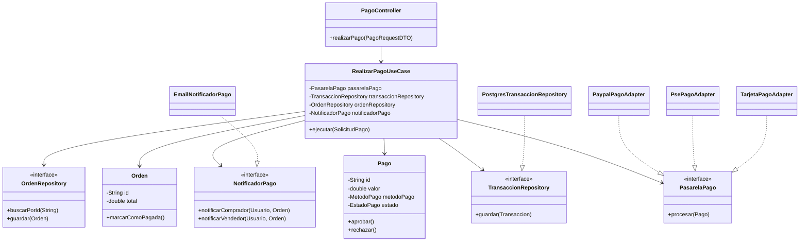
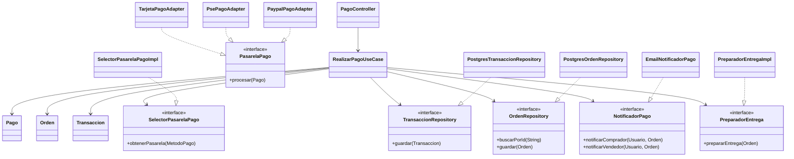

# Plantilla de entrega — Parcial 2

## Pregunta P_clean_architecture_pagos: Rediseño del módulo de pagos con Clean Architecture

### Estudiante

* **Nombre completo**: Marlon Garcia

---

### LLM utilizado

| Campo                           | Valor                                                                                                                                                                                                                                    |
| ------------------------------- | ---------------------------------------------------------------------------------------------------------------------------------------------------------------------------------------------------------------------------------------- |
| **Nombre del LLM**              | ChatGPT                                                                                                                                                                                                                                  |
| **Modelo específico**           | GPT-5.5 Thinking                                                                                                                                                                                                                         |
| **¿Por qué elegiste este LLM?** | Elegí este LLM porque permite analizar código y arquitectura de software con buena estructura, además de generar ejemplos claros en Java y explicar conceptos como Clean Architecture, inversión de dependencias y separación por capas. |

---

### Prompt utilizado

```
Estoy trabajando sobre OpenLib Market, un marketplace de libros. Necesito rediseñar el módulo de pagos aplicando Clean Architecture.

El módulo debe soportar:
- Procesar pagos con distintos métodos: tarjeta, PSE y PayPal.
- Registrar la transacción en una base de datos PostgreSQL.
- Notificar por correo al comprador y al vendedor.
- Exponer una API REST para que el frontend hecho en JavaFX pueda consumirla.

Actualmente el equipo puso todo en una sola clase llamada PaymentService, con un método realizarPago que hace demasiadas cosas: llama la pasarela de pago, guarda la transacción, envía correos, cambia el estado de la orden y prepara la entrega o descarga del libro.

Quiero que me ayudes a rediseñar este módulo usando Clean Architecture. La respuesta debe incluir:
1. Qué componentes van en cada capa: Entities, Use Cases, Interface Adapters y Frameworks & Drivers.
2. Un diagrama de estructura en Mermaid o ASCII.
3. Explicación de cómo se respeta la regla de dependencia.
4. Explicación de cómo se inyectan dependencias externas como PostgreSQL, correo y pasarelas de pago sin violar la arquitectura.
5. Una comparación breve con el diseño acoplado original.
```

---

### Respuesta del LLM

El módulo de pagos de OpenLib Market debe separarse en capas para evitar que una sola clase concentre responsabilidades de negocio, infraestructura y comunicación externa. La clase `PaymentService` actual viola la separación de responsabilidades porque procesa el pago, cambia el estado de la orden, guarda en base de datos, envía correos y coordina la entrega.

Con Clean Architecture, la lógica central debe quedar independiente de frameworks, bases de datos, APIs externas y detalles de transporte como REST.

---

## 1. Capas propuestas

### Entities

En esta capa van las clases del dominio. Representan conceptos centrales del negocio y no deben depender de PostgreSQL, Spring Boot, JavaFX, SMTP ni APIs externas.

Componentes:

```text
Pago
Orden
Transaccion
Usuario
MetodoPago
EstadoPago
EstadoOrden
```

Ejemplo:

```java
public class Pago {
    private String id;
    private double valor;
    private MetodoPago metodoPago;
    private EstadoPago estado;

    public Pago(String id, double valor, MetodoPago metodoPago) {
        this.id = id;
        this.valor = valor;
        this.metodoPago = metodoPago;
        this.estado = EstadoPago.PENDIENTE;
    }

    public void aprobar() {
        this.estado = EstadoPago.APROBADO;
    }

    public void rechazar() {
        this.estado = EstadoPago.RECHAZADO;
    }

    public double getValor() {
        return valor;
    }

    public MetodoPago getMetodoPago() {
        return metodoPago;
    }
}
```

```java
public enum MetodoPago {
    TARJETA,
    PSE,
    PAYPAL
}
```

```java
public enum EstadoPago {
    PENDIENTE,
    APROBADO,
    RECHAZADO
}
```

---

### Use Cases

En esta capa va la lógica de aplicación. El caso de uso principal sería:

```text
RealizarPagoUseCase
```

Este caso de uso coordina el proceso de pago, pero no debe depender directamente de PayPal, PSE, PostgreSQL o SMTP. Para eso usa interfaces.

Interfaces internas:

```java
public interface PasarelaPago {
    ResultadoPago procesar(Pago pago);
}
```

```java
public interface TransaccionRepository {
    void guardar(Transaccion transaccion);
}
```

```java
public interface OrdenRepository {
    Orden buscarPorId(String idOrden);
    void guardar(Orden orden);
}
```

```java
public interface NotificadorPago {
    void notificarComprador(Usuario comprador, Orden orden);
    void notificarVendedor(Usuario vendedor, Orden orden);
}
```

Caso de uso:

```java
public class RealizarPagoUseCase {

    private final PasarelaPago pasarelaPago;
    private final TransaccionRepository transaccionRepository;
    private final OrdenRepository ordenRepository;
    private final NotificadorPago notificadorPago;

    public RealizarPagoUseCase(
            PasarelaPago pasarelaPago,
            TransaccionRepository transaccionRepository,
            OrdenRepository ordenRepository,
            NotificadorPago notificadorPago
    ) {
        this.pasarelaPago = pasarelaPago;
        this.transaccionRepository = transaccionRepository;
        this.ordenRepository = ordenRepository;
        this.notificadorPago = notificadorPago;
    }

    public ResultadoPago ejecutar(SolicitudPago solicitud) {
        Orden orden = ordenRepository.buscarPorId(solicitud.getIdOrden());

        Pago pago = new Pago(
                solicitud.getIdPago(),
                orden.getTotal(),
                solicitud.getMetodoPago()
        );

        ResultadoPago resultado = pasarelaPago.procesar(pago);

        Transaccion transaccion = new Transaccion(pago, orden, resultado.isExitoso());
        transaccionRepository.guardar(transaccion);

        if (resultado.isExitoso()) {
            pago.aprobar();
            orden.marcarComoPagada();
            ordenRepository.guardar(orden);

            notificadorPago.notificarComprador(orden.getComprador(), orden);
            notificadorPago.notificarVendedor(orden.getVendedor(), orden);
        } else {
            pago.rechazar();
        }

        return resultado;
    }
}
```

---

### Interface Adapters

Aquí van las clases que conectan el mundo externo con los casos de uso. Traducen datos, implementan interfaces o adaptan tecnologías concretas.

Componentes:

```text
PagoController
PagoRequestDTO
PagoResponseDTO
PostgresTransaccionRepository
PostgresOrdenRepository
EmailNotificadorPago
TarjetaPagoAdapter
PsePagoAdapter
PaypalPagoAdapter
```

Controlador REST:

```java
@RestController
@RequestMapping("/api/pagos")
public class PagoController {

    private final RealizarPagoUseCase realizarPagoUseCase;

    public PagoController(RealizarPagoUseCase realizarPagoUseCase) {
        this.realizarPagoUseCase = realizarPagoUseCase;
    }

    @PostMapping
    public PagoResponseDTO realizarPago(@RequestBody PagoRequestDTO request) {
        SolicitudPago solicitud = new SolicitudPago(
                request.getIdPago(),
                request.getIdOrden(),
                request.getMetodoPago()
        );

        ResultadoPago resultado = realizarPagoUseCase.ejecutar(solicitud);

        return new PagoResponseDTO(
                resultado.isExitoso(),
                resultado.getMensaje()
        );
    }
}
```

Adaptador de PostgreSQL:

```java
public class PostgresTransaccionRepository implements TransaccionRepository {

    @Override
    public void guardar(Transaccion transaccion) {
        // Guardar transacción en PostgreSQL usando JDBC, JPA o Spring Data
    }
}
```

Adaptador de correo:

```java
public class EmailNotificadorPago implements NotificadorPago {

    @Override
    public void notificarComprador(Usuario comprador, Orden orden) {
        // Enviar correo al comprador
    }

    @Override
    public void notificarVendedor(Usuario vendedor, Orden orden) {
        // Enviar correo al vendedor
    }
}
```

Adaptadores de pasarela:

```java
public class PaypalPagoAdapter implements PasarelaPago {
    @Override
    public ResultadoPago procesar(Pago pago) {
        // Llamar API o SDK de PayPal
        return new ResultadoPago(true, "Pago PayPal aprobado");
    }
}
```

```java
public class PsePagoAdapter implements PasarelaPago {
    @Override
    public ResultadoPago procesar(Pago pago) {
        // Llamar API de PSE
        return new ResultadoPago(true, "Pago PSE aprobado");
    }
}
```

```java
public class TarjetaPagoAdapter implements PasarelaPago {
    @Override
    public ResultadoPago procesar(Pago pago) {
        // Llamar pasarela de tarjeta
        return new ResultadoPago(true, "Pago con tarjeta aprobado");
    }
}
```

---

### Frameworks & Drivers

Esta capa contiene detalles técnicos externos:

```text
Spring Boot
PostgreSQL
SMTP
PayPal API
PSE API
API bancaria para tarjetas
JavaFX
Servidor web
JPA / JDBC
```

Estos elementos no deben ser conocidos por las entidades ni por los casos de uso. Son detalles reemplazables.

---

## 2. Diagrama de estructura



---

## 3. Regla de dependencia

La regla de dependencia se respeta porque las dependencias apuntan hacia adentro:

```text
Frameworks & Drivers
        ↓
Interface Adapters
        ↓
Use Cases
        ↓
Entities
```

El controlador REST conoce al caso de uso, pero el caso de uso no conoce al controlador.

El caso de uso conoce interfaces como `PasarelaPago`, `TransaccionRepository` y `NotificadorPago`, pero no conoce implementaciones concretas como `PaypalPagoAdapter`, `PostgresTransaccionRepository` o `EmailNotificadorPago`.

Las entidades como `Pago` y `Orden` no dependen de Spring Boot, PostgreSQL, SMTP ni APIs externas.

---

## 4. Inyección de dependencias externas

Las dependencias externas se conectan desde la capa externa. Por ejemplo, con configuración de Spring:

```java
@Configuration
public class PaymentConfig {

    @Bean
    public RealizarPagoUseCase realizarPagoUseCase(
            PasarelaPago pasarelaPago,
            TransaccionRepository transaccionRepository,
            OrdenRepository ordenRepository,
            NotificadorPago notificadorPago
    ) {
        return new RealizarPagoUseCase(
                pasarelaPago,
                transaccionRepository,
                ordenRepository,
                notificadorPago
        );
    }

    @Bean
    public PasarelaPago pasarelaPago() {
        return new PaypalPagoAdapter();
    }

    @Bean
    public TransaccionRepository transaccionRepository() {
        return new PostgresTransaccionRepository();
    }

    @Bean
    public NotificadorPago notificadorPago() {
        return new EmailNotificadorPago();
    }
}
```

Así, `RealizarPagoUseCase` no crea directamente objetos externos. No usa `new PaypalPagoAdapter()`, no abre conexiones a PostgreSQL y no instancia servicios SMTP. Todo eso se inyecta desde afuera.

---

## 5. Comparación con el diseño original

Diseño original:

```text
PaymentService.realizarPago()
- procesa pago
- guarda transacción
- envía correos
- cambia estado de orden
- prepara entrega
- conoce APIs externas
- conoce base de datos
```

Diseño con Clean Architecture:

```text
PagoController: recibe la petición REST.
RealizarPagoUseCase: coordina la lógica del pago.
Pago / Orden / Transaccion: representan el dominio.
PasarelaPago: abstracción para métodos de pago.
TransaccionRepository: abstracción para persistencia.
NotificadorPago: abstracción para correos.
Adaptadores externos: PostgreSQL, SMTP, PayPal, PSE, tarjeta.
```

El nuevo diseño es más mantenible, más flexible y más fácil de probar.

---

### Análisis crítico de la respuesta

#### 1. ¿Qué hizo bien el prompt?

El prompt fue claro porque dio suficiente contexto del sistema OpenLib Market y explicó el problema actual: una clase `PaymentService` con un método `realizarPago` que concentra varias responsabilidades.

Una parte efectiva del prompt fue pedir explícitamente que se separara el sistema en las capas de Clean Architecture: “Entities, Use Cases, Interface Adapters y Frameworks & Drivers”. Eso ayudó a que la respuesta quedara organizada.

También funcionó pedir un diagrama, explicación de la regla de dependencia e inyección de dependencias externas. Esto obligó al LLM a no quedarse solo en teoría, sino a aplicar la arquitectura al caso específico de pagos.

---

#### 2. ¿Qué se puede mejorar?

El prompt pudo pedir más detalle sobre cómo seleccionar dinámicamente la pasarela de pago según el método escogido: tarjeta, PSE o PayPal. La respuesta menciona adaptadores para cada pasarela, pero no profundiza mucho en cómo elegir cuál usar en tiempo de ejecución.

También se pudo pedir explícitamente que el frontend JavaFX no debe estar en el backend ni en los casos de uso, sino consumir la API REST como cliente externo.

La respuesta fue correcta en general, pero se podría mejorar agregando un `PasarelaPagoFactory` o un selector de pasarelas para decidir qué adaptador usar según el método de pago. Además, sería bueno separar la preparación de entrega o descarga en otro caso de uso o servicio interno, porque no necesariamente debería quedar mezclado con el procesamiento del pago.

---

#### 3. Respuesta final

Para rediseñar el módulo de pagos de OpenLib Market con Clean Architecture, lo primero es eliminar la clase acoplada `PaymentService`, ya que tiene demasiadas responsabilidades. El método `realizarPago` mezcla lógica de negocio, infraestructura, comunicación externa y actualización de estado.

La solución es separar el módulo en capas concéntricas donde las dependencias siempre apunten hacia adentro.

---

## Entities

En la capa de entidades van los objetos principales del negocio:

```text
Pago
Orden
Transaccion
Usuario
MetodoPago
EstadoPago
EstadoOrden
```

Estas clases representan reglas del dominio. Por ejemplo, un pago puede estar pendiente, aprobado o rechazado; una orden puede pasar a estado pagada; una transacción registra el resultado de un intento de pago.

Estas entidades no deben importar clases de Spring Boot, PostgreSQL, JavaFX, SMTP, PayPal ni PSE.

Ejemplo:

```java
public class Pago {
    private String id;
    private double valor;
    private MetodoPago metodoPago;
    private EstadoPago estado;

    public Pago(String id, double valor, MetodoPago metodoPago) {
        this.id = id;
        this.valor = valor;
        this.metodoPago = metodoPago;
        this.estado = EstadoPago.PENDIENTE;
    }

    public void aprobar() {
        this.estado = EstadoPago.APROBADO;
    }

    public void rechazar() {
        this.estado = EstadoPago.RECHAZADO;
    }
}
```

---

## Use Cases

En la capa de casos de uso va la lógica de aplicación. El caso principal sería:

```text
RealizarPagoUseCase
```

Este caso de uso coordina el proceso:

1. Buscar la orden.
2. Crear el pago.
3. Procesar el pago con la pasarela correspondiente.
4. Registrar la transacción.
5. Cambiar el estado de la orden.
6. Notificar al comprador y al vendedor.
7. Activar el proceso de entrega o descarga si el pago fue exitoso.

El caso de uso debe depender de abstracciones:

```java
public interface PasarelaPago {
    ResultadoPago procesar(Pago pago);
}
```

```java
public interface SelectorPasarelaPago {
    PasarelaPago obtenerPasarela(MetodoPago metodoPago);
}
```

```java
public interface TransaccionRepository {
    void guardar(Transaccion transaccion);
}
```

```java
public interface OrdenRepository {
    Orden buscarPorId(String idOrden);
    void guardar(Orden orden);
}
```

```java
public interface NotificadorPago {
    void notificarComprador(Usuario comprador, Orden orden);
    void notificarVendedor(Usuario vendedor, Orden orden);
}
```

```java
public interface PreparadorEntrega {
    void prepararEntrega(Orden orden);
}
```

Caso de uso:

```java
public class RealizarPagoUseCase {

    private final SelectorPasarelaPago selectorPasarelaPago;
    private final TransaccionRepository transaccionRepository;
    private final OrdenRepository ordenRepository;
    private final NotificadorPago notificadorPago;
    private final PreparadorEntrega preparadorEntrega;

    public RealizarPagoUseCase(
            SelectorPasarelaPago selectorPasarelaPago,
            TransaccionRepository transaccionRepository,
            OrdenRepository ordenRepository,
            NotificadorPago notificadorPago,
            PreparadorEntrega preparadorEntrega
    ) {
        this.selectorPasarelaPago = selectorPasarelaPago;
        this.transaccionRepository = transaccionRepository;
        this.ordenRepository = ordenRepository;
        this.notificadorPago = notificadorPago;
        this.preparadorEntrega = preparadorEntrega;
    }

    public ResultadoPago ejecutar(SolicitudPago solicitud) {
        Orden orden = ordenRepository.buscarPorId(solicitud.getIdOrden());

        Pago pago = new Pago(
                solicitud.getIdPago(),
                orden.getTotal(),
                solicitud.getMetodoPago()
        );

        PasarelaPago pasarela = selectorPasarelaPago.obtenerPasarela(solicitud.getMetodoPago());

        ResultadoPago resultado = pasarela.procesar(pago);

        Transaccion transaccion = new Transaccion(pago, orden, resultado.isExitoso());
        transaccionRepository.guardar(transaccion);

        if (resultado.isExitoso()) {
            pago.aprobar();
            orden.marcarComoPagada();
            ordenRepository.guardar(orden);

            notificadorPago.notificarComprador(orden.getComprador(), orden);
            notificadorPago.notificarVendedor(orden.getVendedor(), orden);

            preparadorEntrega.prepararEntrega(orden);
        } else {
            pago.rechazar();
        }

        return resultado;
    }
}
```

---

## Interface Adapters

En esta capa van los adaptadores que conectan el exterior con los casos de uso.

Componentes:

```text
PagoController
PagoRequestDTO
PagoResponseDTO
PostgresTransaccionRepository
PostgresOrdenRepository
EmailNotificadorPago
TarjetaPagoAdapter
PsePagoAdapter
PaypalPagoAdapter
SelectorPasarelaPagoImpl
PreparadorEntregaImpl
```

El controlador REST debe estar aislado de la lógica de negocio. Su trabajo es recibir la solicitud, convertirla a un objeto de entrada y llamar al caso de uso.

```java
@RestController
@RequestMapping("/api/pagos")
public class PagoController {

    private final RealizarPagoUseCase realizarPagoUseCase;

    public PagoController(RealizarPagoUseCase realizarPagoUseCase) {
        this.realizarPagoUseCase = realizarPagoUseCase;
    }

    @PostMapping
    public PagoResponseDTO realizarPago(@RequestBody PagoRequestDTO request) {
        SolicitudPago solicitud = new SolicitudPago(
                request.getIdPago(),
                request.getIdOrden(),
                request.getMetodoPago()
        );

        ResultadoPago resultado = realizarPagoUseCase.ejecutar(solicitud);

        return new PagoResponseDTO(resultado.isExitoso(), resultado.getMensaje());
    }
}
```

Ejemplo de selector de pasarela:

```java
public class SelectorPasarelaPagoImpl implements SelectorPasarelaPago {

    private final PasarelaPago tarjetaPagoAdapter;
    private final PasarelaPago psePagoAdapter;
    private final PasarelaPago paypalPagoAdapter;

    public SelectorPasarelaPagoImpl(
            PasarelaPago tarjetaPagoAdapter,
            PasarelaPago psePagoAdapter,
            PasarelaPago paypalPagoAdapter
    ) {
        this.tarjetaPagoAdapter = tarjetaPagoAdapter;
        this.psePagoAdapter = psePagoAdapter;
        this.paypalPagoAdapter = paypalPagoAdapter;
    }

    @Override
    public PasarelaPago obtenerPasarela(MetodoPago metodoPago) {
        return switch (metodoPago) {
            case TARJETA -> tarjetaPagoAdapter;
            case PSE -> psePagoAdapter;
            case PAYPAL -> paypalPagoAdapter;
        };
    }
}
```

---

## Frameworks & Drivers

Aquí van los detalles externos:

```text
Spring Boot
JavaFX
PostgreSQL
SMTP
PayPal API
PSE API
API bancaria de tarjeta
JPA / JDBC
Servidor web
```

JavaFX no debe contener la lógica del pago. Solo consume la API REST expuesta por el backend.

PostgreSQL, SMTP y las pasarelas son detalles externos que se conectan mediante adaptadores.

---

## Diagrama de estructura



---

## Regla de dependencia

La regla de dependencia se respeta porque las capas externas dependen de las internas, pero no al revés.

```text
Frameworks & Drivers
        ↓
Interface Adapters
        ↓
Use Cases
        ↓
Entities
```

El caso de uso no conoce PostgreSQL, SMTP, PayPal, PSE ni Spring Boot. Solo conoce interfaces internas.

Las implementaciones concretas están afuera y se conectan mediante inyección de dependencias.

---

## Inyección de dependencias

La inyección se hace desde la capa externa, por ejemplo con configuración de Spring Boot:

```java
@Configuration
public class PaymentConfig {

    @Bean
    public RealizarPagoUseCase realizarPagoUseCase(
            SelectorPasarelaPago selectorPasarelaPago,
            TransaccionRepository transaccionRepository,
            OrdenRepository ordenRepository,
            NotificadorPago notificadorPago,
            PreparadorEntrega preparadorEntrega
    ) {
        return new RealizarPagoUseCase(
                selectorPasarelaPago,
                transaccionRepository,
                ordenRepository,
                notificadorPago,
                preparadorEntrega
        );
    }
}
```

Así el caso de uso recibe las dependencias listas, pero no las construye ni conoce sus detalles.

---

## Testeabilidad

Este diseño es mucho más testeable que la clase `PaymentService` original.

Antes, para probar `realizarPago`, había que lidiar con base de datos, correo, pasarelas externas, estado de orden y entrega al mismo tiempo.

Ahora se puede probar `RealizarPagoUseCase` usando mocks o fakes:

```text
FakeSelectorPasarelaPago
FakeTransaccionRepository
FakeOrdenRepository
FakeNotificadorPago
FakePreparadorEntrega
```

Esto permite probar la lógica del pago sin conectarse a PostgreSQL, sin enviar correos reales y sin llamar APIs externas.

---

## Conclusión

El rediseño aplica Clean Architecture porque separa correctamente el dominio, los casos de uso, los adaptadores y los detalles externos.

El controlador REST queda aislado de la lógica de negocio. PostgreSQL, correo y pasarelas de pago quedan como implementaciones externas. Las entidades y casos de uso quedan protegidos de cambios tecnológicos.

Frente al diseño original con `PaymentService`, esta solución es más clara, mantenible, extensible y fácil de probar.
