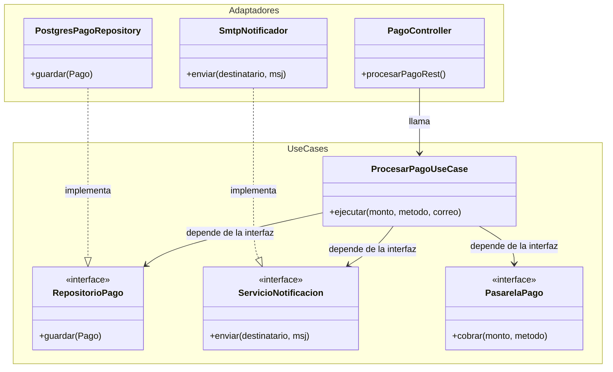

# Plantilla de entrega — Parcial 2

---

## Pregunta P07: Clean Architecture — Modulo de Pagos

### Estudiante
- **Nombre completo**: Ivan Wright

---

### LLM utilizado

| Campo | Valor |
|---|---|
| **Nombre del LLM** | Gemini |
| **Modelo especifico** | Gemini 3.1 Pro |
| **¿Por que elegiste este LLM?** | Lo elegi porque es espectacular generando diagramas Mermaid y estructurando carpetas y capas de Clean Architecture para Java sin enredarse. |

---

### Prompt utilizado

> **Si respondiste sin IA, omite esta sección y ve directamente a Análisis crítico.**

```text
hola gemini, actua como un arquitecto de software senior en java.

[CONTEXTO]
En OpenLib Market tenemos un modulo de gestion de pagos que esta super acoplado. Todo esta metido en una sola clase `PaymentService` con un metodo `realizarPago` que llama a la pasarela (tarjeta, PSE, PayPal), envia correos de notificacion, cambia el estado de la orden en la base de datos PostgreSQL y devuelve informacion a una API REST que la consume un frontend en JavaFX.

[PROBLEMA]
Necesito que rediseñes este modulo aplicando Clean Architecture. Tienes que definir exactamente que va en cada capa (Entities, Use Cases, Interface Adapters, Frameworks & Drivers), dibujar un diagrama de la estructura en Mermaid y explicarme paso a paso como estas inyectando las dependencias externas para no violar la arquitectura.

[RESTRICCIONES]
- Debes aplicar el Principio de Inversion de Dependencia (DIP) para aislar la base de datos y el servicio de correos del caso de uso principal.
- La regla de dependencia estricta debe respetarse (las capas internas no pueden conocer nada de las externas).
- Escribe el codigo en Java moderno.

[FORMATO]
Entregame todo en markdown. Quiero ver la estructura de las capas, el diagrama mermaid, y los bloques de codigo java con comentarios explicando por que se ubican en esa capa especifica.

[VALIDACION]
Sabre que tu diseño es correcto si en el futuro puedo cambiar PostgreSQL por MongoDB o el proveedor de correos sin tener que tocar ni una sola linea de la logica central del modulo de pagos.
```

---

### Respuesta del LLM

> **Si respondiste sin IA, omite esta sección y ve directamente a Análisis crítico.**

```markdown
¡Hola! Entiendo perfectamente el problema. El clásico `PaymentService` acoplado es lo que llamamos un "God Object" (Objeto Dios) que hace de todo y conoce detalles de bases de datos, redes y APIs. Vamos a desacoplarlo radicalmente usando **Clean Architecture**.

### 1. Definición de las Capas

1. **Entities (Entidades de Negocio)**: Las reglas puras del pago. No saben de correos ni de bases de datos. Aquí vivirá nuestra clase `Pago`.
2. **Use Cases (Casos de Uso)**: La orquestación. Tendremos un `ProcesarPagoUseCase` que dicta los pasos lógicos (validar, pagar, notificar, guardar), pero no sabe *cómo* se ejecutan técnicamente. Para ello, define "Puertos" (Interfaces).
3. **Interface Adapters (Adaptadores)**: Los traductores. Aquí estará el controlador REST (`PagoController`) y los adaptadores que implementan las interfaces del caso de uso (`PostgresPagoRepository`, `SmtpNotificador`).
4. **Frameworks & Drivers**: Los detalles externos y pesados. Spring Boot, la base de datos PostgreSQL, la librería de correo y el propio cliente JavaFX.

### 2. Estructura y Diagrama (Mermaid)

Para asegurar que las dependencias fluyan solo hacia adentro (Regla de Dependencia), usamos el **Principio de Inversión de Dependencias (DIP)** en los límites.



### 3. Implementación en Java y Regla de Dependencia

**Capa 1: Entidades (Aislada de todo)**
```java
package com.openlib.pagos.domain.entities;

public class Pago {
    private String transaccionId;
    private double monto;
    private String estado; // PENDIENTE, APROBADO
    
    public Pago(double monto) { this.monto = monto; this.estado = "PENDIENTE"; }
    public void aprobar() { this.estado = "APROBADO"; }
}
```

**Capa 2: Casos de Uso y Puertos (Inversión de Dependencia)**
Aquí es donde ocurre la magia. El caso de uso dicta las reglas pero obliga a los de afuera a ajustarse a sus interfaces.

```java
package com.openlib.pagos.domain.usecases;
import com.openlib.pagos.domain.entities.Pago;

// Puertos que definen lo que el Caso de Uso exige (Interfaces)
public interface RepositorioPago { void guardar(Pago pago); }
public interface ServicioNotificacion { void enviar(String usuario, String mensaje); }
public interface PasarelaPago { boolean cobrar(double monto, String metodo); }

// El Caso de Uso principal
public class ProcesarPagoUseCase {
    // Las dependencias se inyectan como Abstracciones, no como implementaciones concretas
    private final RepositorioPago repo;
    private final ServicioNotificacion notificador;
    private final PasarelaPago pasarela;
    
    public ProcesarPagoUseCase(RepositorioPago repo, ServicioNotificacion notif, PasarelaPago pasarela) {
        this.repo = repo;
        this.notificador = notif;
        this.pasarela = pasarela;
    }
    
    public Pago ejecutar(double monto, String metodo, String correoUsuario) {
        Pago pago = new Pago(monto);
        
        if (pasarela.cobrar(monto, metodo)) {
            pago.aprobar();
            repo.guardar(pago);
            notificador.enviar(correoUsuario, "Tu pago fue aprobado exitosamente");
        }
        return pago;
    }
}
```

**Capas 3 y 4: Adaptadores, Frameworks y Drivers**
La capa externa implementa las interfaces y orquesta la inyección (ej. a través de Spring).

```java
package com.openlib.pagos.infrastructure.adapters;
import org.springframework.stereotype.Repository;

// Implementación del Repositorio (Detalle de PostgreSQL que apunta hacia adentro)
@Repository
public class PostgresPagoRepository implements RepositorioPago {
    @Override
    public void guardar(Pago pago) {
        // Código SQL/JPA acoplado a PostgreSQL
        System.out.println("Guardando transacción en PostgreSQL...");
    }
}

// Adaptador de Entrada (REST Controller consumido por JavaFX)
@RestController
@RequestMapping("/api/pagos")
public class PagoController {
    // Spring inyecta el UseCase ya construido con los adaptadores correctos
    private final ProcesarPagoUseCase procesarPagoUseCase;
    
    public PagoController(ProcesarPagoUseCase procesarPagoUseCase) {
        this.procesarPagoUseCase = procesarPagoUseCase;
    }
    
    @PostMapping
    public ResponseEntity<?> procesar(@RequestBody PagoRequest req) {
        // El controlador solo traduce la petición web y llama al caso de uso
        Pago resultado = procesarPagoUseCase.ejecutar(req.getMonto(), req.getMetodo(), req.getCorreo());
        return ResponseEntity.ok(resultado);
    }
}
```

### 4. ¿Por qué tu diseño está protegido? (Validación)
Tu caso de uso `ProcesarPagoUseCase` solo sabe que existe una interfaz `ServicioNotificacion` y un `RepositorioPago`. No tiene ninguna importación de Spring, ni de SQL, ni de SMTP. Si mañana decides cambiar PostgreSQL por MongoDB, solo creas la clase `MongoPagoRepository implements RepositorioPago` y **no tocas ni una sola línea de la lógica del módulo de pagos**. El acoplamiento ha desaparecido.
```

---

### Analisis critico de la respuesta

#### 1. ¿Que hizo bien el prompt?

El prompt fue muy efectivo porque fui super estricto con las restricciones de Clean Architecture. Al exigirle que usara el Principio de Inversion de Dependencia (DIP) y pedirle explicitamente que justificara como aislaba la base de datos y los correos, logre que el LLM no me diera un codigo generico sino uno que realmente se adapta a la necesidad de OpenLib Market. *La validacion final fue clave para asegurarme de que el diseño cumpliera su proposito real: poder cambiar de base de datos sin romper nada*.


#### 2. ¿Que se puede mejorar?

A mi prompt le falto pedirle que incluyera una capa de validacion para los datos de entrada (Data Transfer Objects o DTOs). *Como sabemos, pasar los objetos o valores crudos directamente desde el controlador al caso de uso puede ser mala practica si no sanitizamos la entrada*. El LLM uso un objeto `PagoRequest` en el controlador, lo cual esta bien, pero omitio explicar como se mapean esos datos hacia el caso de uso de manera robusta.


#### 3. Respuesta final

El LLM hizo un trabajo excelente ubicando cada componente. La entidad `Pago` quedo totalmente limpia de dependencias, y el controlador REST quedo perfectamente aislado, sirviendo solo como un puente (Interface Adapter) que recibe la peticion y llama al `ProcesarPagoUseCase`. 

La regla de dependencia se respeta en todo el diseño gracias a las interfaces (`RepositorioPago`, `ServicioNotificacion`, etc.). *No hay dependencias cruzando en la direccion equivocada porque el controlador (afuera) llama al caso de uso (adentro), y el repositorio de Postgres (afuera) implementa la interfaz que definio el caso de uso (adentro)*.

Este diseño es infinitamente mas testeable que el `PaymentService` original acoplado. En el diseño anterior, si queriamos probar el pago, estabamos obligados a levantar una base de datos Postgres real y mandar correos de verdad. *Ahora, gracias a que el caso de uso recibe las dependencias por constructor (Inyeccion de Dependencias), en las pruebas unitarias de JUnit simplemente le paso un Mock de la base de datos y un Mock del notificador, logrando pruebas ultrarrapidas y 100% aisladas de la infraestructura real*.
