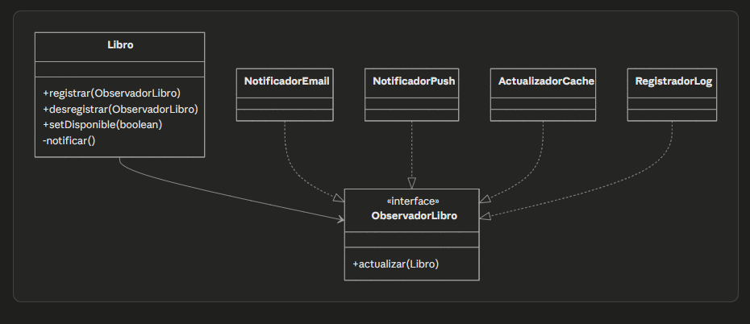

# Plantilla de entrega — Parcial 2

> **Instrucción**: Copia esta plantilla para cada pregunta del parcial. Reemplaza `[Pregunta XX]` por el identificador correcto (ej: `P01_solid_srp`) y completa todas las secciones. Haz al menos 2 commits por pregunta: uno con el prompt + respuesta del LLM, y otro con el análisis.

---

## Pregunta [P05_patron_notificaciones]

### Estudiante
- **Nombre completo**: [Alejandro Andres Perez Diaz]

---

### LLM utilizado

| Campo | Valor |
|---|---|
| **Nombre del LLM** | [Claude] |
| **Modelo específico** | [sonet 4.6] |
| **¿Por qué elegiste este LLM?** | [Mejor ia opinion personal] |

---

### Prompt utilizado

> **Si respondiste sin IA, omite esta sección y ve directamente a Análisis crítico.**

```
[Actúa como Ingeniero de Software Senior. Diseña e implementa el sistema de notificaciones de OpenLib Market cuando un libro agotado vuelve a estar disponible. El sistema debe notificar por email a usuarios de wishlist, enviar push a favoritos, actualizar caché Redis y registrar en log de auditoría. Usa dos patrones de diseño combinados de los vistos en clase, justifica por qué los elegiste y descarta al menos una alternativa. Incluye el  diagrama de clases , código Java de las clases principales.

Un buen prompt incluye:
- Contexto del proyecto OpenLib Market
- El código o situación específica
- Lo que esperas que el LLM haga
- Restricciones (ej: "usa Java 21", "aplica SOLID")
- Formato de salida esperado (ej: "respuesta en markdown con código Java")]
```

---

### Respuesta del LLM

> **Si respondiste sin IA, omite esta sección y ve directamente a Análisis crítico.**
[Los dos patrones: Observer + Factory Method
javapublic interface ObservadorLibro {
    void actualizar(Libro libro);
}

public class Libro {
    private List<ObservadorLibro> observadores = new ArrayList<>();
    private boolean disponible;

    public void registrar(ObservadorLibro o) {
        observadores.add(o);
    }

    public void desregistrar(ObservadorLibro o) {
        observadores.remove(o);
    }

    public void setDisponible(boolean disponible) {
        this.disponible = disponible;
        if (disponible) notificar();
    }

    private void notificar() {
        for (ObservadorLibro o : observadores) {
            try {
                o.actualizar(this);
            } catch (Exception e) {
                Logger.getLogger("OpenLib").warning("Fallo en observador: " + e.getMessage());
            }
        }
    }
}
javapublic class NotificadorEmail implements ObservadorLibro {
    public void actualizar(Libro libro) {
        // enviar email a usuarios de wishlist
        System.out.println("Email enviado: " + libro.getTitulo());
    }
}

public class NotificadorPush implements ObservadorLibro {
    public void actualizar(Libro libro) {
        // enviar push a favoritos
        System.out.println("Push enviado: " + libro.getTitulo());
    }
}

public class ActualizadorCache implements ObservadorLibro {
    public void actualizar(Libro libro) {
        // actualizar Redis
        System.out.println("Cache actualizada: " + libro.getTitulo());
    }
}

public class RegistradorLog implements ObservadorLibro {
    public void actualizar(Libro libro) {
        System.out.println("Log registrado: " + libro.getTitulo());
    }
}
Factory Method:
javapublic abstract class NotificadorFactory {
    public abstract ObservadorLibro crearNotificador();
}

public class EmailFactory extends NotificadorFactory {
    public ObservadorLibro crearNotificador() {
        return new NotificadorEmail();
    }
}

public class PushFactory extends NotificadorFactory {
    public ObservadorLibro crearNotificador() {
        return new NotificadorPush();
    }
}
Diagrama:

.

Si el LLM generó código, asegúrate de que esté correctamente formateado.
Si tuviste que hacer varias iteraciones, pega la MEJOR respuesta obtenida,
pero menciona cuántas iteraciones hiciste.]
```

---

### Análisis crítico de la respuesta


