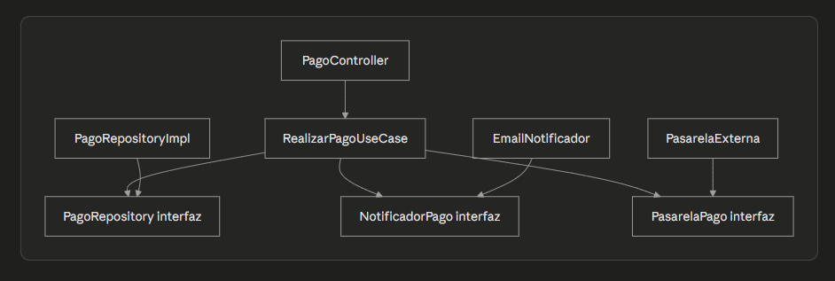

# Plantilla de entrega — Parcial 2

> **Instrucción**: Copia esta plantilla para cada pregunta del parcial. Reemplaza `[Pregunta XX]` por el identificador correcto (ej: `P01_solid_srp`) y completa todas las secciones. Haz al menos 2 commits por pregunta: uno con el prompt + respuesta del LLM, y otro con el análisis.

---

## Pregunta [P07_clean_architecture]

### Estudiante
- **Nombre completo**: [Alejandro Andres Perez Diaz]

---

### LLM utilizado

| Campo | Valor |
|---|---|
| **Nombre del LLM** | [Claude ] |
| **Modelo específico** | [Sonet 4.6 |
| **¿Por qué elegiste este LLM?** | [mejor ia opnion persnal] |

---

### Prompt utilizado

> **Si respondiste sin IA, omite esta sección y ve directamente a Análisis crítico.**

```
[Actúa como Ingeniero de Software Senior. Rediseña el módulo de pagos de OpenLib Market aplicando Clean Architecture. Define qué va en cada capa: Entities, Use Cases, Interface Adapters y Frameworks & Drivers. Dibuja un diagrama en Mermaid de la estructura, muestra cómo se respeta la regla de dependencia y explica cómo se inyectan las dependencias externas sin violar la arquitectura.

Un buen prompt incluye:
- Contexto del proyecto OpenLib Market
- El código o situación específica
- Lo que esperas que el LLM haga
- Restricciones (ej: "usa Java 21", "aplica SOLID")
- Formato de salida esperado (ej: "respuesta en markdown con código Java")]
```

---

### Respuesta del LLM

> **Si respondiste sin IA, omite esta sección y ve directamente a Análisis crítico.**
[Entities:
javapublic class Pago {
    private String id;
    private double monto;
    private EstadoPago estado;
    
    public void confirmar() {
        this.estado = EstadoPago.CONFIRMADO;
    }
}

public class Orden {
    private String id;
    private Pago pago;
    
    public void marcarPagada() {
        this.pago.confirmar();
    }
}
Use Cases:
javapublic interface PagoRepository {
    void guardar(Pago pago);
}

public interface NotificadorPago {
    void notificar(Pago pago);
}

public interface PasarelaPago {
    boolean procesar(Pago pago);
}

public class RealizarPagoUseCase {
    private final PagoRepository repositorio;
    private final NotificadorPago notificador;
    private final PasarelaPago pasarela;

    public RealizarPagoUseCase(PagoRepository repositorio,
                                NotificadorPago notificador,
                                PasarelaPago pasarela) {
        this.repositorio = repositorio;
        this.notificador = notificador;
        this.pasarela = pasarela;
    }

    public void ejecutar(Pago pago) {
        pasarela.procesar(pago);
        pago.confirmar();
        repositorio.guardar(pago);
        notificador.notificar(pago);
    }
}
Interface Adapters:
javapublic class PagoController {
    private final RealizarPagoUseCase useCase;

    public ResponseEntity pagar(@RequestBody PagoDTO dto) {
        useCase.ejecutar(dto.toDomain());
        return ResponseEntity.ok().build();
    }
}

public class PagoRepositoryImpl implements PagoRepository {
    public void guardar(Pago pago) {
        // lógica PostgreSQL
    }
}

public class EmailNotificador implements NotificadorPago {
    public void notificar(Pago pago) {
        // enviar email
    }
}
Frameworks & Drivers:
Spring Boot, PostgreSQL, SMTP, pasarela externa de pagos. No contienen lógica de negocio.

Cómo se respeta la regla de dependencia
Pago y Orden no saben nada de Spring ni de PostgreSQL. RealizarPagoUseCase solo conoce interfaces, nunca implementaciones concretas. Las implementaciones concretas como PagoRepositoryImpl están en la capa de adaptadores y apuntan hacia adentro implementando las interfaces del caso de uso.

Si el LLM generó código, asegúrate de que esté correctamente formateado.
Si tuviste que hacer varias iteraciones, pega la MEJOR respuesta obtenida,
pero menciona cuántas iteraciones hiciste.]
```

---

### Análisis crítico de la respuesta

#### 1. ¿Qué hizo bien el prompt?

[Evalúa tu propio prompt, no la respuesta del LLM. ¿El contexto fue suficiente? ¿Las restricciones fueron claras? ¿El formato de salida que pediste ayudó a obtener una buena respuesta? ¿Qué parte de tu prompt fue más efectiva? Sé específico: menciona fragmentos concretos de tu prompt que funcionaron bien.]


#### 2. ¿Qué se puede mejorar?

[¿Qué le faltó a tu prompt? ¿Qué harías diferente si pudieras reformularlo? ¿El LLM entendió mal algo por falta de claridad en tu prompt? ¿La respuesta tiene errores u omisiones? ¿Qué no cubrió el LLM que tú sí sabes por lo visto en clase?]


#### 3. Respuesta final

[Escribe tu respuesta definitiva a la pregunta del parcial, integrando lo que aprendiste del LLM pero yendo más allá. Corrige errores, llena omisiones, conecta con conceptos vistos en clase. Esta es tu respuesta: demuestra que tú dominas el tema.]
