# Plantilla de entrega — Parcial 2

> **Instrucción**: Copia esta plantilla para cada pregunta del parcial. Reemplaza `[Pregunta XX]` por el identificador correcto (ej: `P01_solid_srp`) y completa todas las secciones. Haz al menos 2 commits por pregunta: uno con el prompt + respuesta del LLM, y otro con el análisis.

---

## Pregunta 05: Patrones de diseño — Sistema de notificaciones

### Estudiante
- **Nombre completo**: Federico Restrepo

---

### LLM utilizado

| Campo | Valor |
|---|---|
| **Nombre del LLM** | Claude |
| **Modelo específico** | Claude Sonnet 4.5 |
| **¿Por qué elegiste este LLM?** | Elegí Claude Sonnet 4.5 porque maneja bien la combinación de múltiples patrones de diseño y produce diagramas Mermaid correctos junto con código Java limpio. |

---

### Prompt utilizado

> **Si respondiste sin IA, omite esta sección y ve directamente a Análisis crítico.**

```text
Actúa como un Arquitecto de Software Senior experto en patrones de diseño GoF.

Contexto: En OpenLib Market, cuando un libro agotado vuelve a estar disponible, varios componentes deben reaccionar automáticamente:
- Enviar notificación por correo a usuarios que lo tienen en su wishlist.
- Enviar notificación push a usuarios que lo marcaron como favorito en la app móvil.
- Actualizar la caché de Redis para que aparezca en búsquedas.
- Registrar el evento en un log de auditoría.

Tarea: Diseña e implementa este sistema de notificaciones usando DOS patrones de diseño GoF de los siguientes vistos en clase: Observer, Strategy, Decorator, Factory, Singleton, Command.

Requisitos:
1. Justifica por qué elegiste esos dos patrones y cómo se complementan.
2. Incluye un diagrama de clases en formato Mermaid.
3. Implementa en Java 21 las clases principales (no esqueletos — código real funcional).
4. Muestra cómo se registran y desregistran dinámicamente los componentes interesados.
5. Indica brevemente cómo manejarías el caso de que una notificación falle sin que afecte al resto.

Formato de salida: markdown con bloques de código Java y diagrama Mermaid.
```

---

### Respuesta del LLM

> **Si respondiste sin IA, omite esta sección y ve directamente a Análisis crítico.**

*(1 iteración)*

---

#### Patrones elegidos: **Observer + Strategy**

**Observer** es el patrón natural cuando múltiples componentes deben reaccionar ante un evento sin que el emisor conozca a los receptores. El libro que vuelve a estar disponible es el **Subject**; los componentes (email, push, Redis, log) son los **Observers**.

**Strategy** complementa al Observer porque cada observer tiene una estrategia diferente de notificación. Encapsular esa lógica en una estrategia hace que sea fácil agregar nuevos canales sin modificar el Subject ni los observers ya existentes.

---

#### Diagrama de clases (Mermaid)

```mermaid
classDiagram
    class LibroSubject {
        -List~ObservadorDisponibilidad~ observadores
        +registrar(ObservadorDisponibilidad)
        +desregistrar(ObservadorDisponibilidad)
        +notificarDisponibilidad(Libro)
    }

    class ObservadorDisponibilidad {
        <<interface>>
        +onLibroDisponible(Libro)
    }

    class NotificadorEmail implements ObservadorDisponibilidad {
        -EstrategiaEnvio estrategia
        +onLibroDisponible(Libro)
    }

    class NotificadorPush implements ObservadorDisponibilidad {
        -EstrategiaEnvio estrategia
        +onLibroDisponible(Libro)
    }

    class ActualizadorCache implements ObservadorDisponibilidad {
        +onLibroDisponible(Libro)
    }

    class RegistradorAuditoria implements ObservadorDisponibilidad {
        +onLibroDisponible(Libro)
    }

    class EstrategiaEnvio {
        <<interface>>
        +enviar(String destinatario, String mensaje)
    }

    class EnvioSMTP implements EstrategiaEnvio {
        +enviar(String destinatario, String mensaje)
    }

    class EnvioFirebase implements EstrategiaEnvio {
        +enviar(String destinatario, String mensaje)
    }

    LibroSubject --> ObservadorDisponibilidad
    NotificadorEmail --> EstrategiaEnvio
    NotificadorPush --> EstrategiaEnvio
```



---

#### Implementación Java 21

```java
// Modelo
public record Libro(String isbn, String titulo, List<String> wishlistEmails, List<String> favoritosTokens) {}

// Interfaz Observer
public interface ObservadorDisponibilidad {
    void onLibroDisponible(Libro libro);
}

// Subject
public class LibroSubject {
    private final List<ObservadorDisponibilidad> observadores = new ArrayList<>();

    public void registrar(ObservadorDisponibilidad o) {
        observadores.add(o);
    }

    public void desregistrar(ObservadorDisponibilidad o) {
        observadores.remove(o);
    }

    public void notificarDisponibilidad(Libro libro) {
        for (ObservadorDisponibilidad o : observadores) {
            try {
                o.onLibroDisponible(libro);
            } catch (Exception e) {
                // fallo aislado: el observer falló pero los demás continúan
                System.err.println("Error en observer " + o.getClass().getSimpleName() + ": " + e.getMessage());
            }
        }
    }
}

// Interfaz Strategy
public interface EstrategiaEnvio {
    void enviar(String destinatario, String mensaje);
}

// Estrategias concretas
public class EnvioSMTP implements EstrategiaEnvio {
    @Override
    public void enviar(String destinatario, String mensaje) {
        System.out.println("[SMTP] Correo a " + destinatario + ": " + mensaje);
        // conectar a smtp.openlib.com y enviar
    }
}

public class EnvioFirebase implements EstrategiaEnvio {
    @Override
    public void enviar(String destinatario, String mensaje) {
        System.out.println("[Firebase] Push a token " + destinatario + ": " + mensaje);
        // llamar a Firebase Cloud Messaging API
    }
}

// Observers concretos
public class NotificadorEmail implements ObservadorDisponibilidad {
    private final EstrategiaEnvio estrategia;

    public NotificadorEmail(EstrategiaEnvio estrategia) {
        this.estrategia = estrategia;
    }

    @Override
    public void onLibroDisponible(Libro libro) {
        String msg = "El libro '" + libro.titulo() + "' ya está disponible en OpenLib Market.";
        for (String email : libro.wishlistEmails()) {
            estrategia.enviar(email, msg);
        }
    }
}

public class NotificadorPush implements ObservadorDisponibilidad {
    private final EstrategiaEnvio estrategia;

    public NotificadorPush(EstrategiaEnvio estrategia) {
        this.estrategia = estrategia;
    }

    @Override
    public void onLibroDisponible(Libro libro) {
        String msg = "¡" + libro.titulo() + " volvió al catálogo!";
        for (String token : libro.favoritosTokens()) {
            estrategia.enviar(token, msg);
        }
    }
}

public class ActualizadorCache implements ObservadorDisponibilidad {
    @Override
    public void onLibroDisponible(Libro libro) {
        System.out.println("[Redis] Actualizando caché para ISBN: " + libro.isbn());
        // redisClient.set("libro:" + libro.isbn(), "DISPONIBLE");
    }
}

public class RegistradorAuditoria implements ObservadorDisponibilidad {
    @Override
    public void onLibroDisponible(Libro libro) {
        System.out.println("[Auditoría] " + java.time.Instant.now() + " - Libro disponible: " + libro.isbn());
        // escribir en tabla de auditoría
    }
}
```

---

#### Ejemplo de uso: registro, notificación y desregistro dinámico

```java
public class EjemploNotificaciones {
    public static void main(String[] args) {
        Libro libro = new Libro(
            "978-3-16-148410-0",
            "Clean Code",
            List.of("ana@mail.com", "luis@mail.com"),
            List.of("token-abc123", "token-xyz456")
        );

        LibroSubject subject = new LibroSubject();

        // Registrar observers
        ObservadorDisponibilidad email = new NotificadorEmail(new EnvioSMTP());
        ObservadorDisponibilidad push  = new NotificadorPush(new EnvioFirebase());
        ObservadorDisponibilidad cache = new ActualizadorCache();
        ObservadorDisponibilidad audit = new RegistradorAuditoria();

        subject.registrar(email);
        subject.registrar(push);
        subject.registrar(cache);
        subject.registrar(audit);

        // El libro vuelve a estar disponible
        subject.notificarDisponibilidad(libro);

        // Desregistrar push dinámicamente (ej. feature flag desactivado)
        subject.desregistrar(push);

        System.out.println("\n--- Segunda notificación sin push ---");
        subject.notificarDisponibilidad(libro);
    }
}
```

---

#### Manejo de fallos

El `try/catch` dentro del loop en `notificarDisponibilidad` aísla los fallos: si el servidor SMTP cae, el observer de email lanza una excepción que se captura, se loguea, y los demás observers (Redis, auditoría, push) continúan ejecutándose con normalidad. Para producción se podría agregar un mecanismo de reintentos o una cola de mensajes fallidos por observer.

---

### Análisis crítico de la respuesta

Lo que más me gustó fue que el código es funcional de verdad, no puro esqueleto con // TODO.Lo que más me gustó fue que el código es funcional de verdad, no puro esqueleto con // TODO. El try/catch dentro del loop también me pareció simple pero efectivo.

Lo que no me convenció fue el análisis de SOLID, muy por encima. Mencionó Observer y Strategy pero no explicó cómo se cumplen OCP o LSP en el diseño concreto.
La combinación de patrones también me pareció forzada. Los observers de caché y auditoría no usan ninguna estrategia, entonces Strategy no aporta nada ahí y hubiera sido más honesto reconocerlo. Y el diagrama Mermaid quedó incompleto, le faltaron ActualizadorCache y RegistradorAuditoria en las relaciones.

Para la próxima le pediría que justifique SOLID con ejemplos del código generado y que revise que el diagrama sea consistente con la implementación.