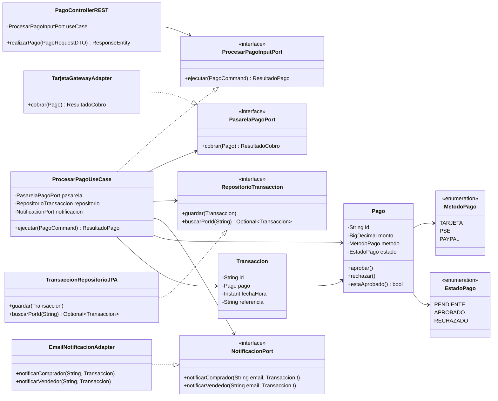

# Plantilla de entrega — Parcial 2

> **Instrucción**: Copia esta plantilla para cada pregunta del parcial. Reemplaza `[Pregunta XX]` por el identificador correcto (ej: `P01_solid_srp`) y completa todas las secciones. Haz al menos 2 commits por pregunta: uno con el prompt + respuesta del LLM, y otro con el análisis.

---

## Pregunta 07: Clean Architecture — Módulo de pagos

### Estudiante
- **Nombre completo**: Federico Restrepo

---

### LLM utilizado

| Campo | Valor |
|---|---|
| **Nombre del LLM** | Claude |
| **Modelo específico** | Claude Sonnet 4.5 |
| **¿Por qué elegiste este LLM?** | Claude produce diseños de Clean Architecture correctos y consistentes, respeta la regla de dependencia sin mezclar capas, y genera diagramas Mermaid funcionales con código Java coherente. |

---

### Prompt utilizado

> **Si respondiste sin IA, omite esta sección y ve directamente a Análisis crítico.**

```text
Actúa como un Arquitecto de Software Senior con dominio de Clean Architecture (Robert C. Martin).

Contexto: En OpenLib Market el equipo acoplO todo el módulo de pagos en una sola clase PaymentService con un único método realizarPago que: llama a la pasarela de pago, envía correos de notificación al comprador y al vendedor, cambia el estado de la orden y prepara la entrega o descarga. El sistema debe soportar múltiples métodos de pago (tarjeta, PSE, PayPal), registrar la transacción en PostgreSQL, notificar por correo y exponer una API REST para un frontend JavaFX.

Tarea: Rediseña este módulo aplicando Clean Architecture estrictamente. Tu respuesta debe:

1. Definir con precisión qué clases o interfaces van en cada capa (Entities, Use Cases, Interface Adapters, Frameworks & Drivers), justificando cada decisión.
2. Mostrar un diagrama de la estructura en Mermaid.
3. Demostrar con código Java 21 cómo se respeta la regla de dependencia: el caso de uso NO debe importar ninguna clase de Interface Adapters ni de Frameworks. Usa puertos de entrada (input ports) y puertos de salida (output ports) como interfaces definidas en la capa de Use Cases.
4. Explicar cómo se inyectan las dependencias externas (pasarela de pago, repositorio JPA, email) sin que el núcleo las conozca.
5. Indicar qué tan testeable es el diseño resultante comparado con el PaymentService original acoplado.

Restricciones: Java 21, sin Spring en las capas de Entities ni Use Cases, código funcional (no esqueletos vacíos).
Formato de salida: markdown con bloques de código Java y diagrama Mermaid.
```

---

### Respuesta del LLM

> **Si respondiste sin IA, omite esta sección y ve directamente a Análisis crítico.**

*(1 iteración)*

---

### Rediseño del módulo de pagos con Clean Architecture

#### Estructura de capas

```
┌─────────────────────────────────────────────────┐
│  Frameworks & Drivers                           │
│  Spring Boot, PostgreSQL/JPA, JavaMail, JavaFX  │
│  ┌───────────────────────────────────────────┐  │
│  │  Interface Adapters                       │  │
│  │  PagoControllerREST, TransaccionRepoJPA,  │  │
│  │  EmailNotificacionAdapter,                │  │
│  │  TarjetaGatewayAdapter, PSEGatewayAdapter │  │
│  │  ┌─────────────────────────────────────┐  │  │
│  │  │  Use Cases                          │  │  │
│  │  │  ProcesarPagoUseCase                │  │  │
│  │  │  PasarelaPagoPort (interface)        │  │  │
│  │  │  RepositorioTransaccion (interface)  │  │  │
│  │  │  NotificacionPort (interface)        │  │  │
│  │  │  ProcesarPagoInputPort (interface)   │  │  │
│  │  │  ┌───────────────────────────────┐  │  │  │
│  │  │  │  Entities                     │  │  │  │
│  │  │  │  Pago, Transaccion, Orden     │  │  │  │
│  │  │  │  MetodoPago (enum)            │  │  │  │
│  │  │  │  EstadoPago (enum)            │  │  │  │
│  │  │  └───────────────────────────────┘  │  │  │
│  │  └─────────────────────────────────────┘  │  │
│  └───────────────────────────────────────────┘  │
└─────────────────────────────────────────────────┘
```

---

#### Diagrama de clases (Mermaid)



---

#### Implementación Java 21

**Capa Entities — sin ninguna dependencia externa**

```java
// Entities/MetodoPago.java
public enum MetodoPago { TARJETA, PSE, PAYPAL }

// Entities/EstadoPago.java
public enum EstadoPago { PENDIENTE, APROBADO, RECHAZADO }

// Entities/Pago.java
public class Pago {
    private final String id;
    private final BigDecimal monto;
    private final MetodoPago metodo;
    private EstadoPago estado;

    public Pago(String id, BigDecimal monto, MetodoPago metodo) {
        if (monto == null || monto.compareTo(BigDecimal.ZERO) <= 0)
            throw new IllegalArgumentException("El monto debe ser positivo");
        this.id = id;
        this.monto = monto;
        this.metodo = metodo;
        this.estado = EstadoPago.PENDIENTE;
    }

    public void aprobar()   { this.estado = EstadoPago.APROBADO; }
    public void rechazar()  { this.estado = EstadoPago.RECHAZADO; }
    public boolean estaAprobado() { return estado == EstadoPago.APROBADO; }

    public String getId()          { return id; }
    public BigDecimal getMonto()   { return monto; }
    public MetodoPago getMetodo()  { return metodo; }
    public EstadoPago getEstado()  { return estado; }
}

// Entities/Transaccion.java
public class Transaccion {
    private final String id;
    private final Pago pago;
    private final java.time.Instant fechaHora;
    private final String referencia;

    public Transaccion(String id, Pago pago, String referencia) {
        this.id = id;
        this.pago = pago;
        this.referencia = referencia;
        this.fechaHora = java.time.Instant.now();
    }

    public String getId()              { return id; }
    public Pago getPago()              { return pago; }
    public java.time.Instant getFecha(){ return fechaHora; }
    public String getReferencia()      { return referencia; }
}
```

**Capa Use Cases — solo depende de Entities y de sus propias interfaces (puertos)**

```java
// UseCases/ports/out/PasarelaPagoPort.java
public interface PasarelaPagoPort {
    ResultadoCobro cobrar(Pago pago);
}

// UseCases/ports/out/RepositorioTransaccion.java
public interface RepositorioTransaccion {
    void guardar(Transaccion transaccion);
    java.util.Optional<Transaccion> buscarPorId(String id);
}

// UseCases/ports/out/NotificacionPort.java
public interface NotificacionPort {
    void notificarComprador(String email, Transaccion transaccion);
    void notificarVendedor(String email, Transaccion transaccion);
}

// UseCases/ports/in/ProcesarPagoInputPort.java
public interface ProcesarPagoInputPort {
    ResultadoPago ejecutar(PagoCommand command);
}

// UseCases/PagoCommand.java  (DTO interno del use case, sin anotaciones REST)
public record PagoCommand(
    String pagoId,
    BigDecimal monto,
    MetodoPago metodo,
    String emailComprador,
    String emailVendedor
) {}

// UseCases/ResultadoPago.java
public record ResultadoPago(boolean exitoso, String transaccionId, String mensaje) {}

// UseCases/ResultadoCobro.java
public record ResultadoCobro(boolean aprobado, String referencia) {}

// UseCases/ProcesarPagoUseCase.java
// ⚠️ No importa nada de Spring, JPA, ni de Interface Adapters
public class ProcesarPagoUseCase implements ProcesarPagoInputPort {

    private final PasarelaPagoPort pasarela;
    private final RepositorioTransaccion repositorio;
    private final NotificacionPort notificacion;

    public ProcesarPagoUseCase(
        PasarelaPagoPort pasarela,
        RepositorioTransaccion repositorio,
        NotificacionPort notificacion
    ) {
        this.pasarela = pasarela;
        this.repositorio = repositorio;
        this.notificacion = notificacion;
    }

    @Override
    public ResultadoPago ejecutar(PagoCommand command) {
        // 1. Crear entidad de dominio
        Pago pago = new Pago(command.pagoId(), command.monto(), command.metodo());

        // 2. Cobrar a través del puerto (sin saber quién implementa)
        ResultadoCobro cobro = pasarela.cobrar(pago);

        if (!cobro.aprobado()) {
            pago.rechazar();
            return new ResultadoPago(false, null, "Pago rechazado por la pasarela");
        }

        // 3. Actualizar estado de la entidad
        pago.aprobar();

        // 4. Persistir transacción
        String transaccionId = java.util.UUID.randomUUID().toString();
        Transaccion transaccion = new Transaccion(transaccionId, pago, cobro.referencia());
        repositorio.guardar(transaccion);

        // 5. Notificar (sin saber si es email, SMS, push, etc.)
        notificacion.notificarComprador(command.emailComprador(), transaccion);
        notificacion.notificarVendedor(command.emailVendedor(), transaccion);

        return new ResultadoPago(true, transaccionId, "Pago procesado exitosamente");
    }
}
```

**Capa Interface Adapters — implementa los puertos, conoce los frameworks pero no el núcleo de negocio**

```java
// InterfaceAdapters/TarjetaGatewayAdapter.java
public class TarjetaGatewayAdapter implements PasarelaPagoPort {
    // Aquí sí puede depender de un SDK de Visa/Mastercard
    @Override
    public ResultadoCobro cobrar(Pago pago) {
        // Llamada real a API de franquicia
        System.out.println("[Tarjeta] Cobrando $" + pago.getMonto());
        return new ResultadoCobro(true, "REF-TARJETA-" + System.currentTimeMillis());
    }
}

// InterfaceAdapters/EmailNotificacionAdapter.java
public class EmailNotificacionAdapter implements NotificacionPort {
    // Aquí sí puede depender de JavaMail o SendGrid
    @Override
    public void notificarComprador(String email, Transaccion t) {
        System.out.println("[Email] Comprador " + email + " — transacción " + t.getId() + " aprobada");
    }
    @Override
    public void notificarVendedor(String email, Transaccion t) {
        System.out.println("[Email] Vendedor " + email + " — venta registrada, ref: " + t.getReferencia());
    }
}

// InterfaceAdapters/TransaccionRepositorioJPA.java
public class TransaccionRepositorioJPA implements RepositorioTransaccion {
    // Aquí sí depende de JPA/Hibernate
    private final java.util.Map<String, Transaccion> store = new java.util.HashMap<>();

    @Override
    public void guardar(Transaccion transaccion) {
        store.put(transaccion.getId(), transaccion);
        System.out.println("[JPA] Transacción guardada: " + transaccion.getId());
    }

    @Override
    public java.util.Optional<Transaccion> buscarPorId(String id) {
        return java.util.Optional.ofNullable(store.get(id));
    }
}

// InterfaceAdapters/PagoControllerREST.java
// El controlador depende del INPUT PORT (interfaz), no del use case concreto
public class PagoControllerREST {
    private final ProcesarPagoInputPort useCase;

    public PagoControllerREST(ProcesarPagoInputPort useCase) {
        this.useCase = useCase;
    }

    // En Spring sería @PostMapping("/pagos")
    public ResultadoPago realizarPago(PagoRequestDTO dto) {
        PagoCommand command = new PagoCommand(
            java.util.UUID.randomUUID().toString(),
            dto.monto(),
            dto.metodo(),
            dto.emailComprador(),
            dto.emailVendedor()
        );
        return useCase.ejecutar(command);
    }
}

public record PagoRequestDTO(BigDecimal monto, MetodoPago metodo, String emailComprador, String emailVendedor) {}
```

**Capa Frameworks & Drivers — configuración e inyección de dependencias**

```java
// Config/AppConfig.java (Spring @Configuration o main manual)
public class AppConfig {
    public static PagoControllerREST buildPagoController() {
        // La inyección ocurre AQUÍ, en la capa más externa
        PasarelaPagoPort pasarela        = new TarjetaGatewayAdapter();
        RepositorioTransaccion repo      = new TransaccionRepositorioJPA();
        NotificacionPort notificacion    = new EmailNotificacionAdapter();

        ProcesarPagoInputPort useCase = new ProcesarPagoUseCase(pasarela, repo, notificacion);
        return new PagoControllerREST(useCase);
    }
}
```

---

#### Regla de dependencia — verificación

| Clase | Capa | Importa de |
|---|---|---|
| `Pago`, `Transaccion` | Entities | Nada externo |
| `ProcesarPagoUseCase` | Use Cases | Solo Entities + interfaces propias |
| `PasarelaPagoPort`, `RepositorioTransaccion`, `NotificacionPort` | Use Cases (puertos de salida) | Solo Entities |
| `TarjetaGatewayAdapter` | Interface Adapters | Use Cases (implementa `PasarelaPagoPort`) |
| `EmailNotificacionAdapter` | Interface Adapters | Use Cases (implementa `NotificacionPort`) |
| `PagoControllerREST` | Interface Adapters | Use Cases (usa `ProcesarPagoInputPort`) |
| `AppConfig` | Frameworks & Drivers | Interface Adapters + Use Cases |

Todas las flechas de dependencia apuntan hacia adentro. ✓

---

#### Testabilidad

**Con el `PaymentService` original acoplado:** para testear hay que levantar una BD PostgreSQL real, un servidor SMTP real y una pasarela de pago real. Cualquier fallo de infraestructura rompe los tests.

**Con Clean Architecture:** el `ProcesarPagoUseCase` se testea así:

```java
@Test
void pagoAprobadoDebePersistirYNotificar() {
    // Mocks de los puertos — sin BD, sin email, sin pasarela real
    PasarelaPagoPort pasarela     = pago -> new ResultadoCobro(true, "REF-TEST-001");
    RepositorioTransaccion repo   = mock(RepositorioTransaccion.class);
    NotificacionPort notificacion = mock(NotificacionPort.class);

    ProcesarPagoInputPort useCase = new ProcesarPagoUseCase(pasarela, repo, notificacion);

    ResultadoPago resultado = useCase.ejecutar(new PagoCommand(
        "pago-1", new BigDecimal("50000"), MetodoPago.TARJETA,
        "comprador@mail.com", "vendedor@mail.com"
    ));

    assertTrue(resultado.exitoso());
    verify(repo).guardar(any(Transaccion.class));
    verify(notificacion).notificarComprador(eq("comprador@mail.com"), any());
    verify(notificacion).notificarVendedor(eq("vendedor@mail.com"), any());
}
```

El núcleo del negocio es completamente testeable en memoria, sin infraestructura.

---

### Análisis crítico de la respuesta
El prompt funcionó bien porque usar PaymentService como caso concreto obligó al LLM a mejorar algo específico en vez de explicar Clean Architecture en abstracto. También ayudó restringir explícitamente que el caso de uso no importara nada de Spring, lo cumplió e incluso lo comentó en el código.
Lo que no funcionó: el diagrama Mermaid quedó en texto plano y no se puede evaluar. 
El TransaccionRepositorioJPA usa un HashMap en memoria, lo cual simplifica demasiado porque el punto era mostrar cómo integrar JPA sin que el núcleo lo conozca. Y el AppConfig instancia directo TarjetaGatewayAdapter sin explicar cómo se elegiría PSE o PayPal en tiempo de ejecución, que era parte del contexto original.

Para la próxima le pediría un repositorio JPA real con mapper de entidades y que resuelva la selección dinámica de pasarela de pago.
