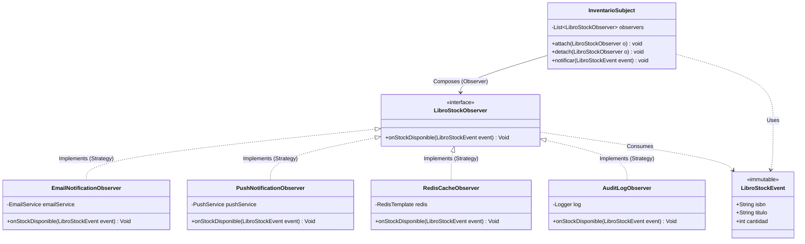

# Plantilla de entrega — Parcial 2

> **Instrucción**: Copia esta plantilla para cada pregunta del parcial. Reemplaza `[Pregunta XX]` por el identificador correcto (ej: `P01_solid_srp`) y completa todas las secciones. Haz al menos 2 commits por pregunta: uno con el prompt + respuesta del LLM, y otro con el análisis.

---

## Pregunta [5]: [patrones_notificaciones]

### Estudiante
- **Nombre completo**: Boris Nicolas Valbuena Gueirsman

---

### LLM utilizado

| Campo | Valor |
|---|---|
| **Nombre del LLM** | Gemini |
| **Modelo específico** | Gemini 3.5 Flash |
| **¿Por qué elegiste este LLM?** | Es la que más usé durante el curso, por lo cual es la misma que usaré en el parcial. |

---

### Prompt utilizado

> **Si respondiste sin IA, omite esta sección y ve directamente a Análisis crítico.**


```
Actúa como un arquitecto de software senior especializado en Java 21, Spring Boot 3.x, patrones de diseño GoF y principios SOLID.

Contexto:

Estoy trabajando en OpenLib Market, una plataforma de compra y venta de libros.

Cuando un libro agotado vuelve a estar disponible, varios componentes del sistema deben reaccionar automáticamente:

* Enviar notificación por correo a usuarios que lo agregaron a wishlist.
* Enviar notificación push a usuarios que lo marcaron como favorito.
* Actualizar la caché Redis para que aparezca en búsquedas.
* Registrar el evento en un log de auditoría.

Necesito diseñar este sistema utilizando dos patrones de diseño combinados de los vistos en clase.

Antes de responder:

1. Analiza el problema paso a paso.
2. Identifica cuáles son los dos patrones más adecuados.
3. Justifica técnicamente por qué elegiste esos patrones.
4. Explica cómo interactúan entre sí.
5. Evalúa otras alternativas y explica por qué son menos adecuadas.
6. Considera extensibilidad, desacoplamiento y mantenibilidad.

Restricciones:

* Utiliza Java 21.
* Sigue principios SOLID.
* Permite agregar nuevos tipos de notificaciones sin modificar código existente.
* Permite registrar y eliminar dinámicamente componentes interesados.
* Evita dependencias directas entre el libro y los sistemas de notificación.
* Considera posibles fallos en una notificación individual.

Formato de salida:

# Análisis del problema

# Patrones seleccionados

# Justificación

# Diagrama de clases (Mermaid)

# Implementación Java

# Flujo de ejecución

# Beneficios del diseño

# Cómo agregar una nueva notificación SMS

# Cumplimiento de SOLID

Validación:

La solución debe permitir que múltiples componentes reaccionen ante el evento de disponibilidad de un libro sin acoplamiento fuerte y debe soportar la incorporación de nuevos observadores o mecanismos de notificación sin modificar las clases existentes.

---

### Respuesta del LLM

¡Hola! Con gusto asumo el rol de Arquitecto de Software Senior. Vamos a diseñar una solución robusta, desacoplada y de nivel empresarial para **OpenLib Market**, aprovechando las capacidades modernas de **Java 21** y **Spring Boot 3.x**.

---

## 1. Análisis del problema

El requerimiento principal es reaccionar ante un cambio de estado específico (`LibroAbastecidoEvent`) y propagar este evento a múltiples componentes independientes (Correo, Push, Redis, Auditoría).

### Retos técnicos clave:

1. **Desacoplamiento:** El módulo de inventario de libros no debe conocer la lógica de notificación ni de caché.
2. **Dinamismo:** El sistema debe permitir registrar o remover interesados en tiempo de ejecución o mediante configuración.
3. **Resiliencia:** Si la notificación push falla, el envío de correos y la actualización de Redis no deben verse afectados.
4. **Extensibilidad (Open/Closed):** Añadir un nuevo canal (como SMS) no debe alterar el código existente.

---

## 2. Patrones seleccionados

Para resolver este problema de forma elegante, combinaremos dos patrones de diseño del GoF (Gang of Four):

1. **Observer (Observador):** Define una dependencia de uno-a-muchos entre objetos, de forma que cuando un objeto cambia de estado, todos sus dependientes son notificados automáticamente.
2. **Strategy (Estrategia):** Define una familia de algoritmos, encapsula cada uno y los hace intercambiables. Lo usaremos para encapsular el comportamiento específico de cada tipo de notificación/reacción.

---

## 3. Justificación técnica e interacción

### ¿Por qué Observer?

Es el patrón por excelencia para arquitecturas orientadas a eventos (*Event-Driven*). Permite que el `LibroService` (Sujeto) emita un evento sin preocuparse de quién lo escucha. Cumple con la restricción de registrar/eliminar componentes dinámicamente.

### ¿Por qué Strategy?

Cada componente que reacciona implementa la interfaz del "Observador", pero internamente cada uno representa una "Estrategia" de procesamiento distinta (I/O de red para correos, operaciones en memoria para Redis, I/O de disco para logs). Esto aísla el manejo de errores (bloques try-catch independientes) de cada canal.

### Interacción entre ambos patrones:

El **Sujeto** (Subject) mantiene una colección de **Estrategias de Observación** (`LibroStockObserver`). Cuando ocurre el evento, el Sujeto itera sobre la lista y ejecuta la estrategia correspondiente de manera polimórfica.

### Alternativas evaluadas y descartadas:

* **Chain of Responsibility:** Podría pasar el evento a lo largo de una cadena. *Desventaja:* Si un eslabón decide detener la cadena (o falla críticamente), los siguientes no se enteran. No encaja con la semántica de "notificación simultánea".
* **Mediator:** Centraliza la comunicación. *Desventaja:* El Mediador terminaría con un acoplamiento fuerte hacia todos los servicios de notificación, convirtiéndose en un "objeto dios" difícil de mantener.

---

## 4. Diagrama de clases (Mermaid)



---

## 5. Implementación Java (Java 21 + Spring Boot 3.x)

Aprovecharemos las características modernas de Java 21 como **Records** (inmutabilidad de eventos) y **Virtual Threads** (implícitos opcionalmente en Spring para tareas concurrentes de I/O de manera eficiente).

### A. El Evento (DTO Inmutable)

```java
package com.openlib.market.event;

public record LibroStockEvent(String isbn, String titulo, int cantidadDisponible) {}

```

### B. Interfaz de la Estrategia del Observador

```java
package com.openlib.market.observer;

import com.openlib.market.event.LibroStockEvent;

public interface LibroStockObserver {
    void onStockDisponible(LibroStockEvent event);
}

```

### C. El Sujeto (Componente de Inventario)

```java
package com.openlib.market.subject;

import com.openlib.market.event.LibroStockEvent;
import com.openlib.market.observer.LibroStockObserver;
import org.springframework.stereotype.Component;
import java.util.List;
import java.util.concurrent.CopyOnWriteArrayList;

@Component
public class InventarioSubject {
    
    // CopyOnWriteArrayList garantiza thread-safety para registros/bajas dinámicas
    private final List<LibroStockObserver> observers = new CopyOnWriteArrayList<>();

    // Inyección automática de todos los beans de Spring que implementen la interfaz
    public InventarioSubject(List<LibroStockObserver> iniciales) {
        this.observers.addAll(iniciales);
    }

    public void attach(LibroStockObserver observer) {
        observers.add(observer);
    }

    public void detach(LibroStockObserver observer) {
        observers.remove(observer);
    }

    public void notificar(LibroStockEvent event) {
        for (LibroStockObserver observer : observers) {
            try {
                observer.onStockDisponible(event);
            } catch (Exception e) {
                // Resiliencia: Un fallo en un observador no detiene a los demás
                System.err.printf("Error procesando evento en %s: %s%n", 
                    observer.getClass().getSimpleName(), e.getMessage());
            }
        }
    }
}

```

### D. Implementación de los Observadores (Estrategias)

```java
package com.openlib.market.observer.impl;

import com.openlib.market.event.LibroStockEvent;
import com.openlib.market.observer.LibroStockObserver;
import org.springframework.stereotype.Component;

@Component
public class EmailNotificationObserver implements LibroStockObserver {
    @Override
    public void onStockDisponible(LibroStockEvent event) {
        // Simulación de lógica de negocio e infraestructura
        System.out.println("[Email] Enviando correos a la lista de Wishlist para: " + event.titulo());
    }
}

@Component
public class PushNotificationObserver implements LibroStockObserver {
    @Override
    public void onStockDisponible(LibroStockEvent event) {
        if (event.cantidadDisponible() < 1) {
            throw new RuntimeException("Fallo simulado en red de notificaciones Push");
        }
        System.out.println("[Push] Enviando notificación push de favoritos para: " + event.titulo());
    }
}

@Component
public class RedisCacheObserver implements LibroStockObserver {
    @Override
    public void onStockDisponible(LibroStockEvent event) {
        System.out.println("[Redis] Actualizando índice de búsquedas para ISBN: " + event.isbn());
    }
}

@Component
public class AuditLogObserver implements LibroStockObserver {
    @Override
    public void onStockDisponible(LibroStockEvent event) {
        System.out.println("[Auditoría] Registro de evento guardado en base de datos de auditoría.");
    }
}

```

### E. Servicio de Aplicación (Orquestador)

```java
package com.openlib.market.service;

import com.openlib.market.event.LibroStockEvent;
import com.openlib.market.subject.InventarioSubject;
import org.springframework.stereotype.Service;

@Service
public class LibroService {

    private final InventarioSubject inventarioSubject;

    public LibroService(InventarioSubject inventarioSubject) {
        this.inventarioSubject = inventarioSubject;
    }

    public void reabastecerLibro(String isbn, String titulo, int cantidad) {
        System.out.println("\n--- Procesando Reabastecimiento de Libro en Inventario ---");
        
        // Lógica de negocio para persistir en BD aquí...

        // Emitir el evento de manera desacoplada
        LibroStockEvent event = new LibroStockEvent(isbn, titulo, cantidad);
        inventarioSubject.notificar(event);
    }
}

```

---

## 6. Flujo de ejecución

Cuando se invoca `libroService.reabastecerLibro("978-3-16", "Clean Code", 15);`, ocurre la siguiente secuencia:

1. `LibroService` instancia el record `LibroStockEvent`.
2. Llama a `inventarioSubject.notificar(event)`.
3. `InventarioSubject` itera sobre sus observadores registrados.
4. Se ejecuta `EmailNotificationObserver` con éxito.
5. Se ejecuta `PushNotificationObserver`. *(Si fallara, el bloque `try-catch` del Subject captura la excepción, la loguea y continúa).*
6. Se ejecuta `RedisCacheObserver` actualizando la memoria.
7. Se ejecuta `AuditLogObserver` persistiendo la trazabilidad.

---

## 7. Beneficios del diseño

* **Aislamiento de fallos:** Un error de conexión con el servidor SMTP o de Firebase (Push) no bloquea la actualización de la caché Redis ni el log de auditoría.
* **Concurrencia Segura:** Se utiliza `CopyOnWriteArrayList` lo que permite que un hilo desasocie un observador mientras otro está notificando, evitando `ConcurrentModificationException`.
* **Aprovechamiento del contenedor de Spring:** Al inyectar `List<LibroStockObserver>`, Spring Boot automáticamente detecta cualquier nuevo bean que implemente la interfaz y lo añade al motor de eventos sin escribir una sola línea de código de configuración manual.

---

## 8. Cómo agregar una nueva notificación SMS

Para cumplir estrictamente con el principio de **Abierto/Cerrado (OCP)**, si el negocio requiere agregar notificaciones por SMS, **no tocamos el código existente**. Simplemente creamos una nueva clase:

```java
package com.openlib.market.observer.impl;

import com.openlib.market.event.LibroStockEvent;
import com.openlib.market.observer.LibroStockObserver;
import org.springframework.stereotype.Component;

@Component
public class SmsNotificationObserver implements LibroStockObserver {
    @Override
    public void onStockDisponible(LibroStockEvent event) {
        System.out.println("[SMS] Enviando mensaje de texto de disponibilidad de stock al usuario.");
    }
}

```

Al compilar y levantar la aplicación, Spring Boot detectará este nuevo `@Component`, lo inyectará en la lista del constructor de `InventarioSubject`, y el sistema empezará a enviar SMS de inmediato.

---

## 9. Cumplimiento de SOLID

* **S (Single Responsibility Principle):** `LibroService` solo gestiona el inventario. Cada observador tiene una única responsabilidad (o enviar correo, o guardar log, o vaciar caché).
* **O (Open/Closed Principle):** El sistema está abierto a la extensión (añadir `SmsNotificationObserver`) pero cerrado a la modificación (`InventarioSubject` y `LibroService` permanecen intactos).
* **L (Liskov Substitution Principle):** Cualquier implementación de `LibroStockObserver` puede reemplazar a otra en la colección de observadores sin alterar el comportamiento correcto del bucle de notificación.
* **I (Interface Segregation Principle):** `LibroStockObserver` expone únicamente el método estrictamente necesario para reaccionar al cambio de stock, sin métodos basura.
* **D (Dependency Inversion Principle):** `InventarioSubject` no depende de clases concretas (`EmailNotificationObserver`, `RedisCacheObserver`), sino de la abstracción `LibroStockObserver`.

---

### Análisis crítico de la respuesta

#### 1. ¿Qué hizo bien el prompt?

[Evalúa tu propio prompt, no la respuesta del LLM. ¿El contexto fue suficiente? ¿Las restricciones fueron claras? ¿El formato de salida que pediste ayudó a obtener una buena respuesta? ¿Qué parte de tu prompt fue más efectiva? Sé específico: menciona fragmentos concretos de tu prompt que funcionaron bien.]


#### 2. ¿Qué se puede mejorar?

[¿Qué le faltó a tu prompt? ¿Qué harías diferente si pudieras reformularlo? ¿El LLM entendió mal algo por falta de claridad en tu prompt? ¿La respuesta tiene errores u omisiones? ¿Qué no cubrió el LLM que tú sí sabes por lo visto en clase?]


#### 3. Respuesta final

[Escribe tu respuesta definitiva a la pregunta del parcial, integrando lo que aprendiste del LLM pero yendo más allá. Corrige errores, llena omisiones, conecta con conceptos vistos en clase. Esta es tu respuesta: demuestra que tú dominas el tema.]
