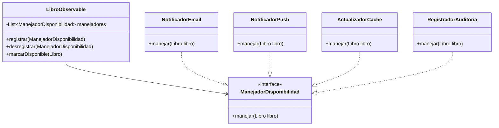

# Plantilla de entrega — Parcial 2

> **Instrucción**: Copia esta plantilla para cada pregunta del parcial. Reemplaza `[Pregunta XX]` por el identificador correcto (ej: `P01_solid_srp`) y completa todas las secciones. Haz al menos 2 commits por pregunta: uno con el prompt + respuesta del LLM, y otro con el análisis.

---

# Pregunta P05: Sistema de notificaciones con dos patrones combinados

### Estudiante
-- **Nombre completo**: Juan Camilo Gomez

---

### LLM utilizado

| Campo | Valor |
|---|---|
| **Nombre del LLM** | Claude |
| **Modelo específico** | Claude Sonnet 4.6 |
| **¿Por qué elegiste este LLM?** | Esta pregunta requiere combinar dos patrones de diseño y justificar la combinación. 

---

### Prompt utilizado

> **Si respondiste sin IA, omite esta sección y ve directamente a Análisis crítico.**

Soy estudiante de Ingeniería de Software en la Pontificia Universidad Javeriana.
Proyecto: OpenLib Market, plataforma colombiana de venta de libros digitales.

Contexto: cuando un libro agotado vuelve a estar disponible, varios componentes necesitan reaccionar:
1. Enviar notificación por correo a usuarios con el libro en su wishlist
2. Enviar notificación push a usuarios que lo marcaron como favorito en la app móvil
3. Actualizar la caché de Redis para que aparezca en búsquedas
4. Registrar el evento en un log de auditoría

Tarea: Diseña e implementa este sistema usando DOS patrones de diseño combinados (de los vistos en clase: Singleton, Factory, Observer, Strategy, Decorator, Command, Template Method).

Debes incluir:
1. Justificación de por qué elegiste esos dos patrones y cómo se complementan
2. Diagrama de clases en Mermaid
3. Código Java 21 de las clases principales
4. Explicación de cómo se registran y desregistran dinámicamente los componentes interesados
5. Cómo manejarías el caso de que una notificación falle sin afectar a las demás

Restricciones:
- Java 21
- Los componentes deben poder registrarse y desregistrarse en tiempo de ejecución
- Una falla en un componente no debe detener los demás
- Responde en markdown con diagrama Mermaid y bloques de código Java
```


---

### Respuesta del LLM

## Sistema de notificaciones: Observer + Strategy

### Patrones elegidos

**Observer**: El libro es el sujeto observable. Cuando su stock cambia de 0 a disponible, notifica a todos sus observadores registrados. Esto permite registrar y desregistrar dinámicamente los componentes interesados (email, push, caché, log).

**Strategy**: Cada tipo de notificación encapsula su algoritmo de envío en una clase independiente. El Observer sabe que tiene que notificar; la Strategy define **cómo** notifica cada uno.

La combinación tiene sentido: Observer maneja el **cuándo y a quién**, Strategy maneja el **cómo**.

---

### Diagrama de clases (Mermaid)



---

### Implementación Java 21

```java
// Interfaz del Observer (Strategy de notificación)
public interface ManejadorDisponibilidad {
    void manejar(Libro libro);
    String getNombre();
}
```

```java
// Sujeto Observable
public class LibroObservable {
    private final List<ManejadorDisponibilidad> manejadores = new ArrayList<>();

    public void registrar(ManejadorDisponibilidad manejador) {
        manejadores.add(manejador);
    }

    public void desregistrar(ManejadorDisponibilidad manejador) {
        manejadores.remove(manejador);
    }

    public void marcarDisponible(Libro libro) {
        libro.setEstado(EstadoLibro.DISPONIBLE);
        for (ManejadorDisponibilidad manejador : manejadores) {
            try {
                manejador.manejar(libro);
            } catch (Exception e) {
                // Una falla no detiene a los demás
                System.err.println("Error en manejador " + manejador.getNombre() + ": " + e.getMessage());
            }
        }
    }
}
```

```java
// Observer 1: Notificación por email
public class NotificadorEmail implements ManejadorDisponibilidad {
    private final WishlistRepository wishlistRepo;
    private final EmailService emailService;

    public NotificadorEmail(WishlistRepository wishlistRepo, EmailService emailService) {
        this.wishlistRepo = wishlistRepo;
        this.emailService = emailService;
    }

    @Override
    public void manejar(Libro libro) {
        List<Usuario> interesados = wishlistRepo.buscarUsuariosPorLibro(libro.getId());
        for (Usuario usuario : interesados) {
            emailService.enviar(usuario.getEmail(), "¡Disponible!",
                "El libro '" + libro.getTitulo() + "' está disponible nuevamente.");
        }
    }

    @Override
    public String getNombre() { return "NotificadorEmail"; }
}
```

```java
// Observer 2: Notificación push
public class NotificadorPush implements ManejadorDisponibilidad {
    private final FavoritosRepository favoritosRepo;
    private final PushService pushService;

    public NotificadorPush(FavoritosRepository favoritosRepo, PushService pushService) {
        this.favoritosRepo = favoritosRepo;
        this.pushService = pushService;
    }

    @Override
    public void manejar(Libro libro) {
        List<String> tokens = favoritosRepo.buscarTokensPorLibro(libro.getId());
        pushService.enviarMasivo(tokens, "¡" + libro.getTitulo() + " está disponible!");
    }

    @Override
    public String getNombre() { return "NotificadorPush"; }
}
```

```java
// Observer 3: Actualizar caché
public class ActualizadorCache implements ManejadorDisponibilidad {
    private final RedisClient redis;

    public ActualizadorCache(RedisClient redis) {
        this.redis = redis;
    }

    @Override
    public void manejar(Libro libro) {
        redis.set("libro:" + libro.getId(), libro.toJson());
        redis.delete("busqueda:agotados");
    }

    @Override
    public String getNombre() { return "ActualizadorCache"; }
}
```

```java
// Observer 4: Log de auditoría
public class RegistradorAuditoria implements ManejadorDisponibilidad {
    private final Logger logger = Logger.getLogger("OpenLib.Auditoria");

    @Override
    public void manejar(Libro libro) {
        logger.info(String.format("[AUDITORIA] Libro ISBN:%s disponible a las %s",
            libro.getIsbn(), LocalDateTime.now()));
    }

    @Override
    public String getNombre() { return "RegistradorAuditoria"; }
}
```

```java
// Ejemplo de uso
public class EjemploUso {
    public static void main(String[] args) {
        LibroObservable sistema = new LibroObservable();

        sistema.registrar(new NotificadorEmail(wishlistRepo, emailService));
        sistema.registrar(new NotificadorPush(favoritosRepo, pushService));
        sistema.registrar(new ActualizadorCache(redis));
        sistema.registrar(new RegistradorAuditoria());

        // Cuando llega stock:
        sistema.marcarDisponible(libroAgotado);

        // Desregistrar auditoría en mantenimiento:
        sistema.desregistrar(registradorAuditoria);
    }
}
```

---

### Análisis crítico de la respuesta

#### 1. ¿Qué hizo bien el prompt?

[Evalúa tu propio prompt, no la respuesta del LLM. ¿El contexto fue suficiente? ¿Las restricciones fueron claras? ¿El formato de salida que pediste ayudó a obtener una buena respuesta? ¿Qué parte de tu prompt fue más efectiva? Sé específico: menciona fragmentos concretos de tu prompt que funcionaron bien.]


#### 2. ¿Qué se puede mejorar?

[¿Qué le faltó a tu prompt? ¿Qué harías diferente si pudieras reformularlo? ¿El LLM entendió mal algo por falta de claridad en tu prompt? ¿La respuesta tiene errores u omisiones? ¿Qué no cubrió el LLM que tú sí sabes por lo visto en clase?]


#### 3. Respuesta final

[Escribe tu respuesta definitiva a la pregunta del parcial, integrando lo que aprendiste del LLM pero yendo más allá. Corrige errores, llena omisiones, conecta con conceptos vistos en clase. Esta es tu respuesta: demuestra que tú dominas el tema.]
