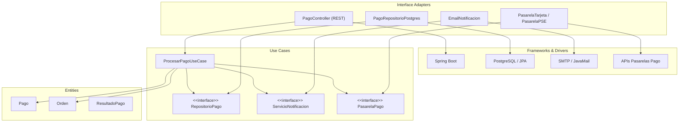

# Pregunta P07: Módulo de pagos con Clean Architecture

### Estudiante
- **Nombre completo**: Juan Camilo Gomez

---

### LLM utilizado

| Campo | Valor |
|---|---|
| **Nombre del LLM** | Claude |
| **Modelo específico** | Claude Sonnet 4.6 |
| **¿Por qué elegiste este LLM?** | Diseñar un módulo completo con Clean Architecture requiere generar mucho código estructurado y diagramas.

---

### Prompt utilizado

```
Soy estudiante de Ingeniería de Software en la Pontificia Universidad Javeriana.
Proyecto: OpenLib Market, plataforma de venta de libros digitales en Colombia.

El equipo acopló todo en un PaymentService monolítico que hace: llamar a la pasarela de pago, 
enviar correo de notificación, cambiar el estado de la orden y preparar la descarga.

Necesito rediseñar el módulo de pagos aplicando Clean Architecture de Robert C. Martin.
El módulo debe soportar:
- Múltiples métodos de pago (tarjeta, PSE, PayPal)
- Registrar la transacción en PostgreSQL
- Notificar al comprador y vendedor por correo
- Exponer una API REST para el frontend JavaFX

Tareas:
1. Define qué va en cada capa: Entities, Use Cases, Interface Adapters, Frameworks & Drivers
2. Dibuja el diagrama de la estructura en Mermaid
3. Muestra código Java 21 de las clases clave de cada capa
4. Explica cómo se respeta la regla de dependencia
5. Muestra cómo se inyectan las dependencias externas sin violar la arquitectura

Restricciones:
- Java 21
- Respeta estrictamente la regla de dependencia (las dependencias solo apuntan hacia adentro)
- Muestra el mecanismo de inyección de dependencias
- Responde en markdown con diagrama Mermaid y código Java
```

---

### Respuesta del LLM

## Módulo de Pagos con Clean Architecture

### Distribución por capas

**Entities:** `Pago`, `Orden`, `ResultadoPago`, `EstadoOrden` — objetos de dominio puros, sin anotaciones de frameworks.

**Use Cases:** `ProcesarPagoUseCase`, `RepositorioPago` (interfaz), `PasarelaPago` (interfaz), `ServicioNotificacion` (interfaz).

**Interface Adapters:** `PagoController` (REST), `PagoRepositorioPostgres` (implementación JPA), `EmailNotificacion` (implementación), `PasarelaTarjeta` / `PasarelaPSE` (implementaciones).

**Frameworks & Drivers:** Spring Boot, PostgreSQL/JPA, JavaMailSender, cliente REST de la pasarela.

---

### Diagrama de estructura (Mermaid)



---

### Código Java por capa

#### Entities

```java
// Entities — sin imports de frameworks
public class Pago {
    private final String id;
    private final BigDecimal monto;
    private final String metodoPago;
    private EstadoPago estado;

    public Pago(String id, BigDecimal monto, String metodoPago) {
        this.id = id;
        this.monto = monto;
        this.metodoPago = metodoPago;
        this.estado = EstadoPago.PENDIENTE;
    }

    public void marcarAprobado() { this.estado = EstadoPago.APROBADO; }
    public void marcarRechazado() { this.estado = EstadoPago.RECHAZADO; }

    // getters...
}
```

#### Use Cases — interfaces (puertos)

```java
// Puerto de salida — repositorio
public interface RepositorioPago {
    void guardar(Pago pago);
    Optional<Pago> buscarPorId(String id);
}

// Puerto de salida — pasarela
public interface PasarelaPago {
    ResultadoPago cobrar(Pago pago);
}

// Puerto de salida — notificación
public interface ServicioNotificacion {
    void notificarPago(Pago pago, Usuario comprador, Usuario vendedor);
}
```

```java
// Caso de uso
public class ProcesarPagoUseCase {
    private final RepositorioPago repositorio;
    private final PasarelaPago pasarela;
    private final ServicioNotificacion notificacion;

    public ProcesarPagoUseCase(RepositorioPago repositorio,
                                PasarelaPago pasarela,
                                ServicioNotificacion notificacion) {
        this.repositorio = repositorio;
        this.pasarela = pasarela;
        this.notificacion = notificacion;
    }

    public ResultadoPago ejecutar(Pago pago, Usuario comprador, Usuario vendedor) {
        ResultadoPago resultado = pasarela.cobrar(pago);
        if (resultado.isAprobado()) {
            pago.marcarAprobado();
        } else {
            pago.marcarRechazado();
        }
        repositorio.guardar(pago);
        notificacion.notificarPago(pago, comprador, vendedor);
        return resultado;
    }
}
```

#### Interface Adapters

```java
// Controlador REST — en capa Adapters
@RestController
@RequestMapping("/api/pagos")
public class PagoController {
    private final ProcesarPagoUseCase procesarPagoUseCase;

    public PagoController(ProcesarPagoUseCase procesarPagoUseCase) {
        this.procesarPagoUseCase = procesarPagoUseCase;
    }

    @PostMapping
    public ResponseEntity<ResultadoPagoDTO> procesar(@RequestBody PagoRequestDTO request) {
        Pago pago = new Pago(UUID.randomUUID().toString(),
                             request.getMonto(), request.getMetodoPago());
        ResultadoPago resultado = procesarPagoUseCase.ejecutar(
            pago, request.getComprador(), request.getVendedor());
        return ResponseEntity.ok(ResultadoPagoDTO.from(resultado));
    }
}
```

```java
// Implementación del repositorio — en capa Adapters
@Repository
public class PagoRepositorioPostgres implements RepositorioPago {
    private final JpaRepository<PagoEntity, String> jpaRepo;

    public PagoRepositorioPostgres(JpaRepository<PagoEntity, String> jpaRepo) {
        this.jpaRepo = jpaRepo;
    }

    @Override
    public void guardar(Pago pago) {
        jpaRepo.save(PagoEntity.from(pago));
    }

    @Override
    public Optional<Pago> buscarPorId(String id) {
        return jpaRepo.findById(id).map(PagoEntity::toDomain);
    }
}
```

---

### Análisis crítico de la respuesta

#### 1. ¿Qué hizo bien el prompt?

pedía las cuatro capas explícitamente, el diagrama, el código por capa, la verificación de la regla de dependencia y el mecanismo de inyección. Esto produjo una respuesta estructurada y completa. 

#### 2. ¿Qué se puede mejorar?

El prompt no pidió que el LLM mostrara la configuración de inyección de dependencias 

#### 3. Respuesta final

El diseño del LLM es correcto y respeta la regla de dependencia. Los puntos importantes:
- ProcesarPagoUseCase depende de interfaces (RepositorioPago, PasarelaPago, ServicioNotificacion), no de implementaciones.
- Las implementaciones (PagoRepositorioPostgres, EmailNotificacion) están en Adapters e implementan las interfaces de Use Cases. El flujo de dependencia va de afuera hacia adentro.
- PagoController está en Adapters y llama al Use Case, no al reves.

Lo que falto en la respuesta: la testeabilidad es la principal ventaja de este diseño. Se puede probar ProcesarPagoUseCase con mocks de RepositorioPago y PasarelaPago :


void debeMarcarPagoAprobadoCuandoPasarelaAprueba() {
    RepositorioPago repoMock = mock(RepositorioPago.class);
    PasarelaPago pasarelaMock = mock(PasarelaPago.class);
    ServicioNotificacion notifMock = mock(ServicioNotificacion.class);
    
    when(pasarelaMock.cobrar(any())).thenReturn(new ResultadoPago(true, "Aprobado"));
    
    ProcesarPagoUseCase useCase = new ProcesarPagoUseCase(repoMock, pasarelaMock, notifMock);
    ResultadoPago resultado = useCase.ejecutar(pago, comprador, vendedor);
    
    assertTrue(resultado.isAprobado());
    verify(repoMock).guardar(any());
}
```

Esto no seria posible con el `PaymentService` monolítico original.
