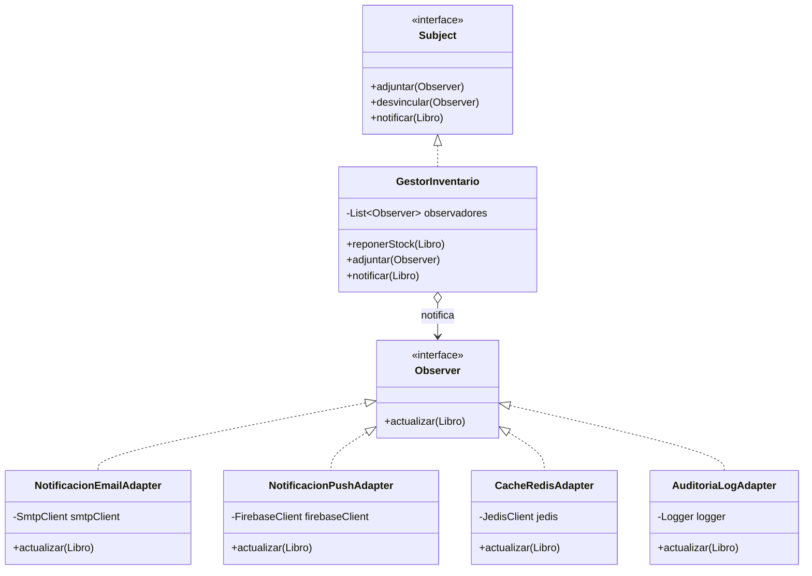

# Plantilla de entrega — Parcial 2

---

## Pregunta P05: Patrones — Notificaciones combinadas

### Estudiante

- **Nombre completo**: Juan David Rodriguez Franco

---

### LLM utilizado

| Campo                                   | Valor                                                                                                          |
| --------------------------------------- | -------------------------------------------------------------------------------------------------------------- |
| **Nombre del LLM**                | Gemini |
| **Modelo específico**            | Gemini 3.1 Pro |
| **¿Por qué elegiste este LLM?** | Gemini 3.1 Pro es excelente para diseñar diagramas UML con Mermaid y combinar múltiples patrones de diseño en un mismo sistema cohesionado y desacoplado. |

---

### Prompt utilizado

```text
Actúa como un arquitecto de software experto en Java y Patrones de Diseño.

Contexto: En OpenLib Market, cuando un libro que estaba agotado vuelve a estar disponible (restock), varios componentes del sistema necesitan reaccionar inmediatamente:
1. Enviar un correo a los usuarios de la wishlist.
2. Enviar una notificación push a los usuarios que lo tienen en favoritos.
3. Actualizar la caché de Redis para las búsquedas.
4. Registrar el evento en un log de auditoría de inventario.

Por favor, diseña e implementa este sistema utilizando DOS (2) patrones de diseño combinados que trabajen en conjunto.
Tu respuesta debe incluir:
1. Qué patrones elegiste y por qué trabajan bien juntos para este problema.
2. Un diagrama de clases en formato Mermaid que muestre la arquitectura.
3. El código Java de las clases e interfaces principales demostrando cómo se registran los componentes y cómo se notifica el cambio de estado.
```

---

### Respuesta del LLM

```markdown
Para resolver este requerimiento donde un evento principal (el cambio de disponibilidad de un libro) debe desencadenar múltiples acciones independientes en diferentes subsistemas, la mejor combinación es utilizar **Observer (Observador)** junto con **Adapter (Adaptador)**.

### 1. Patrones Elegidos y Justificación
* **Observer**: Es el patrón ideal para este caso porque define una dependencia de uno-a-muchos. El publicador (`Inventario`) no necesita saber quién lo está escuchando. Simplemente notifica el evento `LibroDisponible` y todos los suscriptores reaccionan. Permite agregar y quitar componentes en tiempo de ejecución.
* **Adapter**: Las acciones requeridas interactúan con sistemas muy dispares (Redis, Firebase Push, SMTP Server, Logger). Estos sistemas externos tienen sus propias interfaces complejas que no son compatibles con nuestra interfaz `Observer`. El patrón Adapter nos permite "envolver" estas librerías externas para que cumplan con el contrato que espera el publicador.

### 2. Diagrama de Clases (Mermaid)



### 3. Implementación en Java

#### 3.1. Las interfaces del Patrón Observer
```java
public interface Observer {
    void actualizar(Libro libro);
}

public interface Subject {
    void adjuntar(Observer observer);
    void desvincular(Observer observer);
    void notificar(Libro libro);
}
```

#### 3.2. El Publicador (GestorInventario)
```java
import java.util.ArrayList;
import java.util.List;

public class GestorInventario implements Subject {
    private final List<Observer> observadores = new ArrayList<>();

    @Override
    public void adjuntar(Observer observer) {
        observadores.add(observer);
    }

    @Override
    public void desvincular(Observer observer) {
        observadores.remove(observer);
    }

    @Override
    public void notificar(Libro libro) {
        for (Observer observer : observadores) {
            // Se puede manejar de forma asíncrona en producción
            observer.actualizar(libro);
        }
    }

    public void reponerStock(Libro libro, int cantidad) {
        libro.setStock(cantidad);
        libro.setEstado("DISPONIBLE");
        System.out.println("Inventario actualizado para: " + libro.getTitulo());
        
        notificar(libro); // Desencadena todas las acciones
    }
}
```

#### 3.3. Los Adaptadores (Observadores Concretos)
Aquí adaptamos sistemas de terceros para que entiendan la señal `actualizar(Libro)`.

```java
// Adaptador para el sistema de correos
public class NotificacionEmailAdapter implements Observer {
    private final SmtpClient smtpClient; // API Externa ficticia

    public NotificacionEmailAdapter(SmtpClient smtpClient) {
        this.smtpClient = smtpClient;
    }

    @Override
    public void actualizar(Libro libro) {
        System.out.println("-> [EMAIL] Buscando wishlist y enviando correo para: " + libro.getTitulo());
        smtpClient.sendMassiveMail("wishlist-users", "¡Tu libro " + libro.getTitulo() + " está de vuelta!");
    }
}

// Adaptador para la caché de Redis
public class CacheRedisAdapter implements Observer {
    private final JedisClient redis; // API Externa ficticia

    public CacheRedisAdapter(JedisClient redis) {
        this.redis = redis;
    }

    @Override
    public void actualizar(Libro libro) {
        System.out.println("-> [REDIS] Invalidando caché antigua e insertando nueva para: " + libro.getIsbn());
        redis.set("libro:" + libro.getIsbn(), libro.toJson());
    }
}
```
*(Se omiten los adaptadores de Push y Auditoría por brevedad, ya que siguen exactamente la misma estructura adaptando sus respectivos clientes).*

#### 3.4. Ejemplo de Configuración y Uso (Cliente)
```java
public class OpenLibApplication {
    public static void main(String[] args) {
        // 1. Crear el publicador
        GestorInventario inventario = new GestorInventario();

        // 2. Crear las librerías externas (Adaptees)
        SmtpClient smtpClient = new SmtpClient();
        JedisClient redisClient = new JedisClient();

        // 3. Crear los adaptadores que actúan como observadores
        Observer emailNotifier = new NotificacionEmailAdapter(smtpClient);
        Observer cacheUpdater = new CacheRedisAdapter(redisClient);

        // 4. Suscribir los observadores al inventario
        inventario.adjuntar(emailNotifier);
        inventario.adjuntar(cacheUpdater);

        // 5. Simular la reposición de stock
        Libro harryPotter = new Libro("123-ISBN", "Harry Potter");
        inventario.reponerStock(harryPotter, 50);
        
        // En este momento, el Gestor de Inventario notificará a Redis, al sistema 
        // de correos, y a cualquier otro componente sin estar acoplado a ellos.
    }
}
```
```

---

### Análisis crítico de la respuesta

#### 1. ¿Qué hizo bien el prompt?

[Pendiente de análisis]

#### 2. ¿Qué se puede mejorar?

[Pendiente de análisis]

#### 3. Respuesta final

[Pendiente de análisis]
