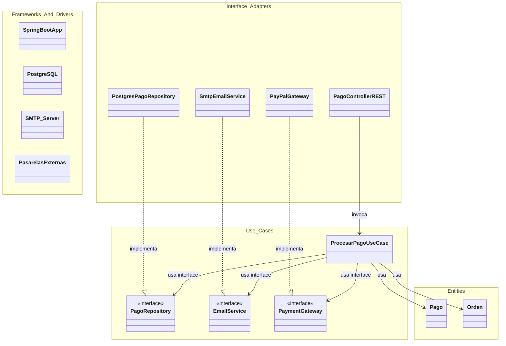

# Plantilla de entrega — Parcial 2

---

## Pregunta P07: P.7

### Estudiante

- **Nombre completo**: Juan David Rodriguez Franco

---

### LLM utilizado

| Campo                                   | Valor                                                                                                                                                                              |
| --------------------------------------- | ---------------------------------------------------------------------------------------------------------------------------------------------------------------------------------- |
| **Nombre del LLM**                | Gemini                                                                                                                                                                             |
| **Modelo específico**            | Gemini 3.1 Pro                                                                                                                                                                     |
| **¿Por qué elegiste este LLM?** | Gemini 3.1 Pro tiene excelente capacidad para diseñar diagramas arquitectónicos y explicar conceptos estructurales complejos como la Regla de Dependencia en Clean Architecture. |

---

### Prompt utilizado

```text
Actúa como un arquitecto de software experto en Clean Architecture.

En el proyecto OpenLib Market, tenemos el módulo de "Gestión de Pagos". Actualmente está todo acoplado en una clase `PaymentService` (API REST, reglas de pago con tarjeta/PSE/PayPal, persistencia en PostgreSQL y notificaciones por correo). 

Necesito que rediseñes este módulo aplicando estrictamente **Clean Architecture**. Por favor incluye:
1. Una descripción clara de qué responsabilidades van en cada capa (Entities, Use Cases, Interface Adapters, Frameworks & Drivers) específicamente para este módulo de pagos.
2. Un diagrama en formato Mermaid que ilustre la estructura de estas capas y demuestre visualmente que se respeta la "Regla de Dependencia".
3. Una explicación breve de cómo se inyectan las dependencias externas (Base de datos, Correos, Pasarelas) usando el Principio de Inversión de Dependencias sin violar la arquitectura.
```

---

### Respuesta del LLM

```markdown
Para desacoplar el monolito `PaymentService`, aplicaremos **Clean Architecture**, dividiendo el sistema en anillos concéntricos. La regla principal aquí es la **Regla de Dependencia**: el código fuente solo puede apuntar hacia adentro (las capas internas no saben nada de las capas externas).

### 1. Responsabilidades por Capa en el Módulo de Pagos

* **Entities (Entidades / Reglas de Negocio Enterprise):**
  * `Pago`, `Orden`, `MetodoPago` (Enums o clases de valor).
  * Contienen la lógica fundamental independiente de la aplicación (ej: validaciones de que un pago no puede procesarse si el monto es cero o negativo).
* **Use Cases (Casos de Uso / Reglas de Negocio de Aplicación):**
  * `ProcesarPagoUseCase`. 
  * Orquesta el flujo: recibe la orden, invoca al procesador de la pasarela, cambia el estado de la orden, llama al repositorio para guardar, e invoca al servicio de notificación. *No importa si es REST o CLI, el flujo es el mismo.*
* **Interface Adapters (Adaptadores de Interfaz):**
  * `PagoController` (Controlador REST que recibe el JSON de JavaFX y lo convierte a DTOs/Input boundaries).
  * `PagoPresenter` (Para formatear la respuesta).
  * Implementaciones de las interfaces de los adaptadores (`PostgresPagoRepository`, `SmtpEmailSender`, `StripePaymentGateway`). 
* **Frameworks & Drivers (Infraestructura):**
  * La base de datos PostgreSQL real, el servidor web (Spring Boot / Javalin), la API de SendGrid/SMTP, y las librerías de Stripe o PayPal.

### 2. Diagrama de la Estructura (Regla de Dependencia)



### 3. Inyección de Dependencias Externas (Principio DIP)

Si el `ProcesarPagoUseCase` necesita guardar un pago o enviar un correo (acciones de infraestructura), estaríamos tentados a hacerle un `import` a `PostgresPagoRepository`. Pero esto violaría la arquitectura porque el "Use Case" (capa interna) dependería de un "Interface Adapter" (capa externa).

Para solucionarlo, aplicamos el **Principio de Inversión de Dependencia (DIP)**:

1. Definimos las interfaces (`PagoRepository`, `EmailService`) **dentro** de la capa de Casos de Uso.
2. El `ProcesarPagoUseCase` solo conoce estas interfaces.
3. Las clases concretas (`PostgresPagoRepository`) en la capa de Adaptadores implementan esas interfaces.
4. Un inyector de dependencias (como el framework de IoC en la capa más externa) se encarga de instanciar las clases concretas y pasárselas al constructor del `ProcesarPagoUseCase` al iniciar la aplicación.

De esta forma, el flujo de control sale hacia la base de datos, pero la dependencia del código fuente apunta hacia adentro.

```

---

### Análisis crítico de la respuesta

#### 1. ¿Qué hizo bien el prompt?

El prompt fue muy sólido porque describió el problema concreto (el monolito `PaymentService`) y exigió tres entregables específicos: distribución por capas, diagrama Mermaid y explicación del DIP. Esto obligó al LLM a no quedarse en teoría abstracta sino a aplicar Clean Architecture directamente al contexto de OpenLib Market. La frase "aplicando estrictamente Clean Architecture" fue clave para que el LLM no mezclara con otras arquitecturas.

#### 2. ¿Qué se puede mejorar?

El prompt debería haber pedido también **código Java de ejemplo del caso de uso** (el `ProcesarPagoUseCase` con sus dependencias inyectadas por constructor), ya que la rúbrica pregunta explícitamente: *"¿Qué tan testeable es el diseño resultante comparado con la versión acoplada original?"*. Sin ver el código del Use Case, es difícil evidenciar la ganancia en testeabilidad. Además, faltó preguntar si el controlador REST está bien aislado de la lógica de negocio con un ejemplo concreto.

#### 3. Respuesta final

El LLM hizo un trabajo excelente estructurando las cuatro capas de Clean Architecture para el módulo de pagos. La explicación del DIP fue particularmente correcta: definir las interfaces (`PagoRepository`, `EmailService`, `PaymentGateway`) **dentro** de la capa de Use Cases, para que los adaptadores externos las implementen, es la técnica correcta para cruzar la frontera sin violar la Regla de Dependencia.

**Comparativa de testeabilidad (lo que el LLM no mostró explícitamente):**

| | `PaymentService` original acoplado | `ProcesarPagoUseCase` con Clean Architecture |
|---|---|---|
| Test unitario | ❌ Imposible sin PostgreSQL, SMTP y Stripe reales | ✅ Basta con Mockito para simular `PagoRepository`, `EmailService`, `PaymentGateway` |
| Cambiar BD | ❌ Modifica `PaymentService` | ✅ Solo crea una nueva implementación de `PagoRepository` |
| Cambiar pasarela | ❌ Modifica `PaymentService` | ✅ Solo crea una nueva implementación de `PaymentGateway` |

Esta comparativa demuestra que Clean Architecture no es solo un ejercicio teórico, sino que transforma un sistema inmantenible en uno donde los cambios de infraestructura tienen costo **cero** sobre las reglas de negocio.
