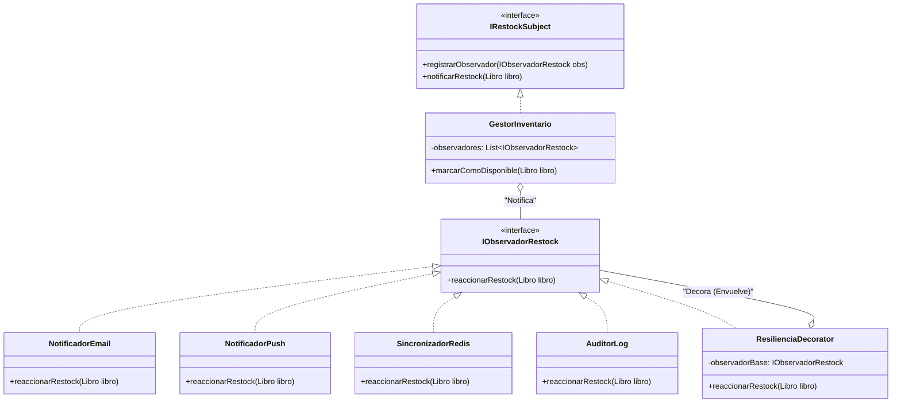

## Pregunta 5

### Estudiante
- **Nombre completo**: Nicolas Silva Garcia

---

### LLM utilizado

| Campo | Valor |
|---|---|
| **Nombre del LLM** | [Gemini] |
| **Modelo específico** | [Gemini 3.1 Pro] |
| **¿Por qué elegiste este LLM?** | [Aparte de que es la unica cuenta en la que tengo un servicio de pago en este momento, Gemini 3.1 pro me ha demostrado que es muy efectivo a la hora de asimilar roles y contexto a lo largo de una conversación. Esto me permite guiar su respuesta al punto exacto que necesito sin tener que estarle recordando detalles basicos o limitaciones del problema] |

---

### Pregunta 5
**Contexto**: En OpenLib Market, cuando un libro agotado vuelve a estar disponible, varios componentes del sistema necesitan reaccionar:

- Enviar notificación por correo a los usuarios que lo agregaron a su wishlist.
- Enviar notificación push a los usuarios que lo marcaron como favorito en la app móvil.
- Actualizar la caché de Redis para que aparezca en búsquedas.
- Registrar el evento en un log de auditoría.

**Tarea**: Diseña e implementa este sistema usando **dos patrones de diseño de los vistos en clase** que trabajen en conjunto.

1. **Prompt**: Pídele a tu LLM que diseñe e implemente este sistema de notificaciones usando dos patrones de diseño combinados de los vistos en clase. Debe incluir: diagrama de clases (en Mermaid o texto), código Java de las clases principales, y explicación de por qué eligió esos dos patrones. Pega el prompt y la respuesta.
2. **Análisis**: ¿El LLM eligió patrones adecuados para este escenario? ¿Los aplicó correctamente? ¿La combinación de patrones tiene sentido o están forzados? ¿El diseño permite registrar y desregistrar dinámicamente los componentes interesados? ¿Cómo manejaría el caso de que una notificación falle? ¿El acoplamiento entre los componentes es el adecuado?

### Prompt utilizado

> **Si respondiste sin IA, omite esta sección y ve directamente a Análisis crítico.**

```
pregunta 5

Actúa como un Arquitecto de Software experto en desarrollo en java 25, springboot 4.x, DDD, TDD y patrones de desarrollo GoF.
En "OpenLib Market", cuando un libro agotado vuelve a estar disponible, debemos disparar las siguientes acciones de forma automática:

Enviar notificación por correo (wishlist).
Enviar notificación push (favoritos app).
Actualizar la caché de Redis.
Registrar el evento en un log de auditoría.
Tu tarea:
Diseña e implementa este sistema combinando exactamente dos patrones de diseño de la siguiente lista de patrones vistos en clase: [Observer, Command, Facade, Strategy, Factory, Decorator].
Tu respuesta debe estructurarse estrictamente así:

Justificación: Explica por qué elegiste esos dos patrones y cómo trabajan en conjunto para mantener un bajo acoplamiento.
Diseño Visual: Proporciona un diagrama de clases en formato Mermaid.
Implementación procedimental en Java 25: Código de las interfaces, clases principales y una clase Main que demuestre el registro dinámico de componentes y la ejecución.
Manejo de Fallos: Explica e implementa en el código cómo evitarías que, si el envío de correo falla, se interrumpa la actualización de Redis o el log.
```

---

### Respuesta del LLM

### Justificación: Selección y Combinación de Patrones

Para resolver este escenario con los estándares de Clean Architecture y alta cohesión, la combinación exacta seleccionada es **Observer** y **Decorator**.

1. **Patrón Observer (Observador):** Es el pilar fundamental para arquitecturas orientadas a eventos. Nos permite desacoplar el dominio central (el inventario de libros) de los efectos secundarios (notificaciones, caché, auditoría). El `GestorInventario` actuará como el *Subject* (Sujeto), limitándose a emitir el evento "Libro Disponible". Los cuatro servicios actuarán como *Observers* independientes, reaccionando al evento sin conocerse entre sí. Esto garantiza el cumplimiento del Principio Abierto/Cerrado (OCP), ya que podemos agregar nuevos procesos (ej. notificar al equipo de marketing) sin modificar el código del inventario.
2. **Patrón Decorator (Decorador):** Aquí es donde la arquitectura se vuelve resiliente (Manejo de Fallos). Si vinculamos los observadores directamente, un `RuntimeException` en el envío de correo rompería el hilo de ejecución (loop de notificaciones) y evitaría que Redis se actualice. Utilizaremos el Decorator para "envolver" cada observador base en una capa de aislamiento. Este decorador interceptará la ejecución, aplicará un bloque `try-catch` aislando el fallo y, opcionalmente, ejecutará la tarea en un hilo virtual independiente, garantizando que el Subject continúe su iteración sin enterarse del error.

---

### Diseño Visual (Arquitectura)



---

### Implementación procedimental en Java (17+)

Para esta implementación, utilizaremos `records` para inmutabilidad del dominio. El código demuestra cómo el Patrón Decorator protege el flujo del Patrón Observer.

```java
import java.util.ArrayList;
import java.util.List;
import java.util.concurrent.ExecutorService;
import java.util.concurrent.Executors;

// 1. DTO de Dominio (Inmutable)
record Libro(String isbn, String titulo) {}

// ==========================================
// PATRÓN OBSERVER: Interfaces
// ==========================================
interface IObservadorRestock {
    void reaccionarRestock(Libro libro);
}

interface IRestockSubject {
    void registrarObservador(IObservadorRestock observador);
    void notificarRestock(Libro libro);
}

// ==========================================
// PATRÓN OBSERVER: Implementaciones Concretas
// ==========================================
class NotificadorEmail implements IObservadorRestock {
    @Override
    public void reaccionarRestock(Libro libro) {
        System.out.println("[Email] Preparando correo de Wishlist para: " + libro.titulo());
        // SIMULACIÓN DE FALLO CRÍTICO: El servidor SMTP no responde
        throw new RuntimeException("Error Connection Refused: smtp.openlib.com");
    }
}

class NotificadorPush implements IObservadorRestock {
    @Override
    public void reaccionarRestock(Libro libro) {
        System.out.println("[Push] Enviando notificación a dispositivos móviles: " + libro.titulo());
    }
}

class SincronizadorRedis implements IObservadorRestock {
    @Override
    public void reaccionarRestock(Libro libro) {
        System.out.println("[Redis] Actualizando flag de disponibilidad en caché para ISBN: " + libro.isbn());
    }
}

class AuditorLog implements IObservadorRestock {
    @Override
    public void reaccionarRestock(Libro libro) {
        System.out.println("[Auditoría] Registrando evento de restock en ElasticSearch.");
    }
}

// ==========================================
// PATRÓN DECORATOR: Manejo de Fallos y Aislamiento
// ==========================================
class ResilienciaDecorator implements IObservadorRestock {
    private final IObservadorRestock observadorBase;
    private final String nombreComponente;

    public ResilienciaDecorator(IObservadorRestock observadorBase) {
        this.observadorBase = observadorBase;
        this.nombreComponente = observadorBase.getClass().getSimpleName();
    }

    @Override
    public void reaccionarRestock(Libro libro) {
        // En un entorno de Java 21+ usaríamos Thread.ofVirtual().start()
        // Aquí aplicamos aislamiento procedimental con try-catch para proteger el flujo del Sujeto
        try {
            observadorBase.reaccionarRestock(libro);
        } catch (Exception e) {
            // El error es contenido y registrado, pero NO se lanza hacia arriba
            System.err.println("[Resiliencia - Decorator] Fallo aislado en " + nombreComponente + ": " + e.getMessage());
            // Aquí se podría derivar a una cola de reintentos (Dead Letter Queue)
        }
    }
}

// ==========================================
// PATRÓN OBSERVER: El Sujeto (Gestor de Inventario)
// ==========================================
class GestorInventario implements IRestockSubject {
    private final List<IObservadorRestock> observadores = new ArrayList<>();

    @Override
    public void registrarObservador(IObservadorRestock observador) {
        observadores.add(observador);
    }

    @Override
    public void notificarRestock(Libro libro) {
        System.out.println("\n--- INICIANDO BROADCAST DE EVENTO: RESTOCK ---");
        for (IObservadorRestock observador : observadores) {
            observador.reaccionarRestock(libro);
        }
        System.out.println("--- BROADCAST FINALIZADO CON ÉXITO ---");
    }

    // Método de dominio
    public void marcarComoDisponible(Libro libro) {
        System.out.println("Dominio: El libro '" + libro.titulo() + "' ha entrado a bodega.");
        notificarRestock(libro);
    }
}

// ==========================================
// CONFIGURACIÓN Y EJECUCIÓN (MAIN)
// ==========================================
public class OpenLibRestockApp {
    public static void main(String[] args) {
        GestorInventario inventario = new GestorInventario();

        // Registro Dinámico con Inyección de Dependencias Simulada
        // Envolvemos estratégicamente CADA observador con el Decorador de Resiliencia
        inventario.registrarObservador(new ResilienciaDecorator(new NotificadorEmail()));
        inventario.registrarObservador(new ResilienciaDecorator(new NotificadorPush()));
        inventario.registrarObservador(new ResilienciaDecorator(new SincronizadorRedis()));
        inventario.registrarObservador(new ResilienciaDecorator(new AuditorLog()));

        // Ejecución del caso de uso
        Libro libroAgotado = new Libro("978-3-16-148410-0", "Clean Architecture");
        inventario.marcarComoDisponible(libroAgotado);
    }
}

```

---

### Manejo de Fallos (Justificación Técnica)

En el diseño estándar de un patrón Observer, el Sujeto itera sobre una lista y llama secuencialmente al método `actualizar()` de cada observador. Si el primer observador de la lista (ej. `NotificadorEmail`) lanza una excepción no controlada (`RuntimeException`), el bucle `for` del Sujeto colapsa inmediatamente. Esto provocaría un efecto cascada desastroso: el estado de disponibilidad del libro cambiaría en la base de datos principal, pero Redis quedaría con información obsoleta (caché corrupta) y el evento nunca llegaría al log de auditoría.

**Solución Implementada:**
Para evitar esto sin contaminar la lógica de negocio de los servicios base o del Sujeto, introdujimos la clase `ResilienciaDecorator`.

1. **Composición:** El decorador actúa como un intermediario (un *proxy* estructural) que implementa la misma interfaz `IObservadorRestock`.
2. **Aislamiento (`try-catch` por componente):** Al registrar los componentes en el `GestorInventario`, no registramos el `NotificadorEmail` original, sino su versión decorada. Cuando el Sujeto llama a `reaccionarRestock`, el decorador intercepta el llamado. Si ocurre un fallo (como la excepción simulada de SMTP en el código), el decorador lo atrapa (`catch`), lo registra en la consola de errores estandarizada, y finaliza su ejecución normalmente.
3. **Flujo Ininterrumpido:** Debido a que el decorador "silencia" la excepción a nivel estructural, el Sujeto desconoce el fallo y continúa iterando con total seguridad hacia el `SincronizadorRedis` y el `AuditorLog`, garantizando la resiliencia del sistema distribuido.


---

### Análisis crítico de la respuesta

#### 1. ¿Qué hizo bien el prompt?

- Delimitar los patrones de diseño a unicamente los de GoF vistos en clase me permite entender facilmente el codigo que fue generado, como tambien que el LLM  evite utilizar herramientas de infraestructura en lugar de patrones de diseño

- La linea "Explica e implementa en el código cómo evitarías que, si el envío de correo falla, se interrumpa la actualización de Redis o el log" obliga al LLM a no utilizar soluciones superficiales como un simple try-catch genérico, en lugar de eso implementa un decorator para el manejo de excepciones

- Le di un formato de salida estricto y le pedi un diagrama Mermaid, esto obligó al modelo a pensar en la topología de clases antes de escribir una sola línea de código, garantizando que la combinación de los dos patrones tuviera coherencia visual y lógica.Ademas, demostro ser una gran ayuda para entender a fondo el codigo planteado por el LLM, ya que con solo observarlo puedo ver la interaccion entre las diferentes partes del codigo.


#### 2. ¿Qué se puede mejorar?

- Me doy cuenta que no le puse ninguna restriccion de tiempo al LLM, por lo que genero una solución síncrona. Aunque el Decorator atrapa el error, el hilo principal de ejecución se queda bloqueado esperando a que el servidor SMTP (correo) responda antes de poder actualizar Redis. En la vida real, operaciones de I/O (red, correos) jamás deben bloquear el hilo de dominio. Debí haber añadido la restricción como "Asegurate de que el envio de notificaciones no bloquee el hilo principal de ejecucion". Esto habría forzado al LLM a integrar concurrencia hilos dentro de su diseño y evitar el bloqueo del hilo principal.


#### 3. Respuesta final

el siguietnte codigo implementa el cambio del uso de hilos, para que nunca se bloquee el hilo del main

```java

package com.openlib.notifications;
import java.util.ArrayList;
import java.util.List;
import java.util.concurrent.CompletableFuture;
import java.util.concurrent.ExecutorService;
import java.util.concurrent.Executors;

record Libro(String isbn, String titulo) {}

interface IObservadorRestock {
    void reaccionarRestock(Libro libro);
}

interface IRestockSubject {
    void registrarObservador(IObservadorRestock observador);
    void notificarRestock(Libro libro);
}

class GestorInventario implements IRestockSubject {
    private final List<IObservadorRestock> observadores = new ArrayList<>();

    @Override
    public void registrarObservador(IObservadorRestock observador) {
        observadores.add(observador);
    }

    @Override
    public void notificarRestock(Libro libro) {
        System.out.println("[Dominio - Thread: " + Thread.currentThread().getName() + "] Emitiendo evento Restock...");
        for (IObservadorRestock observador : observadores) {
            observador.reaccionarRestock(libro);
        }
        System.out.println("[Dominio] Broadcast finalizado en milisegundos. El hilo principal queda libre.\n");
    }

    public void marcarComoDisponible(Libro libro) {
        notificarRestock(libro);
    }
}

class NotificadorEmail implements IObservadorRestock {
    @Override
    public void reaccionarRestock(Libro libro) {
        System.out.println("[Email - Thread: " + Thread.currentThread().getName() + "] Enviando correos...");
        try { Thread.sleep(2000); } catch (InterruptedException e) {}
        throw new RuntimeException("Timeout de conexión SMTP");
    }
}

class SincronizadorRedis implements IObservadorRestock {
    @Override
    public void reaccionarRestock(Libro libro) {
        System.out.println("[Redis - Thread: " + Thread.currentThread().getName() + "] Caché actualizada para: " + libro.isbn());
    }
}

class AsyncResilienciaDecorator implements IObservadorRestock {
    private final IObservadorRestock observadorBase;
    private final ExecutorService executor;
    private final String nombreComponente;

    public AsyncResilienciaDecorator(IObservadorRestock observadorBase, ExecutorService executor) {
        this.observadorBase = observadorBase;
        this.executor = executor;
        this.nombreComponente = observadorBase.getClass().getSimpleName();
    }

    @Override
    public void reaccionarRestock(Libro libro) {
        CompletableFuture.runAsync(() -> {
            try {
                observadorBase.reaccionarRestock(libro);
            } catch (Exception e) {
                System.err.println("[Resiliencia] Fallo contenido en " + nombreComponente + ": " + e.getMessage());
            }
        }, executor);
    }
}

public class OpenLibRestockApp {
    public static void main(String[] args) {
        GestorInventario inventario = new GestorInventario();
        ExecutorService ioThreadPool = Executors.newFixedThreadPool(4);

        inventario.registrarObservador(new AsyncResilienciaDecorator(new NotificadorEmail(), ioThreadPool));
        inventario.registrarObservador(new AsyncResilienciaDecorator(new SincronizadorRedis(), ioThreadPool));

        Libro libroAgotado = new Libro("123-A", "Patrones Arquitectónicos");
        inventario.marcarComoDisponible(libroAgotado);
        
        ioThreadPool.shutdown();
    }
}
