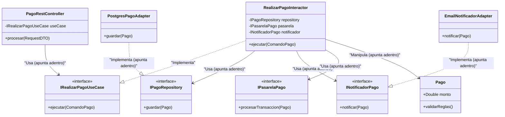

## Pregunta 7

### Estudiante
- **Nombre completo**: Nicolas Silva Garcia

---

### LLM utilizado

| Campo | Valor |
|---|---|
| **Nombre del LLM** | [Gemini] |
| **Modelo específico** | [Gemini 3.1 Pro] |
| **¿Por qué elegiste este LLM?** | [Aparte de que es la unica cuenta en la que tengo un servicio de pago en este momento, Gemini 3.1 pro me ha demostrado que es muy efectivo a la hora de asimilar roles y contexto a lo largo de una conversación. Esto me permite guiar su respuesta al punto exacto que necesito sin tener que estarle recordando detalles basicos o limitaciones del problema]  |

---

### Pregunta 7
El equipo de OpenLib Market está diseñando el módulo de **gestión de pagos**. Debe soportar:

- Procesar un pago con múltiples métodos (tarjeta, PSE, PayPal).
- Registrar la transacción en base de datos PostgreSQL.
- Notificar al comprador y al vendedor por correo.
- Exponer una API REST para que el frontend JavaFX la consuma.

Actualmente el equipo acopló todo en una sola clase `PaymentService` con un único método `realizarPago` que cubre todas las funcionalidades: llamar a la pasarela de pago, enviar el correo de notificación, cambiar el estado de la orden y preparar la entrega o descarga.

**Tarea**: Rediseña este módulo aplicando Clean Architecture.

1. **Prompt**: Pídele a tu LLM que rediseñe el módulo de pagos de OpenLib Market aplicando Clean Architecture. Debe: definir qué va en cada capa (Entities, Use Cases, Interface Adapters, Frameworks & Drivers), dibujar un diagrama de la estructura (en Mermaid o ASCII), mostrar cómo se respeta la regla de dependencia, y explicar cómo se inyectan las dependencias externas sin violar la arquitectura. Pega el prompt y la respuesta.
2. **Análisis**: ¿El LLM ubicó correctamente cada componente en su capa correspondiente? ¿El controlador REST está bien aislado de la lógica de negocio? ¿La regla de dependencia se respeta en todo el diseño? ¿Hay dependencias que cruzan capas en la dirección equivocada? ¿Qué tan testeable es el diseño resultante comparado con la versión acoplada original?

### Prompt utilizado

> **Si respondiste sin IA, omite esta sección y ve directamente a Análisis crítico.**

```
Actúa como un Arquitecto de Software Principal experto en Java y Clean Architecture.

En "OpenLib Market", el módulo de gestión de pagos actualmente es un monolito. Toda la lógica está acoplada en un único método PaymentService.realizarPago() que hace de todo: procesa el pago (Tarjeta/PSE/PayPal), guarda en PostgreSQL, envía correos de notificación, cambia el estado de la orden y expone directamente la respuesta al frontend JavaFX.

Tu tarea:
Rediseña este módulo aplicando estrictamente Clean Architecture (Robert C. Martin). Tu respuesta debe ser procedimental y enfocada en la implementación, estructurada de la siguiente manera:

    Mapeo de Capas: Define exactamente qué clases/interfaces van en cada una de las 4 capas (Entities, Use Cases, Interface Adapters, Frameworks & Drivers).

    Diseño Visual: Proporciona un diagrama en formato Mermaid (classDiagram) que muestre la estructura de clases y las interfaces.

    Regla de Dependencia y Flujo de Control: Explica paso a paso cómo viaja la petición desde el controlador REST hasta la base de datos, demostrando cómo se respeta la Regla de Dependencia (las flechas apuntan hacia adentro).

    Inyección de Dependencias: Muestra un fragmento de código Java clave que demuestre cómo se inyectan las dependencias externas (PostgreSQL, Correo, Pasarelas) en el Caso de Uso sin violar la arquitectura
```

---

### Respuesta del LLM

Este es el reto arquitectónico definitivo de tu evaluación. Desacoplar un monolito como `PaymentService` es exactamente el tipo de problema al que se enfrenta un Arquitecto Principal.

Para resolverlo, aplicaremos Clean Architecture enfocándonos en un diseño **procedimental y lógico**. Abandonaremos la estructura anidada y distribuiremos las responsabilidades para que el flujo de control y las dependencias estén matemáticamente alineados con la Regla de Dependencia.

A continuación, la arquitectura detallada para refactorizar este módulo.

---

### 1. Mapeo de Capas (Estructura Estricta)

Para garantizar que "las dependencias apunten hacia adentro", dividimos el módulo en las siguientes 4 capas concéntricas:

* **1. Entities (Reglas de Negocio Centrales - El Núcleo):**
* `Pago` (Clase o Record): Contiene el estado del pago (monto, moneda, fecha) y validaciones matemáticas o de dominio puras (ej. no permitir pagos negativos).
* `Orden` (Clase): Representa el estado de la compra.


* **2. Use Cases (Reglas de Aplicación):**
* `IRealizarPagoUseCase` (Interfaz/Input Port): El contrato de entrada que define qué hace el caso de uso.
* `RealizarPagoInteractor` (Clase): Contiene el procedimiento algorítmico paso a paso.
* `IPagoRepository` (Interfaz/Output Port): Contrato para persistencia.
* `IPasarelaPago` (Interfaz/Output Port): Contrato para la pasarela externa (Stripe, PayPal, PSE).
* `INotificadorPago` (Interfaz/Output Port): Contrato para envío de mensajes.


* **3. Interface Adapters (Adaptadores):**
* `PagoRestController` (Clase): Recibe la petición HTTP, la mapea a un DTO y llama al Input Port (`IRealizarPagoUseCase`).
* `PostgresPagoAdapter` (Clase): Implementa `IPagoRepository`. Transforma la entidad `Pago` a tablas SQL.
* `EmailNotificadorAdapter` (Clase): Implementa `INotificadorPago`. Transforma el mensaje de dominio a un formato de correo electrónico.
* `StripePasarelaAdapter` (Clase): Implementa `IPasarelaPago`. Transforma los datos del pago al formato requerido por la API de Stripe.


* **4. Frameworks & Drivers (Detalles Técnicos - El Exterior):**
* *Spring Boot Web* (Tomcat integrado).
* *Spring Data JPA / JDBC Driver de PostgreSQL*.
* *JavaMailSender* o SDK de SendGrid.
* *SDK oficial de Stripe/PayPal*.


---

### 2. Diseño Visual: Estructura y Principio de Inversión de Dependencias (DIP)

Este diagrama demuestra cómo las flechas de dependencia (líneas continuas y discontinuas) siempre apuntan desde los adaptadores (capa exterior) hacia el centro (Casos de uso y Entidades).



---

### 3. Regla de Dependencia y Flujo de Control

Es vital entender la diferencia entre el **flujo de ejecución** (cómo viajan los datos en tiempo real) y la **dependencia del código fuente** (quién conoce a quién a nivel de importaciones en Java).

**Procedimiento de ejecución paso a paso:**

1. **Entrada:** El cliente HTTP envía un POST a `/api/pagos`. El `PagoRestController` (Adaptador) recibe la petición.
2. **Llamada al centro:** El Controlador conoce la interfaz `IRealizarPagoUseCase` (depende hacia adentro). Llama a `useCase.ejecutar(...)`.
3. **Lógica Procedimental:** El `RealizarPagoInteractor` (Caso de Uso) toma el control. Crea la Entidad `Pago` y aplica reglas de negocio.
4. **Cruce de Límites (El Secreto de Clean Architecture):** Aquí el Interactor necesita guardar en PostgreSQL y enviar un correo. Sin embargo, *no puede* importar ni llamar a `PostgresPagoAdapter` porque eso sería apuntar hacia afuera.
* **¿Cómo lo resuelve?** El Interactor llama a los métodos de sus propias interfaces (`IPagoRepository.guardar()` y `INotificadorPago.notificar()`). **El flujo de control va hacia la base de datos, pero la dependencia del código fuente sigue apuntando hacia el Interactor**, porque `PostgresPagoAdapter` implementa la interfaz del Interactor.


---

### 4. Implementación de Inyección de Dependencias (Java)

Para que el `RealizarPagoInteractor` permanezca "limpio", libre de anotaciones de Spring (`@Service`, `@Autowired`), inyectamos las dependencias por constructor. La configuración de Spring (Framework) se encarga de ensamblar las piezas por fuera del dominio.

**1. El Caso de Uso (Capa Interior - Sin rastro de Spring Boot):**

```java
// Paquete: com.openlib.pagos.application.usecases
public class RealizarPagoInteractor implements IRealizarPagoUseCase {
    
    // Dependencias abstractas (Puertos de salida)
    private final IPagoRepository pagoRepository;
    private final IPasarelaPago pasarelaPago;
    private final INotificadorPago notificadorPago;

    // Inyección por constructor (Agnóstico al framework)
    public RealizarPagoInteractor(
            IPagoRepository pagoRepository, 
            IPasarelaPago pasarelaPago, 
            INotificadorPago notificadorPago) {
        this.pagoRepository = pagoRepository;
        this.pasarelaPago = pasarelaPago;
        this.notificadorPago = notificadorPago;
    }

    @Override
    public ResultadoPago ejecutar(ComandoPago comando) {
        // 1. Crear Entidad
        Pago nuevoPago = new Pago(comando.monto(), comando.metodo());
        
        // 2. Procesar en pasarela (vía Interfaz)
        pasarelaPago.procesarTransaccion(nuevoPago);
        
        // 3. Persistir (vía Interfaz)
        pagoRepository.guardar(nuevoPago);
        
        // 4. Notificar (vía Interfaz)
        notificadorPago.notificar(nuevoPago);
        
        return new ResultadoPago(true, "Pago procesado correctamente");
    }
}

```

**2. El Ensamblaje (Capa Exterior - Frameworks & Drivers):**

En la capa más externa, utilizamos una clase de configuración de Spring para conectar las implementaciones concretas (Adaptadores) con la interfaz del caso de uso. El dominio nunca se entera de que Spring existe.

```java
// Paquete: com.openlib.infrastructure.config
import org.springframework.context.annotation.Bean;
import org.springframework.context.annotation.Configuration;

@Configuration
public class CasoUsoConfig {

    @Bean
    public IRealizarPagoUseCase realizarPagoUseCase(
            PostgresPagoAdapter postgresAdapter,   // Spring inyecta el adaptador de DB
            StripePasarelaAdapter stripeAdapter,   // Spring inyecta el adaptador de Stripe
            EmailNotificadorAdapter emailAdapter   // Spring inyecta el adaptador de Correo
    ) {
        // Ensamblamos el Interactor inyectando las implementaciones concretas 
        // a través de las abstracciones esperadas por el constructor.
        return new RealizarPagoInteractor(
                postgresAdapter, 
                stripeAdapter, 
                emailAdapter
        );
    }
}

```

---

### Análisis crítico de la respuesta

#### 1. ¿Qué hizo bien el prompt?

Le exigi directamente usar el DPI en la linea "explicar cómo se inyectan las dependencias externas sin violar la arquitectura". Esto obligó al LLM a evitar las anotaciones de tipo spring y utilizar el constructor del interactor para mandar los datos a los puertos necesarios, cumpliendo así con el principio de inversión de dependencias. 

Al pedir "definir qué va en cada capa (Entities, Use Cases, Interface Adapters, Frameworks & Drivers)", obligue a la IA a categorizar cada componente antes de programarlo, lo cual previno la mezcla de responsabilidades.


#### 2. ¿Qué se puede mejorar?

- Le pedi al LLM refactorizar para soportar múltiples métodos de pago (tarjeta, PSE, PayPal), pero no le especifiqué que debía mostrar la lógica de enrutamiento, por lo que simplemente me mostró un caso particular de uso (tarjeta de crédito), evadiendo la lógica de enrutamiento.Debí pedirle que integrara un patrón de diseño (como Strategy o Factory) en la capa de Adaptadores para decidir dinámicamente qué pasarela (Stripe, PSE, PayPal) usar según la petición del usuario.


#### 3. Respuesta final

Debi solicitar un patron Strategy especifico para evitar el bloque de ifs que determina el metodo de pago a utilizar, arreglando asi el problema de enrutamiento de pagos en la capa de Adaptadores. 

En resumen, la arquitectura correcta para manejar el problema de los pagos es Clean Architecture, la cual organiza el código en capas concéntricas que dependen únicamente hacia adentro. En el centro se encuentran las entidades y casos de uso (lógica de negocio pura), y en la periferia los adaptadores y frameworks (detalles de implementación como bases de datos o APIs externas). El flujo de control y dependencias debe ser así: el cliente llama al controlador, este delega al caso de uso, y el caso de uso interactúa con los puertos (interfaces) que luego son implementados por los adaptadores en la capa externa.

