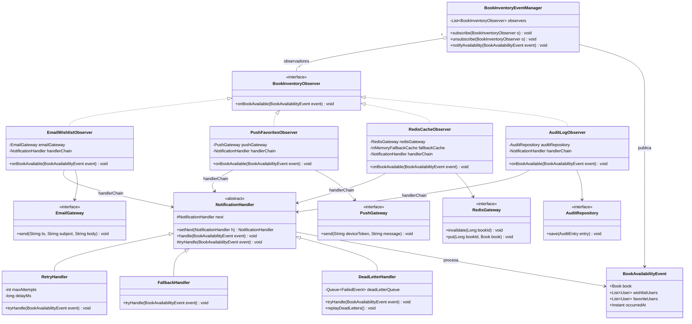

# Plantilla de entrega — Parcial 2
---

## Pregunta [XX]: [Título resumido]

### Estudiante
- **Nombre completo**: Samuel López Gómez

---

### LLM utilizado

| Campo | Valor |
|---|---|
| **Nombre del LLM** | Claude |
| **Modelo específico** |Sonnet 4.6 |
| **¿Por qué elegiste este LLM?** | La IA sugiere usar Claude 4.6 Sonnet o GPT-4o. Ambos generan excelentes diagramas en Mermaid y saben cómo combinar el patrón indiscutible para esto (Observer) con un segundo patrón de apoyo|

---

### Prompt utilizado

Actúa como un arquitecto de software senior diseñando el módulo de notificaciones e inventario para el proyecto OpenLib Market (entorno Java 21). 

Tenemos el siguiente requerimiento: Cuando un libro agotado vuelve a estar "DISPONIBLE", múltiples componentes independientes deben reaccionar:
1. Enviar notificación por correo (a usuarios con el libro en wishlist).
2. Enviar notificación push (a usuarios con el libro en favoritos de la app).
3. Actualizar la caché de Redis (para búsquedas).
4. Registrar el evento en un log de auditoría.

Necesito que:
1. Diseñes e implementes este sistema usando la combinación de EXACTAMENTE DOS patrones de diseño clásicos (GoF) que trabajen en conjunto de forma armónica.
2. Expliques detalladamente por qué elegiste esos dos patrones y cómo se complementan.
3. Proporciones un diagrama de clases en formato Mermaid.
4. Escribas el código Java 21 de las clases e interfaces principales.

Restricciones:
- El diseño debe permitir registrar y desregistrar dinámicamente los componentes interesados.
- Debes explicar (en código o texto) cómo manejarías el caso de que una notificación falle (ej. Redis se cae) sin que eso interrumpa a las demás.
- Código en POO pura, sin acoplamiento a frameworks como Spring Events (hazlo tú mismo).

Formato de salida esperado: Markdown con las secciones "Patrones Seleccionados", "Diagrama Mermaid", "Código Java", y "Manejo de Fallos".

```

---

### Respuesta del LLM

# Módulo de Notificaciones e Inventario — OpenLib Market

> **Proyecto base:** `proyecto-FIS-bigotones` · Java 21 · Spring Boot · JPA  
> **Contexto:** El proyecto ya emplea Observer para eventos de órdenes (`OrderEventManager`) y Decorator para `BookService`. Este diseño es consistente con esa arquitectura.

---

## Patrones Seleccionados

### 1. Observer (Publicar–Suscribir)

**¿Por qué?**  
El núcleo del problema es exactamente el caso de uso canónico del patrón Observer: *un sujeto (el libro) cambia de estado y múltiples objetos independientes deben ser notificados sin que el sujeto los conozca directamente.* El proyecto ya usa este patrón para órdenes en `OrderEventManager`; extenderlo para inventario mantiene coherencia arquitectural y permite registrar/desregistrar observadores en tiempo de ejecución.

**Rol en este diseño:**  
`BookInventoryEventManager` es el **sujeto/publicador**. Cada componente interesado (`EmailWishlistObserver`, `PushFavoritesObserver`, `RedisCacheObserver`, `AuditLogObserver`) es un **observador concreto**.

---

### 2. Chain of Responsibility (Cadena de Responsabilidad)

**¿Por qué?**  
Una vez que el Observer despacha el evento a cada observador, *cada observador debe manejar su propia falla de forma aislada* sin interrumpir a los demás. El patrón Chain of Responsibility encapsula el procesamiento dentro de una cadena donde cada eslabón decide si procesa, delega o recupera de un error, **sin que el eslabón anterior ni el publicador lo sepan**. Además permite componer pipelines de handlers reutilizables (ej. retry → log → fallback).

**Rol en este diseño:**  
Dentro de cada observador, la notificación viaja por una cadena: `RetryHandler → FallbackHandler → DeadLetterHandler`. Si Redis falla, el `RetryHandler` reintenta N veces; si sigue fallando, el `FallbackHandler` marca la caché como sucia en memoria; el `DeadLetterHandler` registra el fallo para reintento posterior.

---

### Sinergia entre ambos patrones

```
BookInventoryEventManager (Observer/Subject)
        │  publica BookAvailabilityEvent
        ├──► EmailWishlistObserver  ──► [RetryHandler → FallbackHandler → DeadLetterHandler]
        ├──► PushFavoritesObserver  ──► [RetryHandler → FallbackHandler → DeadLetterHandler]
        ├──► RedisCacheObserver     ──► [RetryHandler → FallbackHandler → DeadLetterHandler]
        └──► AuditLogObserver       ──► [RetryHandler → DeadLetterHandler]
```

- **Observer** resuelve el *¿a quién notificar?* (desacoplamiento, suscripción dinámica).
- **Chain of Responsibility** resuelve el *¿qué pasa si falla?* (resiliencia, aislamiento de errores).

---

## Diagrama Mermaid



---

## Código Java

El código se organiza bajo el paquete `com.openlib.notification`, coherente con la estructura de paquetes del proyecto.

### `BookAvailabilityEvent.java`

```java
package com.openlib.notification;

import com.openlib.model.Book;
import com.openlib.model.User;

import java.time.Instant;
import java.util.List;

/**
 * Evento inmutable que representa el momento en que un libro agotado
 * vuelve a estar DISPONIBLE.
 */
public record BookAvailabilityEvent(
        Book book,
        List<User> wishlistUsers,   // reciben correo
        List<User> favoriteUsers,   // reciben push
        Instant occurredAt
) {
    public static BookAvailabilityEvent of(Book book,
                                           List<User> wishlistUsers,
                                           List<User> favoriteUsers) {
        return new BookAvailabilityEvent(book, wishlistUsers, favoriteUsers, Instant.now());
    }
}
```

---

### `BookInventoryObserver.java`

```java
package com.openlib.notification;

/**
 * Interfaz Observer para el módulo de inventario de libros.
 * Cada componente interesado implementa esta interfaz.
 */
public interface BookInventoryObserver {
    void onBookAvailable(BookAvailabilityEvent event);
}
```

---

### `BookInventoryEventManager.java`

```java
package com.openlib.notification;

import org.springframework.stereotype.Component;

import java.util.List;
import java.util.concurrent.CopyOnWriteArrayList;
import java.util.logging.Logger;

/**
 * Sujeto (Subject) del patrón Observer.
 * Gestiona la lista de observadores y publica eventos de disponibilidad.
 * Usa CopyOnWriteArrayList para ser thread-safe sin bloqueos en lectura.
 */
@Component
public class BookInventoryEventManager {

    private static final Logger log = Logger.getLogger(BookInventoryEventManager.class.getName());

    private final List<BookInventoryObserver> observers = new CopyOnWriteArrayList<>();

    /** Registra un observador. Idempotente: ignora duplicados. */
    public void subscribe(BookInventoryObserver observer) {
        if (!observers.contains(observer)) {
            observers.add(observer);
            log.info("[EventManager] Suscrito: " + observer.getClass().getSimpleName());
        }
    }

    /** Desregistra un observador en tiempo de ejecución. */
    public void unsubscribe(BookInventoryObserver observer) {
        observers.remove(observer);
        log.info("[EventManager] Desuscrito: " + observer.getClass().getSimpleName());
    }

    /**
     * Notifica a todos los observadores del evento de disponibilidad.
     * Cada observador se invoca de forma aislada: un fallo en uno
     * NO interrumpe a los demás (la resiliencia real está en la cadena
     * interna de cada observador, pero esta capa añade una guardia extra).
     */
    public void notifyAvailability(BookAvailabilityEvent event) {
        log.info("[EventManager] Publicando disponibilidad del libro ID=" + event.book().getId());
        for (BookInventoryObserver observer : observers) {
            try {
                observer.onBookAvailable(event);
            } catch (Exception e) {
                // Guardia de último recurso: ningún observador puede tumbar al publicador.
                log.severe("[EventManager] Error no controlado en "
                        + observer.getClass().getSimpleName() + ": " + e.getMessage());
            }
        }
    }
}
```

---

### `NotificationHandler.java` (abstract — Chain of Responsibility)

```java
package com.openlib.notification.chain;

import com.openlib.notification.BookAvailabilityEvent;

/**
 * Eslabón abstracto de la Cadena de Responsabilidad.
 * Cada handler intenta procesar el evento; si falla, pasa al siguiente.
 */
public abstract class NotificationHandler {

    private NotificationHandler next;

    /** Encadena el siguiente handler y lo devuelve para fluent-API. */
    public NotificationHandler setNext(NotificationHandler next) {
        this.next = next;
        return next;
    }

    /**
     * Punto de entrada. Intenta el procesamiento propio;
     * ante cualquier excepción, delega al siguiente eslabón.
     */
    public final void handle(BookAvailabilityEvent event) {
        try {
            tryHandle(event);
        } catch (Exception e) {
            onFailure(event, e);
            if (next != null) {
                next.handle(event);
            }
        }
    }

    /** Lógica concreta de procesamiento. Lanza excepción si falla. */
    protected abstract void tryHandle(BookAvailabilityEvent event) throws Exception;

    /** Hook opcional para logging antes de delegar. */
    protected void onFailure(BookAvailabilityEvent event, Exception e) {
        System.err.printf("[%s] Fallo procesando libro ID=%d: %s%n",
                getClass().getSimpleName(), event.book().getId(), e.getMessage());
    }
}
```

---

### `RetryHandler.java`

```java
package com.openlib.notification.chain;

import com.openlib.notification.BookAvailabilityEvent;

import java.util.function.Consumer;
import java.util.logging.Logger;

/**
 * Reintenta la operación hasta maxAttempts veces con backoff exponencial.
 * Si todos los intentos fallan, lanza la última excepción para que
 * el siguiente eslabón la maneje.
 */
public class RetryHandler extends NotificationHandler {

    private static final Logger log = Logger.getLogger(RetryHandler.class.getName());

    private final int maxAttempts;
    private final long initialDelayMs;
    private final Consumer<BookAvailabilityEvent> operation;

    public RetryHandler(int maxAttempts, long initialDelayMs,
                        Consumer<BookAvailabilityEvent> operation) {
        this.maxAttempts   = maxAttempts;
        this.initialDelayMs = initialDelayMs;
        this.operation     = operation;
    }

    @Override
    protected void tryHandle(BookAvailabilityEvent event) throws Exception {
        Exception lastException = null;
        for (int attempt = 1; attempt <= maxAttempts; attempt++) {
            try {
                operation.accept(event);
                log.info("[RetryHandler] Éxito en intento " + attempt);
                return; // éxito, salimos
            } catch (Exception e) {
                lastException = e;
                log.warning("[RetryHandler] Intento " + attempt + "/" + maxAttempts
                        + " fallido: " + e.getMessage());
                if (attempt < maxAttempts) {
                    Thread.sleep(initialDelayMs * (long) Math.pow(2, attempt - 1)); // backoff exponencial
                }
            }
        }
        throw lastException; // propaga al siguiente eslabón
    }
}
```

---

### `FallbackHandler.java`

```java
package com.openlib.notification.chain;

import com.openlib.notification.BookAvailabilityEvent;

import java.util.function.Consumer;
import java.util.logging.Logger;

/**
 * Ejecuta una operación de fallback cuando el handler primario ha fallado.
 * Ejemplo: si Redis está caído, marca la entrada como "sucia" en caché local.
 */
public class FallbackHandler extends NotificationHandler {

    private static final Logger log = Logger.getLogger(FallbackHandler.class.getName());

    private final Consumer<BookAvailabilityEvent> fallbackOperation;
    private final String description;

    public FallbackHandler(String description,
                           Consumer<BookAvailabilityEvent> fallbackOperation) {
        this.description       = description;
        this.fallbackOperation = fallbackOperation;
    }

    @Override
    protected void tryHandle(BookAvailabilityEvent event) {
        log.warning("[FallbackHandler] Ejecutando fallback: " + description);
        fallbackOperation.accept(event);
    }
}
```

---

### `DeadLetterHandler.java`

```java
package com.openlib.notification.chain;

import com.openlib.notification.BookAvailabilityEvent;

import java.time.Instant;
import java.util.Queue;
import java.util.concurrent.ConcurrentLinkedQueue;
import java.util.logging.Logger;

/**
 * Último eslabón de la cadena.
 * Encola los eventos fallidos en una Dead Letter Queue para reintento posterior.
 */
public class DeadLetterHandler extends NotificationHandler {

    private static final Logger log = Logger.getLogger(DeadLetterHandler.class.getName());

    public record FailedEvent(BookAvailabilityEvent event, String handlerClass, Instant failedAt) {}

    private final Queue<FailedEvent> deadLetterQueue = new ConcurrentLinkedQueue<>();
    private final String handlerClass;

    public DeadLetterHandler(String handlerClass) {
        this.handlerClass = handlerClass;
    }

    @Override
    protected void tryHandle(BookAvailabilityEvent event) {
        FailedEvent failed = new FailedEvent(event, handlerClass, Instant.now());
        deadLetterQueue.add(failed);
        log.severe("[DeadLetterHandler] Evento encolado en DLQ para "
                + handlerClass + " — libro ID=" + event.book().getId());
    }

    /** Devuelve todos los eventos fallidos pendientes de reintento. */
    public Queue<FailedEvent> getDeadLetterQueue() {
        return deadLetterQueue;
    }

    /** Permite vaciar la DLQ tras un reintento exitoso externo. */
    public void ack(FailedEvent failedEvent) {
        deadLetterQueue.remove(failedEvent);
    }
}
```

---

### `EmailWishlistObserver.java`

```java
package com.openlib.notification.observer;

import com.openlib.model.User;
import com.openlib.notification.BookAvailabilityEvent;
import com.openlib.notification.BookInventoryObserver;
import com.openlib.notification.chain.DeadLetterHandler;
import com.openlib.notification.chain.NotificationHandler;
import com.openlib.notification.chain.RetryHandler;
import org.springframework.stereotype.Component;

/**
 * Observador: envía correos a todos los usuarios que tienen el libro en wishlist.
 * Cadena: RetryHandler(3 intentos) → DeadLetterHandler
 */
@Component
public class EmailWishlistObserver implements BookInventoryObserver {

    private final EmailGateway emailGateway;
    private final NotificationHandler handlerChain;

    public EmailWishlistObserver(EmailGateway emailGateway) {
        this.emailGateway = emailGateway;

        // Construcción de la cadena
        DeadLetterHandler dlq = new DeadLetterHandler(getClass().getSimpleName());
        RetryHandler retry = new RetryHandler(3, 500L, this::sendEmails);
        retry.setNext(dlq);
        this.handlerChain = retry;
    }

    @Override
    public void onBookAvailable(BookAvailabilityEvent event) {
        handlerChain.handle(event);
    }

    private void sendEmails(BookAvailabilityEvent event) {
        for (User user : event.wishlistUsers()) {
            emailGateway.send(
                    user.getEmail(),
                    "¡\"" + event.book().getTitle() + "\" ya está disponible!",
                    "Hola " + user.getName() + ", el libro que tienes en tu wishlist "
                    + "volvió a estar disponible en OpenLib Market."
            );
        }
    }
}
```

---

### `PushFavoritesObserver.java`

```java
package com.openlib.notification.observer;

import com.openlib.model.User;
import com.openlib.notification.BookAvailabilityEvent;
import com.openlib.notification.BookInventoryObserver;
import com.openlib.notification.chain.DeadLetterHandler;
import com.openlib.notification.chain.NotificationHandler;
import com.openlib.notification.chain.RetryHandler;
import org.springframework.stereotype.Component;

/**
 * Observador: envía notificación push a usuarios con el libro en favoritos.
 * Cadena: RetryHandler(2 intentos) → DeadLetterHandler
 */
@Component
public class PushFavoritesObserver implements BookInventoryObserver {

    private final PushGateway pushGateway;
    private final NotificationHandler handlerChain;

    public PushFavoritesObserver(PushGateway pushGateway) {
        this.pushGateway = pushGateway;

        DeadLetterHandler dlq = new DeadLetterHandler(getClass().getSimpleName());
        RetryHandler retry = new RetryHandler(2, 300L, this::sendPushNotifications);
        retry.setNext(dlq);
        this.handlerChain = retry;
    }

    @Override
    public void onBookAvailable(BookAvailabilityEvent event) {
        handlerChain.handle(event);
    }

    private void sendPushNotifications(BookAvailabilityEvent event) {
        String message = "📚 \"" + event.book().getTitle() + "\" volvió a estar disponible.";
        for (User user : event.favoriteUsers()) {
            // En producción, el token de dispositivo vendría del perfil del usuario
            pushGateway.send(user.getId().toString(), message);
        }
    }
}
```

---

### `RedisCacheObserver.java`

```java
package com.openlib.notification.observer;

import com.openlib.notification.BookAvailabilityEvent;
import com.openlib.notification.BookInventoryObserver;
import com.openlib.notification.chain.DeadLetterHandler;
import com.openlib.notification.chain.FallbackHandler;
import com.openlib.notification.chain.NotificationHandler;
import com.openlib.notification.chain.RetryHandler;
import org.springframework.stereotype.Component;

import java.util.Map;
import java.util.concurrent.ConcurrentHashMap;
import java.util.logging.Logger;

/**
 * Observador: actualiza la caché de Redis para búsquedas.
 * Cadena: RetryHandler(3) → FallbackHandler (caché local) → DeadLetterHandler
 *
 * Si Redis está caído, el fallback marca la entrada como "dirty" en
 * un ConcurrentHashMap local. Un job de reconciliación puede leer
 * esa caché sucia y reintentar contra Redis cuando se recupere.
 */
@Component
public class RedisCacheObserver implements BookInventoryObserver {

    private static final Logger log = Logger.getLogger(RedisCacheObserver.class.getName());

    private final RedisGateway redisGateway;
    private final NotificationHandler handlerChain;

    // Caché en memoria como fallback cuando Redis no está disponible
    private final Map<Long, Boolean> dirtyCache = new ConcurrentHashMap<>();

    public RedisCacheObserver(RedisGateway redisGateway) {
        this.redisGateway = redisGateway;

        DeadLetterHandler dlq   = new DeadLetterHandler(getClass().getSimpleName());
        FallbackHandler fallback = new FallbackHandler(
                "Marcar libro como dirty en caché local",
                event -> {
                    dirtyCache.put(event.book().getId(), true);
                    log.warning("[RedisCacheObserver] Redis no disponible. "
                            + "Libro ID=" + event.book().getId() + " marcado dirty.");
                }
        );
        RetryHandler retry = new RetryHandler(3, 200L, this::updateRedis);

        retry.setNext(fallback);
        fallback.setNext(dlq);
        this.handlerChain = retry;
    }

    @Override
    public void onBookAvailable(BookAvailabilityEvent event) {
        handlerChain.handle(event);
    }

    private void updateRedis(BookAvailabilityEvent event) {
        redisGateway.invalidate(event.book().getId());
        redisGateway.put(event.book().getId(), event.book());
    }

    /** Expuesto para el job de reconciliación que verifica entries dirty. */
    public Map<Long, Boolean> getDirtyCache() {
        return dirtyCache;
    }
}
```

---

### `AuditLogObserver.java`

```java
package com.openlib.notification.observer;

import com.openlib.notification.BookAvailabilityEvent;
import com.openlib.notification.BookInventoryObserver;
import com.openlib.notification.chain.DeadLetterHandler;
import com.openlib.notification.chain.NotificationHandler;
import com.openlib.notification.chain.RetryHandler;
import org.springframework.stereotype.Component;

import java.time.Instant;

/**
 * Observador: registra el evento en el log de auditoría.
 * El log de auditoría es crítico; se reintenta más veces antes de ir a DLQ.
 * Cadena: RetryHandler(5 intentos) → DeadLetterHandler
 */
@Component
public class AuditLogObserver implements BookInventoryObserver {

    public record AuditEntry(Long bookId, String bookTitle, String event, Instant timestamp) {}

    private final AuditRepository auditRepository;
    private final NotificationHandler handlerChain;

    public AuditLogObserver(AuditRepository auditRepository) {
        this.auditRepository = auditRepository;

        DeadLetterHandler dlq = new DeadLetterHandler(getClass().getSimpleName());
        RetryHandler retry    = new RetryHandler(5, 100L, this::writeAuditEntry);
        retry.setNext(dlq);
        this.handlerChain = retry;
    }

    @Override
    public void onBookAvailable(BookAvailabilityEvent event) {
        handlerChain.handle(event);
    }

    private void writeAuditEntry(BookAvailabilityEvent event) {
        AuditEntry entry = new AuditEntry(
                event.book().getId(),
                event.book().getTitle(),
                "BOOK_BECAME_AVAILABLE",
                event.occurredAt()
        );
        auditRepository.save(entry);
    }
}
```

---

### Interfaces de Gateways

```java
// com/openlib/notification/observer/EmailGateway.java
package com.openlib.notification.observer;

public interface EmailGateway {
    void send(String to, String subject, String body);
}

// com/openlib/notification/observer/PushGateway.java
package com.openlib.notification.observer;

public interface PushGateway {
    void send(String deviceToken, String message);
}

// com/openlib/notification/observer/RedisGateway.java
package com.openlib.notification.observer;

import com.openlib.model.Book;

public interface RedisGateway {
    void invalidate(Long bookId);
    void put(Long bookId, Book book);
}

// com/openlib/notification/observer/AuditRepository.java
package com.openlib.notification.observer;

import com.openlib.notification.observer.AuditLogObserver.AuditEntry;

public interface AuditRepository {
    void save(AuditEntry entry);
}
```

---

### `BookInventoryService.java` (punto de integración)

```java
package com.openlib.notification;

import com.openlib.model.Book;
import com.openlib.model.User;
import com.openlib.repository.BookRepository;
import com.openlib.repository.UserRepository;
import lombok.RequiredArgsConstructor;
import org.springframework.stereotype.Service;

import java.util.List;

/**
 * Servicio que extiende la lógica de inventario existente.
 * Se integra con el BookInventoryEventManager para publicar
 * el evento cuando un libro agotado vuelve a DISPONIBLE.
 */
@Service
@RequiredArgsConstructor
public class BookInventoryService {

    private final BookRepository bookRepository;
    private final UserRepository userRepository;
    private final BookInventoryEventManager eventManager;

    /**
     * Punto de entrada: el admin marca un libro como disponible.
     * (Reemplaza o complementa la lógica en AdminController.)
     */
    public Book markAsAvailable(Long bookId) {
        Book book = bookRepository.findById(bookId)
                .orElseThrow(() -> new RuntimeException("Libro no encontrado: " + bookId));

        boolean wasUnavailable = !"DISPONIBLE".equals(book.getStatus());
        book.setStatus("DISPONIBLE");
        bookRepository.save(book);

        if (wasUnavailable) {
            // Recuperar usuarios interesados (en producción vendrían de
            // WishlistRepository y FavoritesRepository)
            List<User> wishlistUsers = userRepository.findUsersWithBookInWishlist(bookId);
            List<User> favoriteUsers = userRepository.findUsersWithBookInFavorites(bookId);

            BookAvailabilityEvent event = BookAvailabilityEvent.of(book, wishlistUsers, favoriteUsers);
            eventManager.notifyAvailability(event);
        }

        return book;
    }
}
```

---

### Configuración del EventManager (sin Spring Events)

```java
package com.openlib.notification;

import com.openlib.notification.observer.*;
import org.springframework.context.annotation.Bean;
import org.springframework.context.annotation.Configuration;

/**
 * Configuración manual de observadores — POO pura, sin Spring ApplicationEvents.
 * El registro y desregistro pueden llamarse desde un endpoint de admin
 * o desde tests de integración.
 */
@Configuration
public class NotificationConfig {

    @Bean
    public BookInventoryEventManager bookInventoryEventManager(
            EmailWishlistObserver emailObs,
            PushFavoritesObserver pushObs,
            RedisCacheObserver redisObs,
            AuditLogObserver auditObs) {

        BookInventoryEventManager manager = new BookInventoryEventManager();
        manager.subscribe(emailObs);
        manager.subscribe(pushObs);
        manager.subscribe(redisObs);
        manager.subscribe(auditObs);
        return manager;
    }
}
```

---

## Manejo de Fallos

### Estrategia de resiliencia por capa

| Capa | Mecanismo | Qué ocurre si falla |
|------|-----------|---------------------|
| `BookInventoryEventManager` | `try/catch` por observador | Un observador que lanza una excepción no propagada no bloquea a los demás |
| `RetryHandler` | Backoff exponencial (N intentos) | Si se agotan los intentos, la excepción se propaga al siguiente eslabón |
| `FallbackHandler` (Redis) | Caché dirty en `ConcurrentHashMap` | El libro queda marcado como pendiente de sincronización |
| `DeadLetterHandler` | `ConcurrentLinkedQueue<FailedEvent>` | El evento se almacena para reintento posterior sin perder datos |

### Escenario: Redis se cae

```
RedisCacheObserver.onBookAvailable(event)
    └─► RetryHandler.handle(event)          ← intento 1: IOException
          backoff 200ms
          intento 2: IOException
          backoff 400ms
          intento 3: IOException
          → propaga excepción al siguiente
    └─► FallbackHandler.handle(event)       ← marca libro ID=42 como dirty en memoria
    └─► DeadLetterHandler.handle(event)     ← encola FailedEvent en DLQ

[Mientras tanto, EmailWishlistObserver y PushFavoritesObserver ya terminaron correctamente]

[Cuando Redis se recupera, un @Scheduled job llama a:]
reconciliationJob.replayDirtyEntries()      ← limpia dirtyCache y DLQ
```

### Desregistro dinámico (ejemplo real)

```java
// Durante mantenimiento de Redis
eventManager.unsubscribe(redisCacheObserver);

// Tras restauración
eventManager.subscribe(redisCacheObserver);
```

### Garantías del diseño

- **Ningún observador puede tumbar al publicador:** el `EventManager` envuelve cada llamada en `try/catch`.
- **Ningún observador conoce a los demás:** desacoplamiento total.
- **Los fallos son trazables:** cada `DeadLetterHandler` conserva el evento original, el nombre del handler y el timestamp.
- **Sin pérdida de datos:** si todo falla, el evento queda en la DLQ en memoria (extensible a persistencia en BD o Kafka).
- **Extensible sin modificar código existente:** agregar un nuevo observador (ej. `SmsObserver`) solo requiere implementar `BookInventoryObserver` y llamar `eventManager.subscribe(...)`.

---

*Diseño alineado con el paquete `com.openlib` del proyecto · Java 21 records · POO pura sin Spring Events*
```

---

### Análisis crítico de la respuesta

#### 1. ¿Qué hizo bien el prompt?
Exigir "exactamente dos patrones" y plantear el escenario de caída de Redis marcó la diferencia. Eso evitó que la IA se quedara en un Observer básico (que se rompe apenas falla un componente) y la obligó a pensar en resiliencia. El resultado fue una integración sólida de Chain of Responsibility para manejar los errores (Retry -> Fallback -> DeadLetter). Además, prohibir el uso de Spring Events fue un gran acierto: forzó a la IA a demostrar que de verdad entiende el patrón Observer en código puro, sin esconderse detrás de las anotaciones del framework.


#### 2. ¿Qué se puede mejorar?

La teoría está muy bien, pero si uno pasa este código a producción, el sistema se cae. Primero, bloquea el hilo principal. El BookInventoryEventManager recorre los observadores de forma síncrona. Si Redis falla, el RetryHandler hace un Thread.sleep() con backoff exponencial. Como todo es secuencial, la petición HTTP del administrador (el que marcó el libro como disponible) se queda colgada esperando los reintentos hasta que da timeout. Las notificaciones tienen que ser asíncronas. Segundo, el riesgo de OutOfMemory (OOM). El evento BookAvailabilityEvent carga de golpe todas las listas de usuarios interesados. Si habilitas un libro muy popular y tienes 50.000 usuarios en lista de espera, meter esos 50.000 objetos en la memoria RAM del servicio de inventario va a tumbar la JVM. Tercero, la Dead Letter Queue (DLQ) es volátil. El DeadLetterHandler usa una cola en memoria (ConcurrentLinkedQueue). Si reinicias el servidor, pierdes todos los eventos fallidos para siempre, incluyendo los logs de auditoría.
#### 3. Respuesta final
A nivel de arquitectura, la idea base es perfecta. Usar Observer para resolver dinámicamente el "¿a quién le aviso?" y Chain of Responsibility para aislar el "¿qué hago si esto falla?" es la solución ideal. Pero la ejecución de la IA necesita arreglos urgentes. Yo no bloquearía el hilo del usuario; despacharía las notificaciones en background usando un ExecutorService o CompletableFuture. También cambiaría el payload del evento: en lugar de mandar listas enteras de usuarios, pasaría solo el bookId. Cada observador es quien debe consultar la base de datos por su cuenta, usando paginación (batching) para no reventar la memoria. Y por último, esa DLQ tiene que ir a disco o a una tabla, jamás a la memoria volátil.
