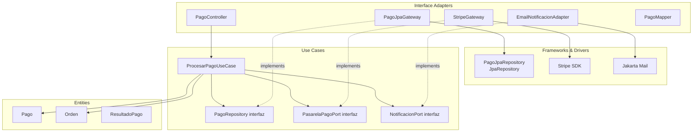

# Pregunta P07: Clean Architecture — Aplicación a pagos

### Estudiante
- **Nombre completo**: Mateo Traslaviña Moreno

---

### LLM utilizado

| Campo | Valor |
|---|---|
| **Nombre del LLM** | Claude |
| **Modelo especifico** | Claude Sonnet 4.6 |
| **¿Por que elegiste este LLM?** | El diseño de modulos con Clean Architecture requiere razonamiento sobre estructura de capas y regla de dependencia. Claude genera diagramas Mermaid correctos y codigo Java idiomatico con Spring Boot. Tras la experiencia de P06, quise comparar mi comprension del tema con como un LLM lo aplica en un caso concreto. |

---

### Prompt utilizado

```
Eres un arquitecto de software senior rediseñando el módulo de pagos de OpenLib Market (Java 21, Spring Boot 3.x, JavaFX frontend, PostgreSQL).

Contexto del problema: actualmente el equipo tiene todo acoplado en una sola clase PaymentService:
- Llamar a la pasarela de pago externa (tarjeta, PSE, PayPal)
- Enviar correo de confirmación al comprador y al vendedor
- Cambiar el estado de la orden en la base de datos
- Preparar la entrega/descarga del libro

Necesito que rediseñes este módulo aplicando Clean Architecture (Robert C. Martin):

Entregables requeridos:
1. Definir qué va en CADA capa (Entities, Use Cases, Interface Adapters, Frameworks & Drivers) con ejemplos concretos de clases para el módulo de pagos.
2. Diagrama de la estructura en Mermaid mostrando las dependencias entre capas.
3. Código Java de las clases principales: la entidad Pago, el use case ProcesarPagoUseCase, el repositorio de pagos (interfaz en Use Cases, implementación JPA en Adapters), y el controller REST.
4. Explicar cómo se inyectan las dependencias externas (pasarela de pago, email) sin violar la regla de dependencia.
5. Comparar testabilidad: ¿por qué el nuevo diseño es más testeable que el PaymentService original?

Restricciones críticas:
- Las entidades NO deben importar nada de Spring/JPA (sin @Entity en la capa de dominio)
- Los Use Cases deben depender solo de interfaces que ellos mismos definen
- El controller REST va en Interface Adapters, no en Use Cases
- La regla de dependencia debe respetarse en TODOS los límites de capa
- Usar inyección por constructor en todas partes

Formato: "Distribución por capas", "Diagrama Mermaid", "Código principal", "Inyección de dependencias", "Testabilidad".
```

---

### Respuesta del LLM

## Distribución por capas

**Entities (Dominio)**:
- `Pago` — entidad con lógica de validación (importe positivo, método no nulo)
- `Orden` — entidad con estado (PENDIENTE → PAGADA → ENTREGADA)
- `ResultadoPago` — value object inmutable con el resultado de una transacción
- `MetodoPago` — enum (TARJETA, PSE, PAYPAL)
- `EstadoOrden` — enum (PENDIENTE, PAGADA, ENTREGADA, CANCELADA)

**Use Cases (Application)**:
- `ProcesarPagoUseCase` — caso de uso principal
- `PagoRepository` — interfaz (puerto de salida)
- `PasarelaPagoPort` — interfaz para pasarela externa
- `NotificacionPort` — interfaz para emails
- `OrdenRepository` — interfaz

**Interface Adapters**:
- `PagoController` — REST endpoint `/api/v1/pagos`
- `PagoJpaGateway` implements `PagoRepository`
- `PagoJpaEntity` — entidad JPA (separada de `Pago` del dominio)
- `StripeGateway` implements `PasarelaPagoPort`
- `EmailNotificacionAdapter` implements `NotificacionPort`
- `PagoMapper` — convierte entre `Pago` y `PagoJpaEntity`

**Frameworks & Drivers**:
- Spring Boot, JPA, PostgreSQL driver
- Stripe SDK, Jakarta Mail
- `PagoJpaRepository extends JpaRepository`

## Diagrama Mermaid



## Código principal

```java
// ===== ENTITY (capa más interna, sin Spring) =====
public class Pago {
    private final String id;
    private final Long ordenId;
    private final BigDecimal monto;
    private final MetodoPago metodo;
    private EstadoPago estado;
    
    public Pago(String id, Long ordenId, BigDecimal monto, MetodoPago metodo) {
        if (monto == null || monto.compareTo(BigDecimal.ZERO) <= 0) {
            throw new IllegalArgumentException("El monto del pago debe ser positivo");
        }
        this.id = Objects.requireNonNull(id);
        this.ordenId = Objects.requireNonNull(ordenId);
        this.monto = monto;
        this.metodo = Objects.requireNonNull(metodo);
        this.estado = EstadoPago.PENDIENTE;
    }
    
    public void confirmar() {
        if (estado != EstadoPago.PENDIENTE) throw new IllegalStateException("Solo pagos pendientes pueden confirmarse");
        this.estado = EstadoPago.CONFIRMADO;
    }
    
    public void rechazar() { this.estado = EstadoPago.RECHAZADO; }
    
    // Getters (sin setters — inmutabilidad controlada)
    public String getId() { return id; }
    public BigDecimal getMonto() { return monto; }
    public EstadoPago getEstado() { return estado; }
}

// ===== PUERTOS (en Use Cases) =====
public interface PagoRepository {
    void guardar(Pago pago);
    Optional<Pago> buscarPorId(String id);
}

public interface PasarelaPagoPort {
    ResultadoTransaccion procesar(Pago pago, DatosMetodoPago datosMetodo);
}

public interface NotificacionPort {
    void notificarPagoExitoso(String emailComprador, String emailVendedor, Pago pago);
}

// ===== USE CASE =====
public class ProcesarPagoUseCase {
    private final PagoRepository pagoRepository;
    private final PasarelaPagoPort pasarelaPago;
    private final NotificacionPort notificacion;
    private final OrdenRepository ordenRepository;
    
    public ProcesarPagoUseCase(
        PagoRepository pagoRepository,
        PasarelaPagoPort pasarelaPago,
        NotificacionPort notificacion,
        OrdenRepository ordenRepository
    ) {
        this.pagoRepository = pagoRepository;
        this.pasarelaPago = pasarelaPago;
        this.notificacion = notificacion;
        this.ordenRepository = ordenRepository;
    }
    
    public ResultadoPagoResponse execute(ProcesarPagoCommand cmd) {
        Pago pago = new Pago(UUID.randomUUID().toString(), cmd.ordenId(), cmd.monto(), cmd.metodo());
        
        ResultadoTransaccion resultado = pasarelaPago.procesar(pago, cmd.datosMetodo());
        
        if (resultado.exitoso()) {
            pago.confirmar();
            Orden orden = ordenRepository.buscarPorId(cmd.ordenId()).orElseThrow();
            orden.marcarComoPagada();
            ordenRepository.guardar(orden);
            notificacion.notificarPagoExitoso(cmd.emailComprador(), cmd.emailVendedor(), pago);
        } else {
            pago.rechazar();
        }
        
        pagoRepository.guardar(pago);
        return new ResultadoPagoResponse(pago.getId(), pago.getEstado(), resultado.mensaje());
    }
}

// ===== ADAPTER: JPA Gateway =====
@Repository
public class PagoJpaGateway implements PagoRepository {
    private final PagoJpaRepository jpaRepository;
    private final PagoMapper mapper;
    
    public PagoJpaGateway(PagoJpaRepository jpaRepository, PagoMapper mapper) {
        this.jpaRepository = jpaRepository;
        this.mapper = mapper;
    }
    
    @Override
    public void guardar(Pago pago) {
        jpaRepository.save(mapper.toEntity(pago));
    }
    
    @Override
    public Optional<Pago> buscarPorId(String id) {
        return jpaRepository.findById(id).map(mapper::toDomain);
    }
}

// ===== CONTROLLER REST =====
@RestController
@RequestMapping("/api/v1/pagos")
public class PagoController {
    private final ProcesarPagoUseCase procesarPagoUseCase;
    
    public PagoController(ProcesarPagoUseCase procesarPagoUseCase) {
        this.procesarPagoUseCase = procesarPagoUseCase;
    }
    
    @PostMapping
    public ResponseEntity<PagoResponseDTO> procesar(@RequestBody @Valid PagoRequestDTO request) {
        ProcesarPagoCommand cmd = PagoRequestMapper.toCommand(request);
        ResultadoPagoResponse resultado = procesarPagoUseCase.execute(cmd);
        return ResponseEntity.ok(PagoResponseMapper.toDTO(resultado));
    }
}
```

## Testabilidad

El `ProcesarPagoUseCase` depende solo de interfaces. Para testearlo sin Stripe real, sin BD real, y sin SMTP:

```java
@Test
void procesarPagoExitoso() {
    PagoRepository pagoRepo = mock(PagoRepository.class);
    PasarelaPagoPort pasarela = mock(PasarelaPagoPort.class);
    NotificacionPort notificacion = mock(NotificacionPort.class);
    OrdenRepository ordenRepo = mock(OrdenRepository.class);
    
    when(pasarela.procesar(any(), any())).thenReturn(new ResultadoTransaccion(true, "OK"));
    when(ordenRepo.buscarPorId(1L)).thenReturn(Optional.of(new Orden(1L)));
    
    ProcesarPagoUseCase useCase = new ProcesarPagoUseCase(pagoRepo, pasarela, notificacion, ordenRepo);
    
    ProcesarPagoCommand cmd = new ProcesarPagoCommand(1L, new BigDecimal("50000"), MetodoPago.TARJETA, ...);
    ResultadoPagoResponse resultado = useCase.execute(cmd);
    
    assertThat(resultado.estado()).isEqualTo(EstadoPago.CONFIRMADO);
    verify(notificacion).notificarPagoExitoso(any(), any(), any());
}
```

Con `PaymentService` original, este test es imposible sin un servidor Stripe real, una BD PostgreSQL real y un servidor SMTP real.

---

### Análisis crítico de la respuesta

#### 1. ¿Qué hizo bien el prompt?

La restricción "las entidades NO deben importar nada de Spring/JPA" fue crucial — el LLM creó `Pago` como POJO puro sin `@Entity`, que es el error más común cuando se intenta aplicar Clean Architecture con JPA. También, pedir la comparación de testabilidad con código concreto (el test con mocks) demostró el valor real del diseño, no solo en teoría.

#### 2. ¿Qué se puede mejorar?

El LLM no mostró el `PagoJpaEntity` (la entidad JPA separada de la entidad de dominio). Este es un detalle importante: Clean Architecture requiere dos representaciones distintas del "pago" — una en el dominio (pura Java) y otra en JPA (con anotaciones JPA). El LLM mencionó que existe `PagoJpaEntity` pero no la implementó.

También faltó manejar la **transaccionalidad** a nivel del use case: `@Transactional` debe estar en el adapter, no en el use case (porque el use case no conoce Spring).

#### 3. Respuesta final

El diseño del LLM es correcto y bien estructurado. La inversión de dependencia está correctamente aplicada: `ProcesarPagoUseCase` define las interfaces (`PagoRepository`, `PasarelaPagoPort`) y los adapters las implementan — las flechas de dependencia apuntan hacia adentro en todos los casos.

