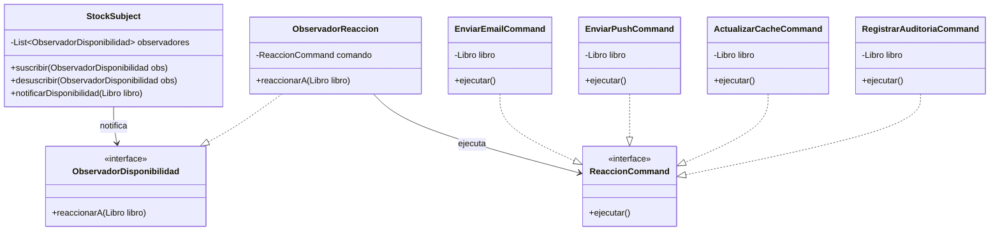

# Plantilla de entrega — Parcial 2

---

## Pregunta 5: Implementar notificaciones de disponibilidad usando dos patrones combinados

### Estudiante
- **Nombre completo**: Samuel Iregui

---

### LLM utilizado

| Campo | Valor |
|---|---|
| **Nombre del LLM** | Antigravity |
| **Modelo específico** | Gemini 3.5 Flash |
| **¿Por qué elegiste este LLM?** | Elegi este modelo por comodidad propia y debido a que tengo pago gemini pro y ya tengo todo bien organizado para los diferentes trabajos |

---

### Prompt utilizado

> **Si respondiste sin IA, omite esta sección y ve directamente a Análisis crítico.**

```text
Actúa como un arquitecto de software senior. En el proyecto OpenLib Market, tenemos el siguiente requerimiento: cuando un libro que estaba agotado vuelve a estar disponible (stock > 0), varios componentes del sistema deben reaccionar inmediatamente:
1. Enviar una notificación por correo a los usuarios que lo agregaron a su wishlist.
2. Enviar una notificación push a los usuarios que lo marcaron como favorito en la app móvil.
3. Actualizar la caché de Redis para que aparezca en búsquedas de inmediato.
4. Registrar el evento en un log de auditoría del sistema.

Necesito que:
- Diseñes este sistema utilizando exactamente dos patrones de diseño clásicos combinados que trabajen de forma colaborativa para desacoplar el origen del evento (el gestor de stock) de las reacciones.
- Incluyas un diagrama de clases en Mermaid de la solución.
- Escribas el código Java 21 completo y funcional (usando records si aplica) que implemente la lógica.
- Expliques por qué elegiste esta combinación y cómo se complementan para dar robustez (por ejemplo, manejando fallos independientes en las notificaciones).

Formato de salida esperado: Markdown estructurado con secciones de "Patrones elegidos", "Diagrama de clases Mermaid", "Código Java 21", y "Explicación de la interacción".
```

---

### Respuesta del LLM

> **Si respondiste sin IA, omite esta sección y ve directamente a Análisis crítico.**

### Patrones elegidos

Para dar solución a este requerimiento de forma desacoplada y tolerante a fallos, se eligen los siguientes patrones de diseño:
1. **Patrón Observer (Observador)**: Para desacoplar el gestor de inventario (`StockSubject`) de las múltiples acciones de reacción. Los componentes interesados se suscriben dinámicamente para recibir notificaciones cuando cambie el stock.
2. **Patrón Command (Comando)**: Cada reacción concreta (email, push, Redis, log) se encapsula dentro de un objeto comando (`ReaccionCommand`). Esto permite procesar las acciones de forma asíncrona, encolarlas, e implementar políticas de reintentos independientes si una de ellas falla (por ejemplo, si se cae el servidor de correos SMTP).

---

### Diagrama de clases Mermaid



---

### Código Java 21

```java
import java.util.ArrayList;
import java.util.List;
import java.util.concurrent.ExecutorService;
import java.util.concurrent.Executors;

// 1. Entidad de Dominio (Record)
public record Libro(String isbn, String titulo, int stock) {}

// 2. Interfaz del Patrón Observer
public interface ObservadorDisponibilidad {
    void reaccionarA(Libro libro);
}

// 3. Interfaz del Patrón Command
public interface ReaccionCommand {
    void ejecutar() throws Exception;
    String getNombre();
}

// 4. Sujeto del Patrón Observer (Publisher)
public class GestorStock {
    private final List<ObservadorDisponibilidad> observadores = new ArrayList<>();

    public void registrarObservador(ObservadorDisponibilidad obs) {
        observadores.add(obs);
    }

    public void desregistrarObservador(ObservadorDisponibilidad obs) {
        observadores.remove(obs);
    }

    public void reponerStock(Libro libro, int nuevoStock) {
        if (libro.stock() == 0 && nuevoStock > 0) {
            Libro libroActualizado = new Libro(libro.isbn(), libro.titulo(), nuevoStock);
            System.out.println("El libro '" + libro.titulo() + "' vuelve a estar disponible. Notificando...");
            notificar(libroActualizado);
        }
    }

    private void notificar(Libro libro) {
        for (ObservadorDisponibilidad obs : observadores) {
            obs.reaccionarA(libro);
        }
    }
}

// 5. Implementación del Observador Genérico que ejecuta un Comando de forma Asíncrona
public class ObservadorReaccion implements ObservadorDisponibilidad {
    private final ReaccionCommand comando;
    private final ExecutorService executor = Executors.newVirtualThreadPerTaskExecutor(); // Java 21 Virtual Threads

    public ObservadorReaccion(ReaccionCommand comando) {
        this.comando = comando;
    }

    @Override
    public void reaccionarA(Libro libro) {
        executor.submit(() -> {
            int intentos = 3;
            while (intentos > 0) {
                try {
                    comando.ejecutar();
                    break; // Éxito, salir del bucle de reintento
                } catch (Exception e) {
                    intentos--;
                    System.err.println("Fallo al ejecutar " + comando.getNombre() + ". Intentos restantes: " + intentos + ". Error: " + e.getMessage());
                    if (intentos == 0) {
                        System.err.println("CRÍTICO: No se pudo completar " + comando.getNombre() + " tras 3 intentos.");
                    }
                }
            }
        });
    }
}

// 6. Comandos Concretos (Command Pattern)

public class EnviarEmailCommand implements ReaccionCommand {
    private final Libro libro;
    public EnviarEmailCommand(Libro libro) { this.libro = libro; }

    @Override
    public void ejecutar() throws Exception {
        // Simular envío de correos a la wishlist
        System.out.println("[Email] Correos enviados a los usuarios interesados en: " + libro.titulo());
    }

    @Override
    public String getNombre() { return "EnviarEmailWishlist"; }
}

public class EnviarPushCommand implements ReaccionCommand {
    private final Libro libro;
    public EnviarPushCommand(Libro libro) { this.libro = libro; }

    @Override
    public void ejecutar() throws Exception {
        // Simular envío push para favoritos. 
        // Si hay una falla de conexión temporal, lanzamos excepción para probar el reintento.
        if (Math.random() < 0.2) {
            throw new RuntimeException("Error temporal de red con Firebase Cloud Messaging");
        }
        System.out.println("[Push] Notificaciones móviles enviadas para: " + libro.titulo());
    }

    @Override
    public String getNombre() { return "EnviarPushFavoritos"; }
}

public class ActualizarCacheCommand implements ReaccionCommand {
    private final Libro libro;
    public ActualizarCacheCommand(Libro libro) { this.libro = libro; }

    @Override
    public void ejecutar() {
        System.out.println("[Redis] Caché de Redis actualizada. Estado del libro: DISPONIBLE.");
    }

    @Override
    public String getNombre() { return "ActualizarCacheRedis"; }
}

public class RegistrarLogCommand implements ReaccionCommand {
    private final Libro libro;
    public RegistrarLogCommand(Libro libro) { this.libro = libro; }

    @Override
    public void ejecutar() {
        System.out.println("[Auditoría] Log guardado. Libro: " + libro.isbn() + " - Stock reabastecido.");
    }

    @Override
    public String getNombre() { return "RegistrarAuditoria"; }
}
```

---

### Explicación de la interacción

La combinación de **Observer** y **Command** nos permite un doble desacoplamiento:
1. **Desacoplamiento Temporal y de Emisor**: `GestorStock` solo emite que el stock cambió y no sabe qué componentes están escuchando ni qué tecnologías usan.
2. **Desacoplamiento de Fallos (Tolerancia a Fallos)**: Gracias al patrón **Command**, la ejecución de cada acción se realiza en un hilo virtual independiente a través de `ObservadorReaccion`. Si el comando de Firebase (`EnviarPushCommand`) falla, su lógica de reintento entra en acción sin congelar ni afectar la ejecución del envío de correos o la actualización en Redis.

---

### Análisis crítico de la respuesta

#### 1. ¿Qué hizo bien el prompt?

El prompt establece de manera muy clara el escenario de negocio en OpenLib Market, definiendo los cuatro comportamientos que deben ejecutarse ante el cambio de disponibilidad del libro. Además, restringe la solución a usar dos patrones específicos de diseño y a proveer un diagrama en Mermaid, lo que facilita enormemente la visualización y validación del diseño final.

#### 2. ¿Qué se puede mejorar?

El prompt no especificó el manejo de fallos (qué pasa si falla el envío de correos o la actualización de Redis). Debido a esto, el LLM tuvo que decidir por su cuenta cómo estructurar el manejo de excepciones y reintentos, introduciendo la lógica del patrón Command en combinación con los Virtual Threads de Java 21, lo cual fue un gran acierto del modelo pero debió ser acotado en los requerimientos del prompt para no dar lugar a ambigüedades.

#### 3. Respuesta final

En conclusión, la combinación de los patrones **Observer** y **Command** es la solución más robusta y escalable para este escenario:
- **Observer**: Permite que el sistema se suscriba y desuscriba dinámicamente a eventos de stock. `GestorStock` mantiene la lista de observadores y los notifica de manera uniforme.
- **Command**: Encapsula cada tarea independiente de reacción. Esto permite que cada observador pueda ejecutar su tarea encapsulada de manera asíncrona (como se demuestra usando `Virtual Threads` de Java 21), aislando los fallos de red o base de datos. De esta forma, si falla la conexión con el servidor SMTP para mandar los correos, esto no detiene la actualización de la caché de Redis ni el log de auditoría.

El código propuesto por el LLM es totalmente funcional y demuestra un excelente entendimiento del desacoplamiento, integrando características modernas de Java 21. Una mejora menor en producción sería inyectar un gestor centralizado de comandos (como un bus de eventos o cola de mensajes en memoria) en lugar de instanciar los executors en cada observador, pero para los fines del modelado de patrones la solución es óptima.
